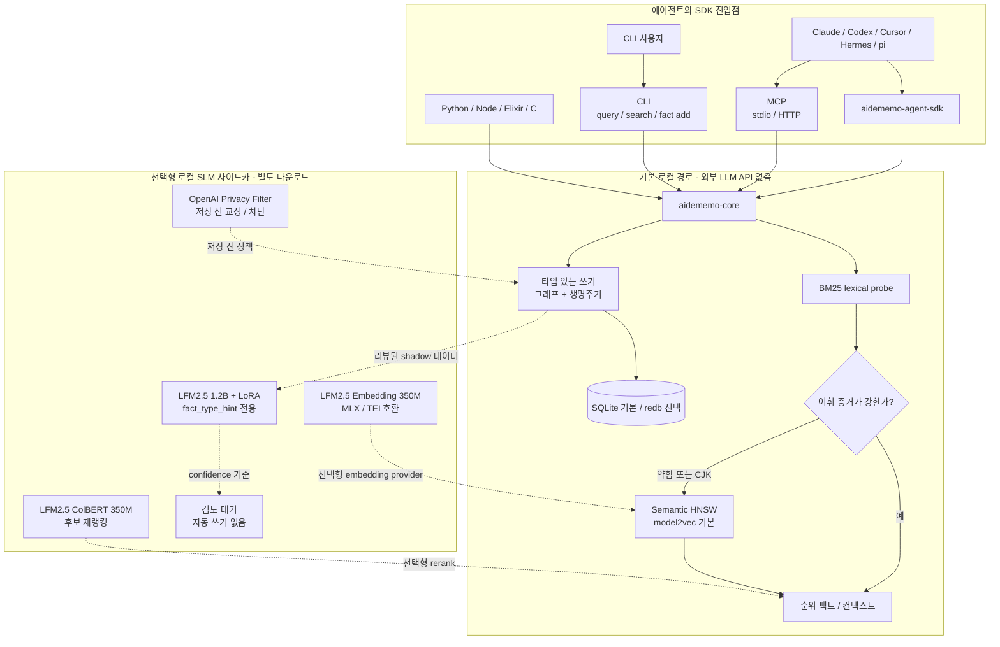

<div align="center">
  
  <h1 align="center">AideMemo</h1>
  <p><strong>코딩 에이전트에 친화적인 SDK 메모리.</strong></p>
  <p>
    하나의 Rust 바이너리와 하나의 임베디드 저장소. 팩트, 그래프 탐색, 이력이 필요한 에이전트를 위한 코드 우선 SDK, MCP 도구, CLI, 네이티브 바인딩을 제공합니다.
  </p>
  <p>
    <a href="https://github.com/taeyun16/aidememo/actions/workflows/ci.yml"></a>
    <a href="./Cargo.toml"></a>
    <a href="./Cargo.toml"></a>
    <a href="#설치"></a>
  </p>
  <p>
    <a href="./packages/aidememo-agent-sdk/README.md"></a>
    <a href="./AGENTS.md"></a>
    <a href="#아키텍처"></a>
    <a href="#왜-aidememo인가"></a>
    <a href="./docs/MEASUREMENTS.md"></a>
    <a href="./COMPARE.md"></a>
  </p>
</div>

<p align="center">
  <a href="./README.md">English</a> | <strong>한국어</strong>
</p>

---

**AideMemo**(`aidememo`)는 Claude Code, Codex, Hermes, pi, Cursor, OpenClaw,
OpenCode를 비롯한 코딩
에이전트를 위한 SDK 친화적 메모리 시스템입니다. 프로젝트 지식을 엔티티와
관계로 연결된 타입 있는 팩트로 저장하고, 유효 기간을 통해 시간 이력을
보존하며, 하나의 저장소를 Python 에이전트 SDK, MCP 도구, CLI, 인프로세스
바인딩으로 제공합니다.

AideMemo는 의도적으로 호스팅 메모리 SaaS, 완전한 에이전트 런타임, 또는
직접 운영해야 하는 벡터 데이터베이스가 아닙니다. 기본 경로는 로컬이며
서버리스입니다. 에이전트는 MCP 도구를 직접 호출하거나, Python을 실행할 수
있고 중간 메모리 상태를 코드로 유지해야 할 때 `aidememo-agent-sdk`를 사용할
수 있습니다. AideMemo의 기본 메모리 루프는 외부 LLM API를 호출하지 않으며,
원격 추출·임베딩·리랭크 서비스는 명시적으로 선택해야 합니다.



실선은 기본 제공 경로입니다. 점선은 로컬 선택형 모델 통합이며 Rust 바이너리에
번들되지 않고 외부 LLM API도 요구하지 않습니다.

## 로컬 SLM 확장(선택형)

AideMemo는 작은 로컬 모델을 메모리 엔진 자체가 아니라 결정적 메모리 코어
주변의 제한된 전문가로 사용합니다. 기본값은 명시적인 타입 쓰기와 BM25 우선
auto-hybrid 검색이며, 아래 모델은 각각 별도로 다운로드하고 설정해야 합니다.

| 역할 | 로컬 모델 | 배치 및 안전 경계 |
|---|---|---|
| 1단계 semantic fallback | `mlx-community/LFM2.5-Embedding-350M-4bit` | `model.provider=lfm-sidecar`로 설정합니다. 약한 BM25 또는 CJK probe만 기존 HNSW 경로로 승격하며 전역 embedding 대체가 아닙니다. 반복 호출에는 warm daemon을 사용합니다. |
| 후보 재랭킹 | `mlx-community/LFM2.5-ColBERT-350M-4bit` | recall이 높은 후보 집합을 호환 로컬 사이드카로 재정렬합니다. 후보 recall과 latency를 먼저 측정해야 하므로 기본값은 꺼짐입니다. |
| 팩트 타입 보조 | `LiquidAI/LFM2.5-1.2B-Instruct-MLX-4bit` + LoRA | 리뷰된 shadow log에서 confidence 기준 `fact_type_hint`를 만듭니다. 명시적 타입을 덮어쓰지 않으며 자동 쓰기가 아닙니다. |
| 쓰기 시점 privacy | OpenAI Privacy Filter MLX `mxfp4` | 저장 전에 민감 구간을 보고·교정·차단합니다. 검색과 latency 및 실패 정책이 달라 별도 선택형 정책으로 둡니다. |

설정은 [LFM 실험](docs/LFM_EXPERIMENTS.md#placement-and-boundaries), 측정된
배치 경계는 [측정 원장](docs/MEASUREMENTS.md#lfm-model-placement-strategy)을
참고하세요.

## 왜 AideMemo인가

| 필요 | AideMemo가 제공하는 것 |
|---|---|
| 에이전트 친화적 SDK 메모리 | `aidememo-agent-sdk`는 코드를 실행하는 에이전트에 `Memory.open`, `search_rows`, `coverage_by`, `aggregate_many`, `remember`를 제공합니다. |
| 로컬 에이전트 메모리 | 하나의 바이너리와 하나의 임베디드 저장소. Postgres, Qdrant, Neo4j, 호스팅 벤더가 필요 없습니다. |
| 제로 토큰 기본 경로 | 기본 캡처, 타입 있는 쓰기, BM25 우선 검색, MCP/SDK 읽기는 외부 LLM API 호출 없이 로컬에서 실행됩니다. |
| 선택형 로컬 SLM | MLX LFM 사이드카가 모델 추론을 진실의 원천으로 만들지 않으면서 약한 쿼리 검색, 후보 재랭킹, shadow 팩트 분류를 보조합니다. |
| 선택형 프라이버시 가드 | 로컬 OpenAI Privacy Filter 사이드카가 팩트 저장 전에 민감한 구간을 보고·마스킹·차단할 수 있습니다. |
| 벡터 재현 이상의 기능 | 타입 있는 팩트, 엔티티, 관계, 그래프 탐색, 시간 유효성, 집계. |
| 에이전트 네이티브 접근 | 코드 우선 조합용 SDK, 모델이 볼 수 있는 stdio/HTTP MCP, 사람을 위한 간결한 CLI. |
| 팀/프로젝트 공유 메모리 | 선택형 `source_id` 범위, 멀티 프로젝트 저장소, 공유 쓰기를 위한 데몬 경로. |
| 여러 Codex 계정 | 하나의 저장소를 여러 `CODEX_HOME` 프로필에 고정하고, `actor_id` provenance와 재개한 workflow session lineage를 유지하면서 로그인 상태는 공유하지 않습니다. |
| 도구 빌더용 임베딩 | Python, Node, Elixir, C 바인딩이 동일한 Rust 코어를 인프로세스로 호출합니다. |

## 설치

대표 사용 사례: [격리된 Codex 프로필이 하나의 프로젝트 메모리 공유](docs/CODEX_MULTI_PROFILE.md).

```bash
# 사전 빌드 CLI와 MCP 서버 설치(macOS/Linux, arm64/x64)
curl -fsSL https://raw.githubusercontent.com/taeyun16/aidememo/main/scripts/install.sh | bash

# 또는 crates.io에서 빌드하여 설치
cargo install aidememo-cli

# 또는 최신 main 브랜치 설치
cargo install --git https://github.com/taeyun16/aidememo aidememo-cli

# 또는 로컬 체크아웃에서 설치
cargo install --path crates/aidememo-cli
```

바이너리 이름은 `aidememo`입니다. 필요한 경우 `~/.local/bin` 또는
`~/.cargo/bin`을 `PATH`에 추가하세요. CI와 로컬 개발 버전은
[`mise.toml`](mise.toml)에 고정되어 있습니다. 체크아웃에서 `mise install`을
실행하면 동일한 Rust, Node, Python, Go, Elixir/Erlang 버전을 사용할 수
있습니다. 워크스페이스 MSRV는 `1.95`입니다.

공개 패키지는 [crates.io](https://crates.io/crates/aidememo-cli)의
`aidememo-cli`, PyPI의
[`aidememo-agent-sdk`](https://pypi.org/project/aidememo-agent-sdk/)와
[`aidememo-python`](https://pypi.org/project/aidememo-python/),
[npm](https://www.npmjs.com/package/aidememo-napi)의 `aidememo-napi`로
제공됩니다. 릴리스 노트는 [v0.1.0 릴리스](https://github.com/taeyun16/aidememo/releases/tag/v0.1.0)를
참조하세요. 해당 릴리스에는 macOS와 Linux의 x64/arm64용 독립 실행형 CLI
압축 파일이 첨부되어 있습니다. 다운로드한 파일은 함께 제공되는
`SHA256SUMS`로 검증할 수 있습니다.

언어 SDK와 바인딩도 공개 레지스트리에서 바로 설치할 수 있습니다.

```bash
python -m pip install aidememo-agent-sdk
python -m pip install "aidememo-agent-sdk[binding]"  # 선택형 네이티브 Python 빠른 경로
npm install aidememo-napi                            # 네이티브 Node.js 바인딩
```

## 문서 사이트

정적 문서 사이트는 [`website/`](website/)에 있으며, Docusaurus가
[`docs/`](docs/)의 영문 기준 Markdown을 렌더링합니다. 영어는
`https://aidememo.taeyun.me/`, 한국어는 `/ko/`에서 제공됩니다. 온보딩과 워크플로 문서는
번역되어 있고 긴 참고 문서는 명시적으로 영문 폴백을 사용합니다.

```bash
mise run docs-install
mise run docs-start
mise run docs-build

# 한국어 로컬 미리보기, 번역 드리프트 검사, 메시지 갱신
mise run docs-start-ko
mise run docs-i18n-check
npm --prefix website run write-translations:ko
```

## 60초 빠른 시작

체크아웃에서 제로 토큰 명령 하나로 핵심 워크플로를 확인할 수 있습니다.

```bash
scripts/demo-workflow.sh
```

임시 저장소를 만들고 Redis decision / lesson / error를 시드한 뒤 간단한
티켓을 시작합니다. 예상 결과는 `OK: sparse ticket recovered decision + lesson
+ error context`입니다.

이어서 동일한 기본 기능을 직접 실행해 보세요.

```bash
aidememo init ./my-wiki
aidememo fact add "Decided to use Redis Cluster for cache HA" \
  --type decision \
  --entities Redis,Cache

aidememo query "Redis cache"
aidememo recent -n 10
aidememo graph --from Redis --depth 2 --format mermaid
```

에이전트에 등록합니다.

```bash
aidememo init --agent codex ./my-wiki
aidememo --backend libsqlite mcp-install --target codex --source-id my-project

# Claude Code
aidememo --backend libsqlite mcp-install --target claude --source-id my-project

# Codex CLI: ~/.codex/config.toml
[mcp_servers.aidememo]
command = "aidememo"
args = ["--backend", "libsqlite", "mcp"]
```

MCP, 기능별 스킬, 훅을 묶은 Claude 플러그인 설치 방법은
[한국어 안내](aidememo-skill/setup-claude-code.ko.md) 또는
[영문 안내](aidememo-skill/setup-claude-code.md)를 참고하세요.

### 코딩 에이전트 설치

| 에이전트 | 권장 설치 |
|---|---|
| Claude Code | 내장 플러그인 또는 `mcp-install --target claude` + `skill install --target claude` |
| Codex | `mcp-install --target codex`. 격리된 `--codex-home` 프로필 반복 지원 |
| Hermes Agent | `skill install --target hermes` + `mcp-install --target hermes`, 또는 `hermes-aidememo` 플러그인 |
| pi coding agent | `skill install --target pi`. pi에는 의도적으로 MCP 단계가 없음 |
| Cursor / OpenClaw / OpenCode | 지원되는 스킬과 각 설치기 대상 |

정확한 명령, 프로필 변수, 검증, 문제 해결은 Docusaurus의
[`코딩 에이전트 설치`](docs/CODING_AGENTS.md)를 참고하세요. 상세 독립 가이드는
영문과 한글로 제공됩니다.

- [Claude Code 한국어](aidememo-skill/setup-claude-code.ko.md) / [English](aidememo-skill/setup-claude-code.md)
- [Codex 한국어](aidememo-skill/setup-codex.ko.md) / [English](aidememo-skill/setup-codex.md)
- [Hermes Agent 한국어](aidememo-skill/setup-hermes.ko.md) / [English](aidememo-skill/setup-hermes.md)
- [pi coding agent 한국어](aidememo-skill/setup-pi.ko.md) / [English](aidememo-skill/setup-pi.md)

## 에이전트 진입점

대부분의 에이전트 턴은 한 번의 메모리 읽기로 시작하고, 질문 형태가 요구할
때만 다른 경로로 분기해야 합니다.

| 작업 형태 | 사용 도구 | 이유 |
|---|---|---|
| 새 이슈, 티켓, PR, 자동화 트리거 | `aidememo_workflow_start` / `aidememo workflow start` | 추적 세션을 만들고 트리거를 저장하며 decision, lesson, error, 최근 팩트, 검색 결과를 반환합니다. |
| 일반 대화형 턴 시작 | `aidememo_context` | 한 번의 MCP 왕복으로 고정 팩트, 개인화, 최근 활동, 주제 맥락을 가져옵니다. |
| 후속 주제 탐색 | `aidememo_query` | 고정/최근 맥락을 이미 불러온 뒤 사용하는 가벼운 주제 검색입니다. |
| 정확한 합계, 횟수, 날짜 집합, 타임라인 | `aidememo_aggregate` | 여러 팩트에 걸친 계산을 결정적으로 수행합니다. 단순 회상이 아니라 교차 팩트 계산을 위한 안전장치로 사용합니다. |
| 지속할 가치가 있는 팩트를 학습 | `aidememo_fact_add` / `aidememo_fact_add_many` | 타입 있는 메모리를 명시적으로 저장합니다. `fact_type`을 생략하면 강한 단서를 결정적으로 추론하고, `session_id`는 후속 팩트를 워크플로 스레드에 유지합니다. |
| 긴 워크플로 재개 | `aidememo_session_canvas` / `aidememo session canvas` / SDK `session_canvas()` | 전체 스레드를 주입하는 대신 팩트 ID 드릴다운이 있는 제한된 Markdown + Mermaid 세션 지도를 가져옵니다. |
| 프로젝트 맥락 준비 | `aidememo_profile_export` / `aidememo profile export` / SDK `project_profile()` | 현재 타입 팩트에서 읽기 전용 `project_profile.md` 텍스트 뷰를 만듭니다. 저장소가 계속 원본입니다. |

에이전트가 보는 메모리 프로필 자체도 감사 가능한 산출물로 취급합니다.
[`docs/SKILLOPT_LITE.md`](docs/SKILLOPT_LITE.md)는 SkillOpt에서 영감을 받은
루프를 설명하며, `scripts/skillopt-lite-check.sh`는 후보 `SKILL.md`와 메모리
프로필 편집을 수락하기 전에 검사합니다.

## 일반 워크플로

### 검색과 회상

```bash
aidememo search "cache policy" -l 5
aidememo search "레디스 장애 원인" -l 5       # 벡터가 준비되면 약한 lexical/CJK 검색만 auto-hybrid 승격
aidememo search "cache policy" --bm25-only    # 결정적 lexical 빠른 경로
aidememo search "cache policy" --hybrid       # 모든 쿼리에 semantic 검색 강제
aidememo query "Redis" --bm25-only            # 결정적 컨텍스트 팩
aidememo query "Redis" --mode hybrid          # 더 풍부한 맥락, semantic 검색을 사용할 수 있음
aidememo overview
```

선택형 Mac 로컬 실험에서는 TEI 호환 `lfm-sidecar` provider를 통해 MLX LFM
임베딩 모델을 연결할 수 있습니다. 기본 BM25 우선 auto-hybrid gate 뒤에
두어야 합니다. 현재 측정은 LFM을 전역 기본 임베딩으로 대체하는 것을
지지하지 않습니다. LFM 1.2B LoRA 팩트 타입 경로도 shadow/review 전용이며
자동 쓰기 결정을 내려서는 안 됩니다. 설정은
[`LFM 실험`](docs/LFM_EXPERIMENTS.md), 측정 경계는
[`검증 근거`](docs/EVIDENCE.md#model-placement)를 참고하세요.

### 지속 가능한 메모리 쓰기

```bash
aidememo fact add "Use LRU for Redis edge caches" \
  --type convention \
  --entities Redis,Cache

aidememo fact supersede <OLD_ID> <NEW_ID> [--source-id ID]
aidememo edit fact <ID> --append "Confirmed in load test"
```

### 하나의 저장소에서 에이전트 메모리 격리

```bash
aidememo fact add "Agent A prefers bm25 first" --entities Retrieval --source-id agent-a
aidememo fact add "Agent B is testing rerank" --entities Retrieval --source-id agent-b

aidememo search "retrieval preference" --source-id agent-a
```

Hermes는 플러그인 도구와 슬래시 명령을 통해 동일한 `source_id` 필드를
사용합니다. SQLite가 기본 공유 저장소 경로입니다. 선택형 redb 백엔드를
사용하면 CLI 폴백이 짧은 잠금 충돌을 재시도합니다. 더 많은 에이전트가
redb에 쓰는 경우 하나의 `aidememo mcp-serve`를 실행하고 에이전트를 연결하세요.

MCP 에이전트는 `--source-id`와 함께 설치하여 서버 환경에
`AIDEMEMO_SOURCE_ID`를 한 번 설정할 수 있습니다. 설치된 MCP 명령에 동일한
저장소 백엔드를 고정하려면 `mcp-install` 앞에 `--backend`를 전달하세요.
해당 네임스페이스가 읽기와 쓰기의 기본값이 되며, 명시적인 `source_id` 도구
인자는 계속 이를 재정의합니다.

```bash
aidememo --backend libsqlite mcp-install --target codex --source-id agent-a
```

`AIDEMEMO_SOURCE_ID`는 신뢰된 프로세스의 기본값이지 인증 경계가 아닙니다.
호출자가 다른 `source_id`를 직접 보낼 수 있기 때문입니다. 서로 독립적으로
인증되는 에이전트가 HTTP 서버를 공유한다면 bearer token마다 고정된
`source_id`와 `actor_id`를 바인딩하세요. Bound caller는 두 값을 재정의하거나
전역 sync stream을 export하거나 전역 admin status를 조회할 수 없습니다.

```json
{"tokens":[{"token":"replace-me","source_id":"agent-a","actor_id":"codex-a"}]}
```

```bash
aidememo mcp-serve --port 3000 --auth-bindings-file ./token-bindings.json
```

정확한 content dedup은 source 범위를 따르며, entity, fact, pinned context,
graph 조회도 같은 source namespace 안에서 동작합니다. Source 범위가 있는 graph
edge는 relation namespace도 정확히 같아야 하며, 기존 범위 없는 edge는 숨깁니다.
전체 경계와 admin token
지침은 [MCP 설정](website/i18n/ko/docusaurus-plugin-content-docs/current/MCP.md)을
참고하세요. `mcp-serve` 자체는 평문 HTTP이므로 loopback이 아닌 배포에는 TLS
reverse proxy 또는 암호화된 private tunnel도 필요합니다. Source partition은
entity name/type ontology를 공유하므로 상호 신뢰하지 않는 tenant는 별도 store를
사용해야 합니다.

하나의 신뢰된 store, token에 바인딩된 source partition, 별도 store 중
적합한 배치 방식을 고르려면
[공유 메모리 배치 가이드](website/i18n/ko/docusaurus-plugin-content-docs/current/SHARED_MEMORY.md)를
참고하세요.

### 에이전트가 코드를 실행할 수 있을 때 Python으로 메모리 조합

한 번의 모델 가시 호출에는 MCP 도구를 사용하세요. 모든 중간 행을 LLM
컨텍스트로 보내지 않고 fanout 검색, 중복 제거, 커버리지 검사, 집계, 배치
쓰기가 필요한 작업에는 `aidememo-agent-sdk`를 사용합니다.

```bash
# 공개 Python 에이전트 SDK 설치
python -m pip install aidememo-agent-sdk

# 선택형 인프로세스 네이티브 바인딩
python -m pip install "aidememo-agent-sdk[binding]"
```

SDK는 `PATH`에 있는 `aidememo` CLI로 폴백합니다. `binding` extra는 공개된
`aidememo-python` 패키지를 설치해 인프로세스 네이티브 빠른 경로를
활성화합니다.

```python
from aidememo_agent import Memory

mem = Memory.open(source_id="research-alpha", storage_backend="libsqlite")
rows = mem.search_rows([
    "release preflight decisions",
    {"query": "lock retry lessons", "topic": "Shared store"},
])
coverage = mem.coverage_by(rows, ["fact_type"])

mem.remember([
    {
        "content": "Lesson: source-scoped fanout keeps multi-agent memory checks isolated.",
        "fact_type": "lesson",
        "entities": ["aidememo", "Agents"],
    }
])
```

### 간단한 이슈나 티켓에서 시작

```bash
aidememo workflow start "Fix Redis timeout in worker" \
  --body-file issue.md \
  --source github:org/repo#123 \
  --bm25-only \
  --json
```

추적 세션을 만들고 들어온 티켓을 `question` 팩트로 기록한 뒤 관련 decision,
lesson, error, 검색 결과가 포함된 컨텍스트 팩을 반환합니다. 따라서 자동화로
실행된 에이전트가 이슈 본문뿐 아니라 프로젝트 메모리를 가지고 시작할 수
있습니다. `--bm25-only`는 임베딩 모델 로드를 건너뛰어 데모와 훅을 결정적으로
유지합니다. 웜 모델 비용보다 semantic recall이 가치 있을 때는 생략하세요.

MCP 에이전트는 작업 중 학습한 팩트를 저장할 때 반환된 `session_id`를
`aidememo_fact_add` 또는 `aidememo_fact_add_many`에 전달해야 합니다. 그러면
후속 decision, lesson, error가 워크플로 스레드에 연결되어 나중에
`level:"session"`으로 회상할 수 있습니다.

장기 작업을 재개하기 전에 읽기 전용 세션 캔버스를 내보냅니다.

```bash
aidememo session canvas "$AIDEMEMO_SESSION_ID" --limit 20 --output session_canvas.md
aidememo profile export --output project_profile.md
```

동일한 산출물은 MCP의 에이전트 핫패스(`aidememo_session_canvas`,
`aidememo_profile_export`)와 `aidememo-agent-sdk`의
`Memory.session_canvas(...)`, `Memory.project_profile(...)`에서도 제공됩니다.

이 산출물은 계층형 메모리 시스템의 유용한 부분, 즉 결정적 드릴다운이 있는
간결한 매크로 뷰를 차용합니다. 숨겨진 상태를 자동으로 캡처하거나 타입 있는
팩트를 대체하지 않습니다. 모든 지속 가능한 주장은 여전히 `aidememo fact get
<id>`로 원본을 확인할 수 있습니다.

### 동시성이 중요할 때 웜 저장소 공유

```bash
aidememo daemon start
aidememo daemon status

# 또는 HTTP MCP 서버를 명시적으로 실행
aidememo mcp-serve --port 3000
curl http://127.0.0.1:3000/health
curl http://127.0.0.1:3000/admin/status
```

데몬 모드는 최적화이며 온보딩 필수 사항이 아닙니다. 모델과 저장소를 웜
상태로 유지하고 명령마다 발생하는 열기 비용을 피합니다. 동일 호스트의
서버리스 공유에서는 약 네 개의 동시 writer까지
`aidememo config set store.lock_retry_ms 5000`이 더 부드러운 기본값입니다.
더 많은 에이전트가 병렬로 쓸 때는 데몬 경로를 사용하세요.

## 측정된 주장

| 측정 | 결과 |
|---|---:|
| LongMemEval-S 검색, bge + 2단계 리랭크 | R@10 `0.992`, MRR `0.958` |
| LongMemEval-S E2E, bge + 리랭크 + MiniMax reader | `74.0%` |
| gbrain-evals BrainBench, aidememo BM25 | P@5 `17.4%`, R@5 `64.1%` |
| gbrain-evals BrainBench, aidememo BM25 데몬 경유 | 동일 점수, `5.7x` 빠름 |
| Hermes 2프로세스 선택형 redb 서버리스 공유 저장소, retry `5000` | 20/20 쓰기 저장, 잠금 오류 0 |
| 선택형 redb 서버리스 lock-retry sweep, retry `5000` | writer 4개까지 원활, writer 8개에서 79/80 저장 |
| HTTP 공유 `mcp-serve`, 클라이언트 2개 x 쓰기 10회 | p50 `18.4ms`, p95 `41.8ms`, 20/20 저장 |
| 제로 토큰 워크플로 데모 | `128ms`에 decision + lesson + error 노출 |
| MCP source/backend 기본 설치 시나리오 M | 21/21 invariant, 설치된 `AIDEMEMO_SOURCE_ID` + `--backend libsqlite`가 MCP 쓰기/검색을 `111.6ms`에 범위화 |
| Hermes Memory-as-Code 시나리오 N | 9/9 invariant, SDK fanout/중복 제거/커버리지/집계에서 beta-source 행 제외 |
| `aidememo-agent-sdk` 패키지 smoke | wheel 설치 + `Memory` / `AideMemoClient` / `AideMemoMemorySDK` 산출물 메서드 검사 `3.38s` 통과 |
| `hermes-aidememo` 패키지 smoke | wheel 설치 + SDK 재노출 / 번들 skill / 선택형 캡처 어댑터 검사 `4.43s` 통과 |
| 릴리스 preflight 워크플로 | 수동 GitHub 워크플로가 local/full 프로필과 명시적 heavy-step 토글로 동일한 릴리스 gate 실행 |
| 공개 이식성 gate | CI와 릴리스 preflight가 first-party 추적 파일의 개발자 전용 홈 경로를 거부 |
| 새 체크아웃 워크플로 | Ubuntu 워크플로가 로컬 산출물 없이 재빌드하고 결정적 온보딩 실행 |
| Rust 배포 준비 | `aidememo-core` `cargo publish --dry-run` 검증, 종속 Rust crate는 core가 crates.io에 게시될 때까지 문서화된 배포 순서에 따라 건너뜀 |
| 공개 레지스트리 smoke | `plan` 모드는 배포 후 `cargo`, `pip`, `npm` 설치 검사를 기록하고, `verify` 모드는 배포 후 로컬 또는 수동 GitHub 워크플로에서 공개 레지스트리로 설치 |
| `aidememo-agent-sdk` 배포 워크플로 | PyPI payload dry-run + trusted publisher 워크플로가 기본적으로 dry-run |
| `hermes-aidememo` 배포 워크플로 | PyPI payload dry-run + trusted publisher 워크플로가 기본적으로 dry-run |
| Changelog 릴리스 gate | 워크스페이스 `0.1.0`에 맞게 `CHANGELOG.md` 정리, 빈 `Unreleased`, 날짜가 있는 `0.1.0` 노트 |
| SkillOpt-lite 프로필 gate | 후보 메모리 프로필 토큰, `aidememo skill check`, 워크플로 데모, SDK 승격 gate 검증 |
| SkillOpt-lite 주기적 사이클 | 수락/거절된 skill-profile 후보를 `target/skillopt-lite`에 기록, `--apply`일 때만 적용 |
| `aidememo-napi` 패키지 분리 | 루트 JS/types 패키지 + 현재 플랫폼 선택형 패키지 설치 smoke 통과 |
| `aidememo-napi` 버전 gate | 루트/플랫폼 패키지 버전과 optionalDependency pin을 함께 검증 |
| `aidememo-napi` 배포 워크플로 | trusted publisher 워크플로가 기본적으로 dry-run이며 정확한 버전 입력일 때만 실제 배포 허용 |

방법론, 명령, 주의점은 [`docs/MEASUREMENTS.md`](docs/MEASUREMENTS.md)를
참고하세요. 요약하면 AideMemo는 SOTA 벤치마크 주장보다 운영 단순성과 시간
메모리 의미론을 앞세워야 합니다.

## 기능 지도

| 영역 | 기능 |
|---|---|
| 검색 | BM25, semantic HNSW, hybrid RRF, 선택형 TEI / `lfm-sidecar`, fastembed 및 리랭크 경로 |
| 그래프 | 엔티티, 팩트, 관계, 탐색, 최단 경로, Mermaid / DOT 내보내기 |
| 시간 | `supersede`, `current_only`, `as_of`, archive / cold tier |
| 에이전트 도구 | `aidememo_workflow_start`, `aidememo_context`, `aidememo_query`, `aidememo_aggregate`, `aidememo_fact_add_many`를 포함한 27개 MCP 도구 |
| 캡처 | `aidememo_extract`, pending review queue, review-only LFM LoRA `fact_type_hint` shadow 경로, 선택형 Hermes/OpenClaw 캡처 어댑터 |
| 산출물 | 타입 있는 팩트에 대한 제한적이고 감사 가능한 Markdown 뷰인 `aidememo session canvas`, `aidememo profile export` |
| 운영 | `doctor` / MCP `aidememo_doctor`, `overview`, `bench`, `vector-rebuild`, `consolidate`, `auto-relate` |
| 공유 | `source_id`, 멀티 프로젝트 저장소, stdio MCP, HTTP/SSE MCP, 데몬 탐색, 클라우드 에이전트와 실험적 메모리 실행을 위한 branch log |
| 코드 우선 조합 | `Memory.open`, `search_rows`, `coverage_by`, `aggregate_many`, `remember`를 제공하는 `aidememo-agent-sdk` |
| 바인딩 | Python, Node, Elixir, C |

## CLI 참고

| 분류 | 명령 |
|---|---|
| 설정 | `aidememo init`, `aidememo init --agent codex`, `aidememo project create/use/list` |
| 읽기 | `aidememo search`, `aidememo query`, `aidememo recent`, `aidememo overview`, `aidememo traverse`, `aidememo path`, `aidememo graph` |
| 쓰기 | `aidememo fact add`, `aidememo fact supersede`, `aidememo fact pin`, `aidememo fact archive`, `aidememo fact delete`, `aidememo edit fact`, `aidememo entity describe` |
| 유지보수 | `aidememo doctor`, `aidememo lint`, `aidememo bench`, `aidememo backup`, `aidememo branch`, `aidememo pending`, `aidememo workflow`, `aidememo ingest`, `aidememo watch`, `aidememo vector-rebuild`, `aidememo consolidate` |
| 서버 | `aidememo mcp`, `aidememo mcp-serve`, `aidememo daemon start/status/stop`, `aidememo mcp-install` |
| 설정값 | `aidememo config get/set/list`, `aidememo auth generate/login/list/logout` |

유용한 설정값:

```bash
aidememo config set store.durability eventual    # 쓰기는 빠르지만 전원 손실 안전성 감소
aidememo config set store.lock_retry_ms 5000     # 짧은 쓰기 경합 완화
aidememo doctor --json                           # sharing.mode와 데몬 안내 포함
aidememo config set model.provider fastembed
aidememo config set model.name bge-small-en-v1.5
aidememo backup create ~/backups/aidememo       # hot + 기존 cold-tier SQLite snapshot + manifest
aidememo backup restore ~/backups/aidememo/backup-01... --force
aidememo branch push --branch agent-a --base ~/backups/aidememo/backup-01... ~/backups/aidememo
aidememo branch merge --branch agent-a ~/backups/aidememo

# SQLite가 기본 로컬 백엔드입니다. `libsqlite`는 동일 경로의 alias입니다.
# redb를 선택하려면 `--features redb`로 빌드하세요.
aidememo config set store.backend sqlite
aidememo config set store.backend libsqlite
aidememo config set store.backend redb
# 설정을 변경하지 않고 명령 하나에만 재정의:
aidememo --backend libsqlite --store ./_meta/wiki.sqlite stats
```

Branch log는 하나의 백업에서 시작하여 메모리를 독립적으로 쓰는 클라우드
에이전트 또는 what-if 실행을 위한 기능입니다. 승리한 branch를 merge하고
노이즈가 많은 후보는 merge하지 마세요. 자세한 내용은
[`docs/BRANCHES.md`](docs/BRANCHES.md)를 참고하세요.

네이티브 바인딩도 동일한 백엔드 selector를 사용합니다. 기본 빌드에는
SQLite가 포함됩니다. redb 저장소를 열려면 Cargo `redb` 기능으로 빌드하세요.

```python
g = aidememo.AideMemo("./_meta/wiki.sqlite", backend="sqlite")
g = aidememo.AideMemo("./_meta/wiki.sqlite", backend="libsqlite")
g = aidememo.AideMemo("./_meta/wiki.redb", backend="redb")
```

## 아키텍처

| Crate | 역할 |
|---|---|
| `aidememo-core` | SQLite 기본 저장소, 선택형 redb 저장소, ingest, BM25, semantic 검색, 그래프, lint, lifecycle |
| `aidememo-cli` | `aidememo` 바이너리: CLI, stdio MCP, HTTP/SSE MCP |
| `aidememo-agent-sdk` | 코드를 실행하는 에이전트(Codex, Claude Code, Hermes, CI)를 위한 Python 조합 계층. `aidememo-python` 또는 CLI 폴백 사용 |
| `aidememo-python` | PyO3 바인딩 |
| `aidememo-napi` | Node.js 바인딩 |
| `aidememo-nif` | Elixir/Erlang 바인딩 |
| `aidememo-ffi` | C ABI 바인딩 |
| `benchmarks` | Rust 벤치마크 바이너리와 재현 가능한 fixture |

## 영향과 참고 자료

AideMemo는 특정 시스템 하나를 복제하지 않습니다. 에이전트 skill 최적화,
장기 메모리 벤치마크, 시간 지식 그래프, 로컬 코딩 에이전트 도구의 아이디어를
결합합니다.

| 참고 자료 | AideMemo가 차용하거나 대응하는 점 |
|---|---|
| [SkillOpt](https://arxiv.org/abs/2605.23904) / [프로젝트 페이지](https://microsoft.github.io/SkillOpt/) | 에이전트 메모리 skill/profile을 학습 가능한 산출물로 취급합니다. AideMemo는 `scripts/skillopt-lite-check.sh` / `scripts/skillopt-lite-cycle.sh`를 통해 제한된 편집, 검증 gate, 거절 편집 버퍼, 정적 배포를 차용합니다. |
| [SkillOps](https://arxiv.org/abs/2605.13716) | 주기적인 skill library 유지보수와 인접한 관점입니다. AideMemo는 현재 완전한 skill 생태계 그래프 대신 더 가벼운 단일 프로필 루프를 유지합니다. |
| [SkillMOO](https://arxiv.org/abs/2604.09297) | 다목적 skill 튜닝과 인접한 연구입니다. AideMemo는 현재 정확성과 워크플로 invariant를 먼저 검사하며 비용/런타임 trade-off는 향후 optimizer 입력으로 둡니다. |
| [LongMemEval](https://arxiv.org/abs/2410.10813), [LongMemEval-V2](https://arxiv.org/abs/2605.12493) | 장기 개인/에이전트 메모리를 위한 벤치마크 형태입니다. AideMemo는 SOTA 주장을 앞세우지 않고 검색, 집계, reader 측 주의점을 조정하는 데 결과를 사용합니다. |
| [Graphiti](https://github.com/getzep/graphiti) / [Zep](https://www.getzep.com/) | 시간 지식 그래프 의미론과 유효 기간 비교입니다. AideMemo는 유사한 이력 의미론을 유지하면서 하나의 임베디드 로컬 저장소를 사용합니다. |
| [Mem0](https://github.com/mem0ai/mem0), [Letta](https://github.com/letta-ai/letta) | 클라우드/기본 추출 및 memory-OS 대안입니다. AideMemo는 의도적으로 사용자가 에이전트를 선택하는 명시적 로컬 우선 방식을 유지합니다. |
| [Mastra Observational Memory](https://mastra.ai/research/observational-memory), [OMEGA](https://omegamax.co/docs/benchmark-report) | 높은 점수를 기록한 메모리 시스템 참고 자료입니다. AideMemo는 SDK 사용성과 제로 토큰 기본 ingest를 우선하면서 이를 벤치마크 맥락으로 사용합니다. |
| [beads](https://gastownhall.github.io/beads/) | 에이전트 지향 로컬 작업 그래프와 `bd ready` 워크플로입니다. AideMemo는 에이전트 로컬 도구 사용성을 차용하지만 이슈 의존성 추적이 아니라 팩트와 그래프 맥락의 검색에 집중합니다. |

더 넓은 경쟁 구도와 출처 원장은 [`COMPARE.md`](COMPARE.md), 이 README의
주장을 뒷받침하는 명령과 수치는
[`docs/MEASUREMENTS.md`](docs/MEASUREMENTS.md)를 참고하세요.

## 비교

| 대안 | 이 대안을 선택할 때 | AideMemo를 선택할 때 |
|---|---|---|
| Mem0 | 관리형 메모리와 자동 클라우드 추출이 필요할 때 | 로컬 우선 명시적 팩트와 기본 벤더 의존성 제거가 필요할 때 |
| Letta | 완전한 상태 기반 에이전트 런타임이 필요할 때 | 이미 에이전트가 있고 연결 가능한 메모리 계층이 필요할 때 |
| Graphiti / Zep | Neo4j와 커뮤니티 탐지가 있는 서버 중심 시간 그래프가 필요할 때 | 유사한 시간 의미론을 하나의 로컬 바이너리로 사용하고 싶을 때 |
| beads | merge가 있는 의존성 인식 이슈 트래커가 필요할 때 | 팩트와 그래프 맥락에 대한 hybrid 검색이 필요할 때 |
| OMEGA 스타일 시스템 | 더 무거운 프롬프트/훅 구조로 LongMemEval 최고 점수를 최적화할 때 | 이식성, 배포 단순성, 명시적 메모리 제어를 최적화할 때 |

전체 비교: [`COMPARE.md`](COMPARE.md). SDK 승격 기준:
[`docs/SDK_POSITIONING.md`](docs/SDK_POSITIONING.md). Changelog와 registry
preflight를 포함한 현재 측정 및 릴리스 gate:
[`docs/MEASUREMENTS.md`](docs/MEASUREMENTS.md).

## 저장소 안내

```text
crates/       Rust 워크스페이스 crate
packages/     Python 에이전트 SDK 패키지
plugins/      Hermes를 포함한 에이전트 통합
aidememo-skill/     에이전트용 skill과 설정 문서
bench/        시나리오 벤치마크와 멀티 에이전트 검사
benchmarks/   Rust 벤치마크 crate와 gbrain 어댑터
scripts/      설치, CI, Hermes, 분석 스크립트
docs/         지속 가능한 측정 및 설계 문서
```

에이전트별 지침은 [`AGENTS.md`](AGENTS.md), 로컬 스크립트 구성은
[`scripts/README.md`](scripts/README.md)를 참고하세요.

## 라이선스

AideMemo는 사용자의 선택에 따라 [MIT License](LICENSE-MIT) 또는
[Apache License 2.0](LICENSE-APACHE)로 제공됩니다.

## 보안

취약점은 비공개로 신고해 주세요. [SECURITY.md](SECURITY.md)를 참고하세요.

## 커뮤니티

- Pull request를 열기 전에 [CONTRIBUTING.md](CONTRIBUTING.md)를 읽어 주세요.
- 사용 방법에 관한 질문은 [GitHub Discussions](https://github.com/taeyun16/aidememo/discussions)에 남겨 주세요.
- 버그와 기능 요청은 구조화된 [이슈 양식](https://github.com/taeyun16/aidememo/issues/new/choose)을 사용해 주세요.
- 모든 참여자는 [행동 강령](CODE_OF_CONDUCT.md)을 따라야 합니다.
- 일반적인 지원 범위는 [SUPPORT.md](SUPPORT.md)에 설명되어 있습니다.
