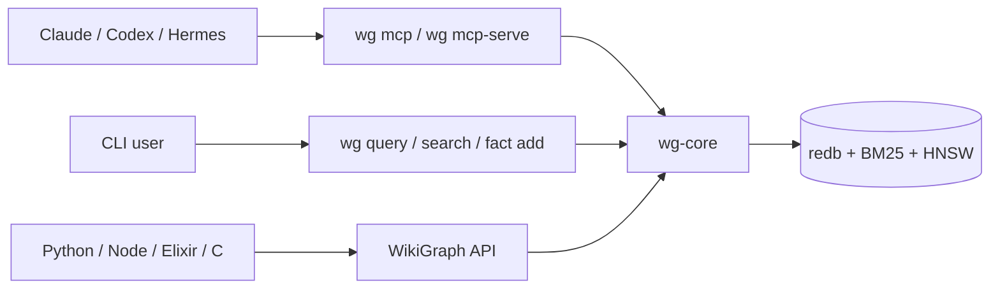

<div align="center">
  <h1 align="center">wg</h1>
  <p><strong>Local-first temporal memory for coding agents.</strong></p>
  <p>
    One Rust binary. One redb store. CLI, MCP, and native bindings for agents that need memory with facts, graph traversal, and history.
  </p>
  <p>
    <a href="https://github.com/taeyun16/wg/actions/workflows/ci.yml"></a>
    <a href="./Cargo.toml"></a>
    <a href="./Cargo.toml"></a>
    <a href="#install"></a>
  </p>
  <p>
    <a href="./AGENTS.md"></a>
    <a href="#architecture"></a>
    <a href="#why-wg"></a>
    <a href="./docs/MEASUREMENTS.md"></a>
    <a href="./COMPARE.md"></a>
  </p>
</div>

---

`wg` is a memory layer for Claude Code, Codex, Cursor, Hermes, and other
coding agents. It stores project knowledge as typed facts connected to
entities and relations, keeps temporal history with validity windows, and
exposes the same store through a CLI, MCP server, and in-process bindings.

It is deliberately not a hosted memory SaaS, a full agent runtime, or a
vector database you have to operate. The default path is local and serverless;
a warm daemon is available when multiple agents need a faster shared endpoint.



## Why wg

| Need | What wg gives you |
|---|---|
| Local agent memory | Single binary + single embedded store. No Postgres, Qdrant, Neo4j, or hosted vendor. |
| More than vector recall | Typed facts, entities, relations, graph traversal, temporal validity, aggregation. |
| Agent-native access | Built-in MCP over stdio and HTTP, plus a compact CLI for humans. |
| Shared team/project memory | Optional `source_id` scoping, multi-project stores, and a daemon path for shared writes. |
| Tool-builder embedding | Python, Node, Elixir, and C bindings call the same Rust core in process. |

## Install

```bash
# One-line installer
curl -fsSL https://raw.githubusercontent.com/taeyun16/wg/main/scripts/install.sh | bash

# Or directly with cargo
cargo install --git https://github.com/taeyun16/wg wg-cli

# Or from a checkout
cargo install --path crates/wg-cli
```

The binary is `wg`. Add `~/.cargo/bin` to your `PATH` if needed. CI currently
validates with Rust `1.95.0`; the workspace MSRV is `1.85`.

## 60-Second Quickstart

```bash
wg init ./my-wiki
wg fact add "Decided to use Redis Cluster for cache HA" \
  --type decision \
  --entities Redis,Cache

wg query "Redis cache"
wg recent -n 10
wg graph --from Redis --depth 2 --format mermaid
```

Register it with an agent:

```bash
wg init --agent codex ./my-wiki

# Claude Code
claude mcp add wg -- wg mcp

# Codex CLI: ~/.codex/config.toml
[mcp_servers.wg]
command = "wg"
args = ["mcp"]
```

## Common Workflows

### Search and recall

```bash
wg search "cache policy" -l 5
wg search "cache policy" --hybrid
wg query "Redis" --mode hybrid
wg overview
```

### Write durable memory

```bash
wg fact add "Use LRU for Redis edge caches" \
  --type convention \
  --entities Redis,Cache

wg fact supersede <OLD_ID> <NEW_ID>
wg edit fact <ID> --append "Confirmed in load test"
```

### Keep agent memories isolated in one store

```bash
wg fact add "Agent A prefers bm25 first" --entities Retrieval --source-id agent-a
wg fact add "Agent B is testing rerank" --entities Retrieval --source-id agent-b

wg search "retrieval preference" --source-id agent-a
```

Hermes uses the same `source_id` field through its plugin tools and slash
commands. Its CLI fallback retries short redb lock collisions for 5 seconds by
default, so two local Hermes agents can share a store without asking the user
to start a server.

### Start from a sparse issue or ticket

```bash
wg workflow start "Fix Redis timeout in worker" \
  --body-file issue.md \
  --source github:org/repo#123 \
  --json
```

This creates a tracked session, records the incoming ticket as a `question`
fact, and returns a context pack with relevant decisions, lessons, errors, and
search hits so an automation-triggered agent can start with project memory
instead of only the issue body.

### Share a warm store when concurrency matters

```bash
wg daemon start
wg daemon status

# Or run the HTTP MCP server explicitly
wg mcp-serve --port 3000
curl http://127.0.0.1:3000/health
curl http://127.0.0.1:3000/admin/status
```

Daemon mode is an optimization, not required onboarding. It keeps the model and
store warm and avoids per-command open costs. For same-host serverless sharing,
`wg config set store.lock_retry_ms 5000` is the smoother default up to about
four concurrent writers; use the daemon path when more agents write in
parallel.

## Measured Claims

| Measurement | Result |
|---|---:|
| LongMemEval-S retrieval, bge + two-stage rerank | R@10 `0.992`, MRR `0.958` |
| LongMemEval-S E2E, bge + rerank + MiniMax reader | `74.0%` |
| gbrain-evals BrainBench, wg BM25 | P@5 `17.4%`, R@5 `64.1%` |
| gbrain-evals BrainBench, wg BM25 via daemon | same score, `5.7x` faster |
| Hermes two-process serverless shared store, retry `5000` | 20/20 writes persisted, 0 lock errors |
| Serverless lock-retry sweep, retry `5000` | smooth through 4 writers; 8 writers persisted 79/80 |
| HTTP shared `mcp-serve`, 2 clients x 10 writes | p50 `18.4ms`, p95 `41.8ms`, 20/20 persisted |
| `wg-napi` package split | root JS/types package + current-platform optional package install smoke passed |
| `wg-napi` publish workflow | trusted-publisher workflow defaults to dry-run and gates real publish on exact version input |

See [`docs/MEASUREMENTS.md`](docs/MEASUREMENTS.md) for methodology, commands,
and caveats. The short version: `wg` should lead with operational simplicity
and temporal memory semantics, not a SOTA benchmark claim.

## Feature Map

| Area | Features |
|---|---|
| Retrieval | BM25, semantic HNSW, hybrid RRF, optional TEI / fastembed rerank |
| Graph | entities, facts, relations, traversal, shortest path, Mermaid / DOT export |
| Time | `supersede`, `current_only`, `as_of`, archive / cold tier |
| Agent tools | 25 MCP tools including `wg_workflow_start`, `wg_context`, `wg_query`, `wg_aggregate`, `wg_fact_add_many` |
| Capture | `wg_extract`, pending review queue, `wg pending list/stats/approve/reject` |
| Ops | `doctor` / MCP `wg_doctor`, `overview`, `bench`, `vector-rebuild`, `consolidate`, `auto-relate` |
| Sharing | `source_id`, multi-project stores, stdio MCP, HTTP/SSE MCP, daemon discovery |
| Bindings | Python, Node, Elixir, C |

## CLI Reference

| Category | Commands |
|---|---|
| Setup | `wg init`, `wg init --agent codex`, `wg project create/use/list` |
| Read | `wg search`, `wg query`, `wg recent`, `wg overview`, `wg traverse`, `wg path`, `wg graph` |
| Write | `wg fact add`, `wg fact supersede`, `wg fact archive`, `wg edit fact`, `wg entity describe`, `wg relation add` |
| Maintenance | `wg doctor`, `wg lint`, `wg bench`, `wg pending`, `wg workflow`, `wg ingest`, `wg watch`, `wg vector-rebuild`, `wg consolidate` |
| Server | `wg mcp`, `wg mcp-serve`, `wg daemon start/status/stop`, `wg mcp-install` |
| Config | `wg config get/set/list`, `wg auth generate/login/list/logout` |

Useful knobs:

```bash
wg config set store.durability eventual    # faster writes, less power-loss safety
wg config set store.lock_retry_ms 5000     # smooth short redb lock contention
wg doctor --json                           # includes sharing.mode and daemon guidance
wg config set model.provider fastembed
wg config set model.name bge-small-en-v1.5
```

## Architecture

| Crate | Purpose |
|---|---|
| `wg-core` | redb store, ingest, BM25, semantic search, graph, lint, lifecycle |
| `wg-cli` | `wg` binary: CLI, stdio MCP, HTTP/SSE MCP |
| `wg-python` | PyO3 bindings |
| `wg-napi` | Node.js bindings |
| `wg-nif` | Elixir/Erlang bindings |
| `wg-ffi` | C ABI bindings |
| `benchmarks` | Rust benchmark binaries and reproducible fixtures |

## Compare

| Alternative | Pick it when | Pick wg when |
|---|---|---|
| Mem0 | You want managed memory and automatic cloud extraction. | You want local-first explicit facts and no default vendor dependency. |
| Letta | You want a full stateful agent runtime. | You already have an agent and need a pluggable memory layer. |
| Graphiti / Zep | You need a server-centric temporal graph with Neo4j and community detection. | You want similar temporal semantics in a single local binary. |
| beads | You need a dependency-aware issue tracker with merge. | You need hybrid retrieval over facts and graph context. |
| OMEGA-style systems | You optimize for top LongMemEval scores with heavier prompt/hook machinery. | You optimize for portability, deployment simplicity, and explicit memory control. |

Full comparison: [`COMPARE.md`](COMPARE.md). Product positioning:
[`POSITIONING.md`](POSITIONING.md). Current roadmap:
[`PRODUCT_ROADMAP.md`](PRODUCT_ROADMAP.md).

## Repository Guide

```text
crates/       Rust workspace crates
plugins/      Agent integrations, including Hermes
wg-skill/     Agent-facing skill and setup docs
bench/        Scenario benchmarks and multi-agent checks
benchmarks/   Rust benchmark crate and gbrain adapter
scripts/      Install, CI, Hermes, and analysis scripts
docs/         Durable measurement and design documentation
```

For agent-specific instructions, read [`AGENTS.md`](AGENTS.md). For local
script organization, read [`scripts/README.md`](scripts/README.md).

## License

See repository license metadata.
