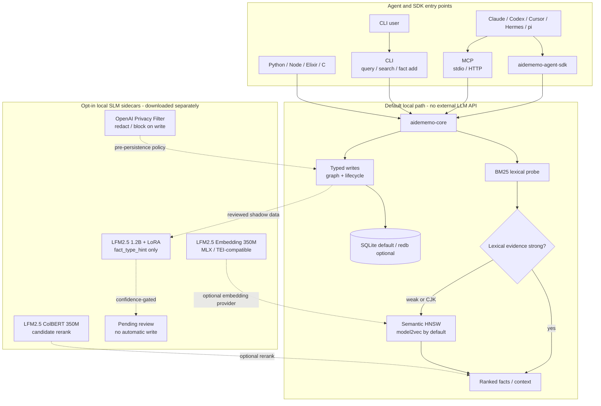

<div align="center">
  
  <h1 align="center">AideMemo</h1>
  <p><strong>Portable working memory for coding agents and orchestrators.</strong></p>
  <p>
    One Rust binary. One embedded store. A code-first SDK, MCP tools, CLI, and native bindings for agents that need memory with facts, graph traversal, and history.
  </p>
  <p>
    <a href="https://github.com/taeyun16/aidememo/actions/workflows/ci.yml"></a>
    <a href="./Cargo.toml"></a>
    <a href="./Cargo.toml"></a>
    <a href="#install"></a>
  </p>
  <p>
    <a href="./packages/aidememo-agent-sdk/README.md"></a>
    <a href="./AGENTS.md"></a>
    <a href="#architecture"></a>
    <a href="#why-aidememo"></a>
    <a href="./docs/MEASUREMENTS.md"></a>
    <a href="./COMPARE.md"></a>
  </p>
</div>

<p align="center">
  <strong>English</strong> | <a href="./README.ko.md">한국어</a>
</p>

---

**AideMemo** (`aidememo`) is portable, agent-friendly working memory and an SDK
for Claude Code, Codex, Hermes, pi, Cursor, OpenClaw, OpenCode, coding-agent
orchestrators, and other agent runtimes. It stores project knowledge as typed facts
connected to entities and relations, keeps temporal history with validity
windows, and exposes the same store through a Python agent SDK, MCP tools, CLI,
and in-process bindings. A tracked workflow can move from Codex to Claude Code,
or between Hermes profiles, without flattening its decisions and failures into
an unauditable chat summary.

It is deliberately not a hosted memory SaaS, a full agent runtime, or a vector
database you have to operate. The default path is local and serverless: agents
can either call MCP tools directly or use `aidememo-agent-sdk` when they can execute
Python and need to keep intermediate memory state in code. AideMemo's default
memory loop calls no external LLM API; remote extraction, embedding, and rerank
services are explicit opt-ins.



Solid arrows are the shipped default path. Dotted arrows are local, opt-in
model integrations: they are not bundled into the Rust binary and do not
require an external LLM API.

## Local SLM Extensions (Opt In)

AideMemo treats small local models as bounded specialists around a deterministic
memory core, not as the memory engine itself. The default remains explicit
typed writes plus BM25-first auto-hybrid retrieval; each model below must be
downloaded and configured separately.

| Role | Local model | Placement and safety boundary |
|---|---|---|
| First-stage semantic fallback | `mlx-community/LFM2.5-Embedding-350M-4bit` | Set `model.provider=lfm-sidecar`; weak or CJK BM25 probes can promote through the existing HNSW path. Keep a daemon warm so model load is paid once. This is not a global embedding replacement. |
| Candidate rerank | `mlx-community/LFM2.5-ColBERT-350M-4bit` | Reorder a high-recall candidate set through a compatible local sidecar. It is off by default because candidate recall and latency must be measured first. |
| Fact-type assistance | `LiquidAI/LFM2.5-1.2B-Instruct-MLX-4bit` + LoRA | Produce confidence-gated `fact_type_hint` values from reviewed shadow logs. Hints never overwrite an explicit caller-provided type and are not automatic writes. |
| Write-time privacy | OpenAI Privacy Filter MLX `mxfp4` | Report, redact, or block sensitive spans before persistence. It is a separate opt-in policy because its latency and failure policy differ from retrieval. |

See [LFM Experiments](docs/LFM_EXPERIMENTS.md#placement-and-boundaries) for setup and
[Measurements](docs/MEASUREMENTS.md#lfm-model-placement-strategy) for the measured
placement boundaries.

## Why AideMemo

| Need | What AideMemo gives you |
|---|---|
| Agent-friendly SDK memory | `aidememo-agent-sdk` gives code-executing agents `Memory.open`, `search_rows`, `coverage_by`, `aggregate_many`, and `remember`. |
| Cross-agent and cross-account handoff | `aidememo_handoff` packages a tracked session; optional dispatch plus `aidememo_handoff_inbox` lets `codex-one`, `codex-two`, or `claude-main` pull the same session without exchanging vendor chat ids. |
| Local agent memory | Single binary + single embedded store. No Postgres, Qdrant, Neo4j, or hosted vendor. |
| Zero-token default path | Default capture, typed writes, BM25-first search, and MCP/SDK reads run locally without external LLM API calls. |
| Opt-in local SLMs | MLX LFM sidecars can assist weak-query retrieval, candidate reranking, and shadow fact typing without turning model inference into the source of truth. |
| Opt-in privacy guard | Local OpenAI Privacy Filter sidecars can report, redact, or block sensitive spans before facts are persisted. |
| More than vector recall | Typed facts, entities, relations, graph traversal, temporal validity, aggregation. |
| Agent-native access | SDK for code-first composition, MCP over stdio/HTTP for model-visible tools, plus a compact CLI for humans. |
| Shared team/project memory | Optional `source_id` scoping, multi-project stores, and a daemon path for shared writes. |
| Multiple Codex accounts | Pin one store into several `CODEX_HOME` profiles, keep `actor_id` provenance, and link resumed workflow sessions without sharing login state. |
| Tool-builder embedding | Python, Node, Elixir, and C bindings call the same Rust core in process. |

## Install

Featured use case: [share one project memory across isolated Codex profiles](docs/CODEX_MULTI_PROFILE.md).

```bash
# Install the prebuilt CLI and MCP server (macOS / Linux, arm64 / x64)
curl -fsSL https://raw.githubusercontent.com/taeyun16/aidememo/main/scripts/install.sh | bash

# Or build and install from crates.io
cargo install aidememo-cli

# Or install the latest main branch
cargo install --git https://github.com/taeyun16/aidememo aidememo-cli

# Or install from a local checkout
cargo install --path crates/aidememo-cli
```

The binary is `aidememo`. Add `~/.cargo/bin` to your `PATH` if needed. CI and
local development versions are pinned in [`mise.toml`](mise.toml); run
`mise install` from a checkout to use the same Rust, Node, Python, Go, and
Elixir/Erlang versions. The workspace MSRV is `1.95`.

The public packages are available as `aidememo-cli` on
[crates.io](https://crates.io/crates/aidememo-cli),
[`aidememo-agent-sdk`](https://pypi.org/project/aidememo-agent-sdk/) and
[`aidememo-python`](https://pypi.org/project/aidememo-python/) on PyPI, and
`aidememo-napi` on [npm](https://www.npmjs.com/package/aidememo-napi). See the
[v0.1.0 release](https://github.com/taeyun16/aidememo/releases/tag/v0.1.0) for
release notes and prebuilt standalone CLI archives for macOS and Linux on x64
and arm64. Verify downloaded archives with the attached `SHA256SUMS` file.

Language SDKs and bindings are also available from their public registries:

```bash
python -m pip install aidememo-agent-sdk
python -m pip install "aidememo-agent-sdk[binding]"  # optional native Python fast path
npm install aidememo-napi                            # native Node.js binding
```

## Documentation Site

The static product and documentation site lives in [`website/`](website/) and
renders the durable English Markdown under [`docs/`](docs/) with Docusaurus.
The product landing page is served at `https://aidememo.taeyun.me/`,
documentation stays under `/docs/`, and Korean is available at `/ko/`. Translated
onboarding/workflow pages use explicit English fallback for long reference
docs. Production builds include an in-browser local search index; no search
service or API key is required.

```bash
mise run docs-install
mise run docs-start
mise run docs-build
npm --prefix website run serve   # test the production-only search index

# Korean local preview, translation drift check, and message refresh
mise run docs-start-ko
mise run docs-i18n-check
npm --prefix website run write-translations:ko
```

`.github/workflows/pages.yml` validates and uploads the same production build
to GitHub Pages on `main`. Before the first deployment, select **GitHub
Actions** under **Settings → Pages → Build and deployment** and restrict the
generated `github-pages` environment to `main`.

## 60-Second Quickstart

From a checkout, see the core workflow in one zero-token command:

```bash
scripts/demo-workflow.sh
```

It creates a temporary store, seeds one Redis decision / lesson / error, then
starts a sparse ticket. Expected result: `OK: sparse ticket recovered decision
+ lesson + error context`.

Then try the same primitives by hand:

```bash
aidememo init ./my-wiki
aidememo fact add "Decided to use Redis Cluster for cache HA" \
  --type decision \
  --entities Redis,Cache

aidememo query "Redis cache"
aidememo recent -n 10
aidememo graph --from Redis --depth 2 --format mermaid
```

Register it with an agent:

```bash
aidememo init --agent codex ./my-wiki
aidememo --backend libsqlite mcp-install --target codex \
  --source-id my-project --actor-id codex-one

# Claude Code
aidememo --backend libsqlite mcp-install --target claude --source-id my-project

# Codex CLI: ~/.codex/config.toml
[mcp_servers.aidememo]
command = "aidememo"
args = ["--backend", "libsqlite", "mcp"]
```

For the bundled Claude plugin (MCP + focused skills + hooks), see the
[English setup guide](aidememo-skill/setup-claude-code.md) or
[Korean setup guide](aidememo-skill/setup-claude-code.ko.md).

### Coding agent setup

| Agent | Recommended install |
|---|---|
| Claude Code | bundled plugin, or `mcp-install --target claude` + `skill install --target claude` |
| Codex | `mcp-install --target codex`; supports repeated isolated `--codex-home` profiles |
| Hermes Agent | `skill install --target hermes` + `mcp-install --target hermes`, or `hermes-aidememo` plugin |
| pi coding agent | `skill install --target pi`; pi intentionally has no MCP step |
| Cursor / OpenClaw / OpenCode | the corresponding installer target, with skills where supported |

See the Docusaurus [`Coding Agent Setup`](docs/CODING_AGENTS.md) page for exact
commands, profile variables, verification, and troubleshooting. Detailed
standalone guides are available in English and Korean:

- [Claude Code](aidememo-skill/setup-claude-code.md) / [한국어](aidememo-skill/setup-claude-code.ko.md)
- [Codex](aidememo-skill/setup-codex.md) / [한국어](aidememo-skill/setup-codex.ko.md)
- [Hermes Agent](aidememo-skill/setup-hermes.md) / [한국어](aidememo-skill/setup-hermes.ko.md)
- [pi coding agent](aidememo-skill/setup-pi.md) / [한국어](aidememo-skill/setup-pi.ko.md)

## Agent Entry Points

Most agent turns should start with one memory read and only branch when the
question shape requires it:

| Task shape | Use | Why |
|---|---|---|
| New issue, ticket, PR, or automation trigger | `aidememo_workflow_start` / `aidememo workflow start` | Creates a tracked session, stores the trigger, and returns decisions, lessons, errors, recent facts, and search hits. |
| Opening a normal interactive turn | `aidememo_context` | One MCP round-trip for pinned facts, personalisation, recent activity, and topic context. |
| Follow-up topic dive | `aidememo_query` | Lighter topic retrieval when pinned/recent context is already loaded. |
| Exact totals, counts, date sets, or timelines | `aidememo_aggregate` | Deterministic arithmetic over matching facts; use it as insurance for cross-fact counting, not for simple recall. |
| Learned a durable fact | `aidememo_fact_add` / `aidememo_fact_add_many` | Store typed memory explicitly; omitted `fact_type` uses deterministic strong-cue inference, and `session_id` keeps follow-up facts on the workflow thread. |
| Resuming a long workflow | `aidememo_session_canvas` / `aidememo session canvas` / SDK `session_canvas()` | Fetch a bounded Markdown + Mermaid map of the session with fact-id drill-down instead of injecting the whole thread. |
| Routing work across agent installations/accounts | `aidememo_handoff` + `aidememo_handoff_inbox` / CLI `handoff` / SDK handoff methods | Preview a bounded packet or dispatch a session pointer to Codex → Claude Code, Hermes Kanban → external Codex, or `codex-one` → `codex-two`. Keep same-board Hermes task state in Kanban. |
| Preparing project context | `aidememo_profile_export` / `aidememo profile export` / SDK `project_profile()` | Generate a read-only `project_profile.md` text view from current typed facts; the store remains the source of truth. |

The agent-facing memory profile itself is treated as an auditable artifact.
[`docs/SKILLOPT_LITE.md`](docs/SKILLOPT_LITE.md) describes the
SkillOpt-inspired loop, and `scripts/skillopt-lite-check.sh` gates candidate
`SKILL.md` / memory-profile edits before they are accepted.

## Orchestrator Handoff

The attractive unit is not a static profile; it is a workflow that survives a
change of worker. Connect each recurring account once, then send the active
session by its short alias:

```bash
aidememo agent add codex-two --type codex \
  --home /path/to/codex-two-home --workspace "$PWD" \
  --source-id release-team

AIDEMEMO_ACTOR_ID=codex-one aidememo handoff send codex-two \
  --focus "Verify package metadata, then run release preflight" \
  --done-when "The installed wheel matches workspace metadata and preflight passes"

# In the second Codex account/terminal, or from the orchestrator:
aidememo handoff run codex-two

# The send output includes the id used here. No actor flag is needed.
aidememo handoff show handoff-...

# Read-only operational view; inactive work moves to attention after one hour.
aidememo handoff board --stale-after 1h --include-completed
```

`send` infers the current session from `AIDEMEMO_SESSION_ID`, the sender from
`AIDEMEMO_ACTOR_ID`, and the receiving runtime, workspace, and default source
scope from `codex-two`. The lower-level packet and manual accept/return flow
remain available when an orchestrator needs explicit route fields:

```bash
aidememo session handoff "$AIDEMEMO_SESSION_ID" \
  --from-actor codex-one \
  --to-actor codex-two \
  --from codex/coding \
  --to codex/reviewer \
  --source-id release-team \
  --focus "Verify package metadata, then run release preflight" \
  --done-when "The installed wheel matches workspace metadata and preflight passes" \
  --dispatch

# In the second Codex account/terminal:
AIDEMEMO_ACTOR_ID=codex-two aidememo handoff inbox --source-id release-team
AIDEMEMO_ACTOR_ID=codex-two aidememo handoff accept handoff-...

# The sender can inspect the returned result fact without polling the session:
aidememo handoff outbox --actor-id codex-one
aidememo handoff show handoff-...
```

The identifiers have deliberately separate jobs: `session_id` is task
continuity, `source_id` is the project/tenant retrieval scope, `actor_id` is a
user-assigned account or installation alias, and agent/profile fields describe
the runtime role. Actor aliases are routing metadata, not authentication; use a
unique non-secret alias per installation. Without `--dispatch`, handoff remains
a read-only preview. With it, the receiver pulls a tiny assignment record and
`accept` renders the packet from the current session, so there is no copied
message payload.

The external worker lane records an AideMemo heartbeat every hour while a
Codex/Claude process is still running. When `HERMES_KANBAN_TASK` (or
`--kanban-task`) links the assignment to Hermes, the same pulse is forwarded to
`hermes kanban heartbeat`; Hermes still owns claim, retry, dependency, and card
completion. `handoff board` is derived from the ledger on every read and only
groups work as `ready`, `in_progress`, `attention`, or `returned`.
For work expected to exceed the 30-minute default timeout, run
`aidememo handoff run codex-two --timeout 14400`; the heartbeat interval remains
3600 seconds unless `--heartbeat-interval` overrides it.

Agents without an automatic adapter can still join the protocol without
pretending AideMemo is their scheduler:

```bash
aidememo agent add cursor-review --type manual --workspace "$PWD"
aidememo handoff send cursor-review --focus "Review the patch"
```

The manual runtime uses CLI, MCP, or SDK `inbox` / `accept` / `heartbeat` /
`return`; `handoff run cursor-review` intentionally refuses because no verified
process adapter is configured.

This is intentionally not Kafka or a job queue. AideMemo has no topics,
offsets, consumer groups, leases, delivery retries, or exactly-once claim. The
ledger only stores a session pointer, routing labels, focus, `done_when`,
acknowledgement state, and an optional linked result fact. A successful return
completes the acknowledgement; a failed return stays accepted for orchestrator
policy. Neither state is a distributed task-success proof.

MCP and SDK consumers can keep the envelope structured instead of parsing the
Markdown: `Memory.handoff_packet(...)` returns route, focus, `done_when`,
resume environment, and prompt-ready `content`; `handoff_inbox()`,
`handoff_accept()`, `handoff_return()`, `handoff_outbox()`, and
`handoff_show()` expose the default round trip; actor-scoped
`handoff_status()` remains available for stricter routing checks. Meanwhile,
`Memory.handoff(...)` remains the text-only convenience call.

Installation profiles store only non-secret runtime metadata: agent adapter,
workspace, source scope, model, environment policy, and a config-root path.
For Codex, the worker maps that path to the documented `CODEX_HOME` boundary;
credentials remain in the agent-owned directory. The default `core`
environment policy avoids leaking unrelated account tokens and permits named
variables only through repeatable `--pass-env` entries.

Run `scripts/demo-agent-handoff.sh` for a zero-token Codex/coding →
Hermes/reviewer smoke of this complete path.

The zero-token Scenario P gate preserves critical evidence `4/4`, route fields
`4/4`, and neighbouring-source leakage `0`, while reducing the packet by
`82.6%` versus the raw session JSON and `34.5%` versus the bounded session
canvas. This validates the handoff protocol and context envelope; downstream
model task success remains a separate opt-in evaluation.

Scenario Q additionally runs three independent MCP processes as `codex-one`,
`codex-two`, and `claude-main`. Its `10/10` gates verify actor and source
isolation, same-session continuation, explicit acknowledgement, one pointer
entity per dispatch, zero copied facts, and zero broker/payload keys.

Scenario R uses a real temporary Hermes Kanban DB and passes `12/12` gates.
The internal `coding -> reviewer` transition creates no AideMemo assignment;
only the external `codex-two` boundary creates one pointer, returned evidence
stays on the same session, and Hermes explicitly owns final card completion.
It is protocol evidence, not an external CLI worker spawner or model-success
result.

Scenario S closes that receiver-side gap with the installable
`aidememo-worker-lane` SDK command. Its zero-token fake Codex/Claude gate passes
`14/14`: the success path receives the packet and resume environment, returns a
fact on the same session, then completes the acknowledgement; the failure path
records an error on the same session and remains accepted for the scheduler.
Sender outbox/status links both returned facts without scanning the session.
The runner uses shell-free argv and leaves Hermes Kanban untouched. This still
does not prove live-model task success, account authentication, exactly-once
execution, or Hermes `spawn_fn` integration.

### Hermes Kanban composition

Hermes Kanban and AideMemo have complementary ownership. Kanban is the
canonical task state machine: cards, dependencies, atomic claims, retries,
heartbeats, comments, worker runs, and completion stay on the board. AideMemo
owns durable semantic memory: project decisions, lessons, recurring errors,
fact-linked evidence, and continuity when work leaves the current Hermes
worker lane.

| Use case | Kanban owns | AideMemo adds |
|---|---|---|
| PM → coder → reviewer profiles on one board | Dependencies, assignment, parent summary, review gate | Cross-card decisions and failure patterns. Reuse one `session_id` from card metadata/comment; do not dispatch an AideMemo inbox item. |
| Retry or crash recovery | Reclaim, prior run, retry count, circuit breaker | Durable failed approaches that remain searchable across retries and sibling cards. |
| A new board/project revisits old work | New board lifecycle | Retrieval of prior project evidence even though the old card is outside the active board. |
| Hermes card delegates to Codex/Claude | Card remains the canonical task and validation gate | A bounded external-agent packet, account-addressed pull, fact ids, and the same session when the result returns to Hermes. |
| Research fleet promotes one result | Fan-out tasks, workspaces, winner/reviewer status | Comparable experiment facts and the evidence/claim boundary used to select the winner. |

Dispatcher-spawned workers expose `HERMES_KANBAN_TASK` and
`HERMES_KANBAN_BOARD`. The Hermes plugin detects that context, avoids
auto-starting a second workflow for ticket-shaped worker prompts, and injects
the ownership rule above. `aidememo_fact_add` now accepts `session_id`, so a
worker can attach one durable finding without falling back to a batch call.

## Common Workflows

### Search and recall

```bash
aidememo search "cache policy" -l 5
aidememo search "레디스 장애 원인" -l 5       # auto-hybrid promotes only weak lexical/CJK probes when vectors are ready
aidememo search "cache policy" --bm25-only    # deterministic lexical fast path
aidememo search "cache policy" --hybrid       # force semantic on every query
aidememo query "Redis" --bm25-only            # deterministic context pack
aidememo query "Redis" --mode hybrid          # richer context, may use semantic retrieval
aidememo overview
```

For optional Mac-local experiments, AideMemo can connect an MLX LFM embedding
model through the TEI-compatible `lfm-sidecar` provider. Keep it behind the
default BM25-first auto-hybrid gate: current measurements do not support using
LFM as the global embedding replacement. The LFM 1.2B LoRA fact-type path is
also shadow/review-only and must not make automatic write decisions. See
[`LFM Experiments`](docs/LFM_EXPERIMENTS.md) for setup and
[`Evidence`](docs/EVIDENCE.md#model-placement) for the measured boundaries.

### Write durable memory

```bash
aidememo fact add "Use LRU for Redis edge caches" \
  --type convention \
  --entities Redis,Cache

aidememo fact supersede <OLD_ID> <NEW_ID> [--source-id ID]
aidememo edit fact <ID> --append "Confirmed in load test"
```

### Keep agent memories isolated in one store

```bash
aidememo fact add "Agent A prefers bm25 first" --entities Retrieval --source-id agent-a
aidememo fact add "Agent B is testing rerank" --entities Retrieval --source-id agent-b

aidememo search "retrieval preference" --source-id agent-a
```

Hermes uses the same `source_id` field through its plugin tools and slash
commands. SQLite is the default shared-store path. If the optional redb backend
is selected, the CLI fallback retries short lock collisions; for heavier
multi-agent redb writes, run one `aidememo mcp-serve` and point agents at it.

For MCP agents, install with `--source-id` to set `AIDEMEMO_SOURCE_ID` once in
the server environment. Pass `--backend` before `mcp-install` to pin the same
storage backend in the installed MCP command. That namespace becomes the
default for reads and writes; explicit `source_id` tool arguments still
override it.

```bash
aidememo --backend libsqlite mcp-install --target codex --source-id agent-a
```

`AIDEMEMO_SOURCE_ID` is a trusted-process default, not an authentication
boundary: a caller can still send another `source_id`. For an HTTP server shared
by independently authenticated agents, bind each bearer token to a fixed
`source_id` and `actor_id` instead. Bound callers cannot override either value,
export the global sync stream, or inspect global admin status.

```json
{"tokens":[{"token":"replace-me","source_id":"agent-a","actor_id":"codex-a"}]}
```

```bash
aidememo mcp-serve --port 3000 --auth-bindings-file ./token-bindings.json
```

Exact-content dedup is source-aware, and scoped entity, fact, pinned-context,
and graph reads stay within the same source namespace. Scoped graph edges also
require an exact relation namespace match; legacy unscoped edges are hidden. See
[MCP setup](docs/MCP.md#http-mcp-server) for the full boundary and admin-token
guidance. Non-loopback deployments also need a TLS reverse proxy or encrypted
private tunnel because `mcp-serve` itself uses plain HTTP. Source partitions
share the entity-name/type ontology; mutually untrusted tenants should use
separate stores.

See the [shared-memory deployment guide](docs/SHARED_MEMORY.md) for choosing
between one trusted store, token-bound source partitions, and separate stores.

### Compose memory in Python when the agent can run code

Use MCP tools for one-off, model-visible calls. Use `aidememo-agent-sdk` when a task
needs fanout retrieval, dedupe, coverage checks, aggregation, or batch writes
without routing every intermediate row through the LLM context.

```bash
# Install the public Python agent SDK
python -m pip install aidememo-agent-sdk

# Optional in-process native binding
python -m pip install "aidememo-agent-sdk[binding]"
```

The SDK falls back to the `aidememo` CLI on `PATH`; the `binding` extra installs
the published `aidememo-python` package for the in-process native fast path.

```python
from aidememo_agent import Memory

mem = Memory.open(source_id="research-alpha", storage_backend="libsqlite")
rows = mem.search_rows([
    "release preflight decisions",
    {"query": "lock retry lessons", "topic": "Shared store"},
])
coverage = mem.coverage_by(rows, ["fact_type"])

mem.remember([
    {
        "content": "Lesson: source-scoped fanout keeps multi-agent memory checks isolated.",
        "fact_type": "lesson",
        "entities": ["aidememo", "Agents"],
    }
])
```

### Start from a sparse issue or ticket

```bash
aidememo workflow start "Fix Redis timeout in worker" \
  --body-file issue.md \
  --source github:org/repo#123 \
  --bm25-only \
  --json
```

This creates a tracked session, records the incoming ticket as a `question`
fact, and returns a context pack with relevant decisions, lessons, errors, and
search hits so an automation-triggered agent can start with project memory
instead of only the issue body. `--bm25-only` keeps demos and hooks
deterministic by skipping embedding-model load; omit it when semantic recall is
worth the warm model cost.

MCP agents should pass the returned `session_id` to `aidememo_fact_add` or
`aidememo_fact_add_many` for facts learned during the task. That keeps follow-up
decisions, lessons, and errors attached to the workflow thread for later
`level:"session"` recall.

For long-running tasks, export a read-only session canvas before resuming:

```bash
aidememo session canvas "$AIDEMEMO_SESSION_ID" --limit 20 --output session_canvas.md
aidememo profile export --output project_profile.md
```

The same artifacts are available on the agent hot path through MCP
(`aidememo_session_canvas`, `aidememo_profile_export`) and through
`aidememo-agent-sdk` (`Memory.session_canvas(...)`, `Memory.project_profile(...)`).

These artifacts borrow the useful part of layered memory systems: a compact
macro view with deterministic drill-down. They do not auto-capture hidden state
or replace typed facts; every durable claim still points back to `aidememo fact
get <id>`.

### Share a warm store when concurrency matters

```bash
aidememo daemon start
aidememo daemon status

# Or run the HTTP MCP server explicitly
aidememo mcp-serve --port 3000
curl http://127.0.0.1:3000/health
curl http://127.0.0.1:3000/admin/status
```

Daemon mode is an optimization, not required onboarding. It keeps the model and
store warm and avoids per-command open costs. For same-host serverless sharing,
`aidememo config set store.lock_retry_ms 5000` is the smoother default up to about
four concurrent writers; use the daemon path when more agents write in
parallel.

## Measured Claims

| Measurement | Result |
|---|---:|
| LongMemEval-S retrieval, bge + two-stage rerank | R@10 `0.992`, MRR `0.958` |
| LongMemEval-S E2E, bge + rerank + MiniMax reader | `74.0%` |
| gbrain-evals BrainBench, aidememo BM25 | P@5 `17.4%`, R@5 `64.1%` |
| gbrain-evals BrainBench, aidememo BM25 via daemon | same score, `5.7x` faster |
| Hermes two-process optional-redb serverless shared store, retry `5000` | 20/20 writes persisted, 0 lock errors |
| Optional-redb serverless lock-retry sweep, retry `5000` | smooth through 4 writers; 8 writers persisted 79/80 |
| HTTP shared `mcp-serve`, 2 clients x 10 writes | p50 `18.4ms`, p95 `41.8ms`, 20/20 persisted |
| Zero-token workflow demo | decision + lesson + error surfaced in `128ms` |
| MCP source/actor/backend install Scenario M | 28/28 invariants; installed source + per-installation actor + `--backend libsqlite` drove MCP write/search/inbox defaults in `107.8ms` |
| Hermes Memory-as-Code Scenario N | 9/9 invariants; SDK fanout/dedupe/coverage/aggregate excluded beta-source rows |
| `aidememo-agent-sdk` pack smoke | wheel install + `Memory` / `AideMemoClient` / `AideMemoMemorySDK` artifact-method checks passed in `3.38s` |
| `hermes-aidememo` pack smoke | wheel install + SDK re-export / bundled skill / opt-in capture adapter checks passed in `4.43s` |
| Release preflight workflow | manual GitHub workflow runs the same release gate with local/full profile and explicit heavy-step toggles |
| Public portability gate | CI and release preflight reject developer-specific home paths from first-party tracked files |
| Fresh-checkout workflow | Ubuntu workflow rebuilds without local artifacts and exercises deterministic onboarding |
| Rust publish readiness | `aidememo-core` `cargo publish --dry-run` verified; dependent Rust crates are a documented publish-order skip until core is live on crates.io |
| Public registry smoke | `plan` mode records post-release `cargo`, `pip`, and `npm` install checks; `verify` mode installs from public registries after publish, locally or through the manual GitHub workflow |
| `aidememo-agent-sdk` publish workflow | PyPI payload dry-run + trusted-publisher workflow defaults to dry-run |
| `hermes-aidememo` publish workflow | PyPI payload dry-run + trusted-publisher workflow defaults to dry-run |
| Changelog release gate | `CHANGELOG.md` cut for workspace `0.1.0`, empty `Unreleased`, dated `0.1.0` notes |
| SkillOpt-lite profile gate | validates candidate memory-profile tokens, `aidememo skill check`, workflow demo, and SDK promotion gate |
| SkillOpt-lite periodic cycle | records accepted / rejected skill-profile candidates under `target/skillopt-lite`; applies only with `--apply` |
| `aidememo-napi` package split | root JS/types package + current-platform optional package install smoke passed |
| `aidememo-napi` version gate | root/platform package versions and optionalDependency pins verified together |
| `aidememo-napi` publish workflow | trusted-publisher workflow defaults to dry-run and gates real publish on exact version input |

See [`docs/MEASUREMENTS.md`](docs/MEASUREMENTS.md) for methodology, commands,
and caveats. The short version: AideMemo should lead with operational simplicity
and temporal memory semantics, not a SOTA benchmark claim.

## Feature Map

| Area | Features |
|---|---|
| Retrieval | BM25, semantic HNSW, hybrid RRF, optional TEI / `lfm-sidecar`, fastembed and rerank paths |
| Graph | entities, facts, relations, traversal, shortest path, Mermaid / DOT export |
| Time | `supersede`, `current_only`, `as_of`, archive / cold tier |
| Agent tools | 29 MCP tools including `aidememo_workflow_start`, `aidememo_handoff`, `aidememo_handoff_inbox`, `aidememo_context`, `aidememo_query`, `aidememo_aggregate`, `aidememo_fact_add_many` |
| Capture | `aidememo_extract`, pending review queue, review-only LFM LoRA `fact_type_hint` shadow path, opt-in Hermes/OpenClaw capture adapter |
| Artifacts | `aidememo session canvas`, `aidememo session handoff`, `aidememo profile export` for bounded, auditable Markdown views over typed facts |
| Ops | `doctor` / MCP `aidememo_doctor`, `overview`, `bench`, `vector-rebuild`, `consolidate`, `auto-relate` |
| Sharing | `source_id`, installation-scoped `actor_id`, pull-based session assignments, multi-project stores, stdio/HTTP MCP, daemon discovery, branch logs |
| Code-first composition | `aidememo-agent-sdk` with `Memory.open`, `search_rows`, `coverage_by`, `aggregate_many`, `remember`, and handoff send/inbox/accept/return/show methods |
| Bindings | Python, Node, Elixir, C |

## CLI Reference

| Category | Commands |
|---|---|
| Setup | `aidememo init`, `aidememo init --agent codex`, `aidememo project create/use/list` |
| Read | `aidememo search`, `aidememo query`, `aidememo recent`, `aidememo overview`, `aidememo traverse`, `aidememo path`, `aidememo graph` |
| Write | `aidememo fact add`, `aidememo fact supersede`, `aidememo fact pin`, `aidememo fact archive`, `aidememo fact delete`, `aidememo edit fact`, `aidememo entity describe` |
| Maintenance | `aidememo doctor`, `aidememo lint`, `aidememo bench`, `aidememo backup`, `aidememo branch`, `aidememo pending`, `aidememo workflow`, `aidememo ingest`, `aidememo watch`, `aidememo vector-rebuild`, `aidememo consolidate` |
| Server | `aidememo mcp`, `aidememo mcp-serve`, `aidememo daemon start/status/stop`, `aidememo mcp-install` |
| Config | `aidememo config get/set/list`, `aidememo auth generate/login/list/logout` |

Useful knobs:

```bash
aidememo config set store.durability eventual    # faster writes, less power-loss safety
aidememo config set store.lock_retry_ms 5000     # smooth short write contention
aidememo doctor --json                           # includes sharing.mode and daemon guidance
aidememo config set model.provider fastembed
aidememo config set model.name bge-small-en-v1.5
aidememo backup create ~/backups/aidememo       # hot + existing cold-tier SQLite snapshots + manifest
aidememo backup restore ~/backups/aidememo/backup-01... --force
aidememo branch push --branch agent-a --base ~/backups/aidememo/backup-01... ~/backups/aidememo
aidememo branch merge --branch agent-a ~/backups/aidememo

# SQLite is the default local backend. `libsqlite` is an alias for the same path.
# Build with `--features redb` to opt into redb.
aidememo config set store.backend sqlite
aidememo config set store.backend libsqlite
aidememo config set store.backend redb
# Or override for one command without mutating config:
aidememo --backend libsqlite --store ./_meta/wiki.sqlite stats
```

Branch logs are for cloud agents or what-if runs that start from one backup and
write memory independently. Merge the winning branch and leave noisy candidates
unmerged. See [`docs/BRANCHES.md`](docs/BRANCHES.md).

Native bindings use the same backend selector. Default builds include SQLite;
build with Cargo `redb` to open redb stores:

```python
g = aidememo.AideMemo("./_meta/wiki.sqlite", backend="sqlite")
g = aidememo.AideMemo("./_meta/wiki.sqlite", backend="libsqlite")
g = aidememo.AideMemo("./_meta/wiki.redb", backend="redb")
```

## Architecture

| Crate | Purpose |
|---|---|
| `aidememo-core` | SQLite default store, optional redb store, ingest, BM25, semantic search, graph, lint, lifecycle |
| `aidememo-cli` | `aidememo` binary: CLI, stdio MCP, HTTP/SSE MCP |
| `aidememo-agent-sdk` | Python composition layer for code-executing agents (Codex, Claude Code, Hermes, CI); uses `aidememo-python` or CLI fallback |
| `aidememo-python` | PyO3 bindings |
| `aidememo-napi` | Node.js bindings |
| `aidememo-nif` | Elixir/Erlang bindings |
| `aidememo-ffi` | C ABI bindings |
| `benchmarks` | Rust benchmark binaries and reproducible fixtures |

## Influences And References

AideMemo is not a clone of any one system. The design combines ideas from agent
skill optimization, long-term memory benchmarks, temporal knowledge graphs,
and local coding-agent tools:

| Reference | What AideMemo borrows or reacts to |
|---|---|
| [SkillOpt](https://arxiv.org/abs/2605.23904) / [project page](https://microsoft.github.io/SkillOpt/) | Treat the agent memory skill/profile as a trainable artifact. AideMemo borrows bounded edits, validation gates, rejected-edit buffers, and static deployment through `scripts/skillopt-lite-check.sh` / `scripts/skillopt-lite-cycle.sh`. |
| [SkillOps](https://arxiv.org/abs/2605.13716) | Adjacent framing for periodic skill-library maintenance. AideMemo keeps the lighter single-profile loop for now instead of a full skill ecosystem graph. |
| [SkillMOO](https://arxiv.org/abs/2604.09297) | Adjacent multi-objective skill tuning work. AideMemo currently gates correctness and workflow invariants first; cost/runtime trade-offs are future optimizer inputs. |
| [LongMemEval](https://arxiv.org/abs/2410.10813) and [LongMemEval-V2](https://arxiv.org/abs/2605.12493) | Benchmark shape for long-term personal / agent memory. AideMemo uses these results to calibrate retrieval, aggregation, and reader-side caveats without leading with SOTA claims. |
| [Graphiti](https://github.com/getzep/graphiti) / [Zep](https://www.getzep.com/) | Temporal knowledge-graph semantics and validity-window comparisons. AideMemo keeps similar history semantics but uses one embedded local store. |
| [Mem0](https://github.com/mem0ai/mem0) and [Letta](https://github.com/letta-ai/letta) | Cloud/default extraction and memory-OS alternatives. AideMemo intentionally stays bring-your-own-agent, explicit, and local-first. |
| [Mastra Observational Memory](https://mastra.ai/research/observational-memory) and [OMEGA](https://omegamax.co/docs/benchmark-report) | High-scoring memory-system references. AideMemo uses them as benchmark context while prioritizing SDK ergonomics and zero-token default ingest. |
| [beads](https://gastownhall.github.io/beads/) | Agent-oriented local task graph and `bd ready` workflow. AideMemo borrows the agent-local tool ergonomics, but focuses on typed memory retrieval rather than issue dependency tracking. |

See [`COMPARE.md`](COMPARE.md) for the broader competitive map and source
ledger, and [`docs/MEASUREMENTS.md`](docs/MEASUREMENTS.md) for the commands and
numbers behind claims in this README.

## Compare

| Alternative | Pick it when | Pick AideMemo when |
|---|---|---|
| Mem0 | You want managed memory and automatic cloud extraction. | You want local-first explicit facts and no default vendor dependency. |
| Letta | You want a full stateful agent runtime. | You already have an agent and need a pluggable memory layer. |
| Graphiti / Zep | You need a server-centric temporal graph with Neo4j and community detection. | You want similar temporal semantics in a single local binary. |
| beads | You need a dependency-aware issue tracker with merge. | You need hybrid retrieval over facts and graph context. |
| OMEGA-style systems | You optimize for top LongMemEval scores with heavier prompt/hook machinery. | You optimize for portability, deployment simplicity, and explicit memory control. |

Full comparison: [`COMPARE.md`](COMPARE.md). SDK promotion criteria:
[`docs/SDK_POSITIONING.md`](docs/SDK_POSITIONING.md). Current measurements and
release gates, including changelog and registry preflight:
[`docs/MEASUREMENTS.md`](docs/MEASUREMENTS.md).

## Repository Guide

```text
crates/       Rust workspace crates
packages/     Python agent SDK packages
plugins/      Agent integrations, including Hermes
aidememo-skill/     Agent-facing skill and setup docs
bench/        Scenario benchmarks and multi-agent checks
benchmarks/   Rust benchmark crate and gbrain adapter
scripts/      Install, CI, Hermes, and analysis scripts
docs/         Durable measurement and design documentation
```

For agent-specific instructions, read [`AGENTS.md`](AGENTS.md). For local
script organization, read [`scripts/README.md`](scripts/README.md).

## License

AideMemo is licensed under either the [MIT License](LICENSE-MIT) or the
[Apache License 2.0](LICENSE-APACHE), at your option.

## Security

Please report vulnerabilities privately. See [SECURITY.md](SECURITY.md).

## Community

- Read [CONTRIBUTING.md](CONTRIBUTING.md) before opening a pull request.
- Ask usage questions in [GitHub Discussions](https://github.com/taeyun16/aidememo/discussions).
- Use the structured [issue forms](https://github.com/taeyun16/aidememo/issues/new/choose) for bugs and feature requests.
- Participation is governed by the [Code of Conduct](CODE_OF_CONDUCT.md).
- General support expectations are documented in [SUPPORT.md](SUPPORT.md).
