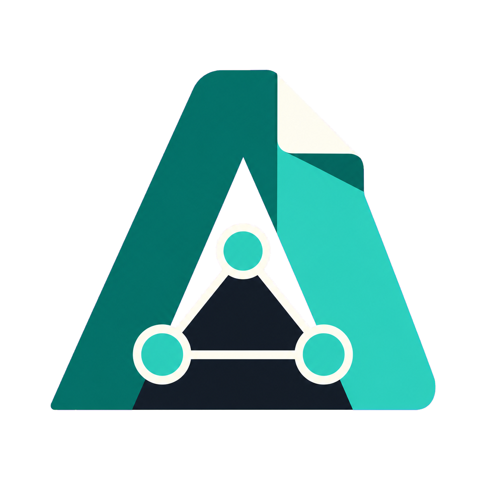
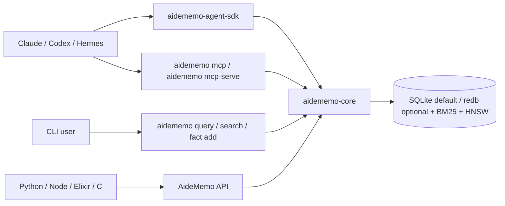

<div align="center">
  
  <h1 align="center">AideMemo</h1>
  <p><strong>Agent-friendly SDK memory for coding agents.</strong></p>
  <p>
    One Rust binary. One embedded store. A code-first SDK, MCP tools, CLI, and native bindings for agents that need memory with facts, graph traversal, and history.
  </p>
  <p>
    <a href="https://github.com/taeyun16/aidememo/actions/workflows/ci.yml"></a>
    <a href="./Cargo.toml"></a>
    <a href="./Cargo.toml"></a>
    <a href="#install"></a>
  </p>
  <p>
    <a href="./packages/aidememo-agent-sdk/README.md"></a>
    <a href="./AGENTS.md"></a>
    <a href="#architecture"></a>
    <a href="#why-aidememo"></a>
    <a href="./docs/MEASUREMENTS.md"></a>
    <a href="./COMPARE.md"></a>
  </p>
</div>

---

**AideMemo** (`aidememo`) is an agent-friendly SDK memory system for Claude Code, Codex, Cursor,
Hermes, and other coding agents. It stores project knowledge as typed facts
connected to entities and relations, keeps temporal history with validity
windows, and exposes the same store through a Python agent SDK, MCP tools, CLI,
and in-process bindings.

It is deliberately not a hosted memory SaaS, a full agent runtime, or a vector
database you have to operate. The default path is local and serverless: agents
can either call MCP tools directly or use `aidememo-agent-sdk` when they can execute
Python and need to keep intermediate memory state in code.



## Why AideMemo

| Need | What AideMemo gives you |
|---|---|
| Agent-friendly SDK memory | `aidememo-agent-sdk` gives code-executing agents `Memory.open`, `search_rows`, `coverage_by`, `aggregate_many`, and `remember`. |
| Local agent memory | Single binary + single embedded store. No Postgres, Qdrant, Neo4j, or hosted vendor. |
| More than vector recall | Typed facts, entities, relations, graph traversal, temporal validity, aggregation. |
| Agent-native access | SDK for code-first composition, MCP over stdio/HTTP for model-visible tools, plus a compact CLI for humans. |
| Shared team/project memory | Optional `source_id` scoping, multi-project stores, and a daemon path for shared writes. |
| Tool-builder embedding | Python, Node, Elixir, and C bindings call the same Rust core in process. |

## Install

```bash
# One-line installer
curl -fsSL https://raw.githubusercontent.com/taeyun16/aidememo/main/scripts/install.sh | bash

# Or directly with cargo
cargo install --git https://github.com/taeyun16/aidememo aidememo-cli

# Or from a checkout
cargo install --path crates/aidememo-cli
```

The binary is `aidememo`. Add `~/.cargo/bin` to your `PATH` if needed. CI and
local development versions are pinned in [`mise.toml`](mise.toml); run
`mise install` from a checkout to use the same Rust, Node, Python, Go, and
Elixir/Erlang versions. The workspace MSRV is `1.85`.

Registry releases are staged separately. Until the first crates.io, PyPI, and
npm publishes complete, prefer the Git or checkout install paths above.

## Documentation Site

The static documentation site lives in [`website/`](website/) and renders the
durable Markdown under [`docs/`](docs/) with Docusaurus.

```bash
mise run docs-install
mise run docs-start
mise run docs-build
```

## 60-Second Quickstart

From a checkout, see the core workflow in one zero-token command:

```bash
scripts/demo-workflow.sh
```

It creates a temporary store, seeds one Redis decision / lesson / error, then
starts a sparse ticket. Expected result: `OK: sparse ticket recovered decision
+ lesson + error context`.

Then try the same primitives by hand:

```bash
aidememo init ./my-wiki
aidememo fact add "Decided to use Redis Cluster for cache HA" \
  --type decision \
  --entities Redis,Cache

aidememo query "Redis cache"
aidememo recent -n 10
aidememo graph --from Redis --depth 2 --format mermaid
```

Register it with an agent:

```bash
aidememo init --agent codex ./my-wiki
aidememo --backend libsqlite mcp-install --target codex --source-id my-project

# Claude Code
claude mcp add aidememo -- aidememo --backend libsqlite mcp

# Codex CLI: ~/.codex/config.toml
[mcp_servers.aidememo]
command = "aidememo"
args = ["--backend", "libsqlite", "mcp"]
```

## Agent Entry Points

Most agent turns should start with one memory read and only branch when the
question shape requires it:

| Task shape | Use | Why |
|---|---|---|
| New issue, ticket, PR, or automation trigger | `aidememo_workflow_start` / `aidememo workflow start` | Creates a tracked session, stores the trigger, and returns decisions, lessons, errors, recent facts, and search hits. |
| Opening a normal interactive turn | `aidememo_context` | One MCP round-trip for pinned facts, personalisation, recent activity, and topic context. |
| Follow-up topic dive | `aidememo_query` | Lighter topic retrieval when pinned/recent context is already loaded. |
| Exact totals, counts, date sets, or timelines | `aidememo_aggregate` | Deterministic arithmetic over matching facts; use it as insurance for cross-fact counting, not for simple recall. |
| Learned a durable fact | `aidememo_fact_add` / `aidememo_fact_add_many` | Store typed memory explicitly; pass the `session_id` returned by `aidememo_workflow_start` to keep follow-up facts on the workflow thread. |
| Resuming a long workflow | `aidememo_session_canvas` / `aidememo session canvas` / SDK `session_canvas()` | Fetch a bounded Markdown + Mermaid map of the session with fact-id drill-down instead of injecting the whole thread. |
| Preparing project context | `aidememo_profile_export` / `aidememo profile export` / SDK `project_profile()` | Generate a read-only `project_profile.md` text view from current typed facts; the store remains the source of truth. |

The agent-facing memory profile itself is treated as an auditable artifact.
[`docs/SKILLOPT_LITE.md`](docs/SKILLOPT_LITE.md) describes the
SkillOpt-inspired loop, and `scripts/skillopt-lite-check.sh` gates candidate
`SKILL.md` / memory-profile edits before they are accepted.

## Common Workflows

### Search and recall

```bash
aidememo search "cache policy" -l 5
aidememo search "cache policy" --hybrid
aidememo query "Redis" --mode hybrid
aidememo overview
```

### Write durable memory

```bash
aidememo fact add "Use LRU for Redis edge caches" \
  --type convention \
  --entities Redis,Cache

aidememo fact supersede <OLD_ID> <NEW_ID>
aidememo edit fact <ID> --append "Confirmed in load test"
```

### Keep agent memories isolated in one store

```bash
aidememo fact add "Agent A prefers bm25 first" --entities Retrieval --source-id agent-a
aidememo fact add "Agent B is testing rerank" --entities Retrieval --source-id agent-b

aidememo search "retrieval preference" --source-id agent-a
```

Hermes uses the same `source_id` field through its plugin tools and slash
commands. SQLite is the default shared-store path. If the optional redb backend
is selected, the CLI fallback retries short lock collisions; for heavier
multi-agent redb writes, run one `aidememo mcp-serve` and point agents at it.

For MCP agents, install with `--source-id` to set `AIDEMEMO_SOURCE_ID` once in
the server environment. Pass `--backend` before `mcp-install` to pin the same
storage backend in the installed MCP command. That namespace becomes the
default for reads and writes; explicit `source_id` tool arguments still
override it.

```bash
aidememo --backend libsqlite mcp-install --target codex --source-id agent-a
```

### Compose memory in Python when the agent can run code

Use MCP tools for one-off, model-visible calls. Use `aidememo-agent-sdk` when a task
needs fanout retrieval, dedupe, coverage checks, aggregation, or batch writes
without routing every intermediate row through the LLM context.

```bash
# From a checkout, until the PyPI release lands:
python -m pip install -e packages/aidememo-agent-sdk

# After the PyPI release:
python -m pip install aidememo-agent-sdk
```

The SDK falls back to the `aidememo` CLI on `PATH`. The optional native binding
fast path becomes `python -m pip install "aidememo-agent-sdk[binding]"` after
the `aidememo-python` PyPI release.

```python
from aidememo_agent import Memory

mem = Memory.open(source_id="research-alpha", storage_backend="libsqlite")
rows = mem.search_rows([
    "release preflight decisions",
    {"query": "lock retry lessons", "topic": "Shared store"},
])
coverage = mem.coverage_by(rows, ["fact_type"])

mem.remember([
    {
        "content": "Lesson: source-scoped fanout keeps multi-agent memory checks isolated.",
        "fact_type": "lesson",
        "entities": ["aidememo", "Agents"],
    }
])
```

### Start from a sparse issue or ticket

```bash
aidememo workflow start "Fix Redis timeout in worker" \
  --body-file issue.md \
  --source github:org/repo#123 \
  --bm25-only \
  --json
```

This creates a tracked session, records the incoming ticket as a `question`
fact, and returns a context pack with relevant decisions, lessons, errors, and
search hits so an automation-triggered agent can start with project memory
instead of only the issue body. `--bm25-only` keeps demos and hooks
deterministic by skipping embedding-model load; omit it when semantic recall is
worth the warm model cost.

MCP agents should pass the returned `session_id` to `aidememo_fact_add` or
`aidememo_fact_add_many` for facts learned during the task. That keeps follow-up
decisions, lessons, and errors attached to the workflow thread for later
`level:"session"` recall.

For long-running tasks, export a read-only session canvas before resuming:

```bash
aidememo session canvas "$AIDEMEMO_SESSION_ID" --limit 20 --output session_canvas.md
aidememo profile export --output project_profile.md
```

The same artifacts are available on the agent hot path through MCP
(`aidememo_session_canvas`, `aidememo_profile_export`) and through
`aidememo-agent-sdk` (`Memory.session_canvas(...)`, `Memory.project_profile(...)`).

These artifacts borrow the useful part of layered memory systems: a compact
macro view with deterministic drill-down. They do not auto-capture hidden state
or replace typed facts; every durable claim still points back to `aidememo fact
get <id>`.

### Share a warm store when concurrency matters

```bash
aidememo daemon start
aidememo daemon status

# Or run the HTTP MCP server explicitly
aidememo mcp-serve --port 3000
curl http://127.0.0.1:3000/health
curl http://127.0.0.1:3000/admin/status
```

Daemon mode is an optimization, not required onboarding. It keeps the model and
store warm and avoids per-command open costs. For same-host serverless sharing,
`aidememo config set store.lock_retry_ms 5000` is the smoother default up to about
four concurrent writers; use the daemon path when more agents write in
parallel.

## Measured Claims

| Measurement | Result |
|---|---:|
| LongMemEval-S retrieval, bge + two-stage rerank | R@10 `0.992`, MRR `0.958` |
| LongMemEval-S E2E, bge + rerank + MiniMax reader | `74.0%` |
| gbrain-evals BrainBench, aidememo BM25 | P@5 `17.4%`, R@5 `64.1%` |
| gbrain-evals BrainBench, aidememo BM25 via daemon | same score, `5.7x` faster |
| Hermes two-process optional-redb serverless shared store, retry `5000` | 20/20 writes persisted, 0 lock errors |
| Optional-redb serverless lock-retry sweep, retry `5000` | smooth through 4 writers; 8 writers persisted 79/80 |
| HTTP shared `mcp-serve`, 2 clients x 10 writes | p50 `18.4ms`, p95 `41.8ms`, 20/20 persisted |
| Zero-token workflow demo | decision + lesson + error surfaced in `128ms` |
| MCP source/backend-default install Scenario M | 21/21 invariants; installed `AIDEMEMO_SOURCE_ID` + `--backend libsqlite` scoped MCP write/search in `111.6ms` |
| Hermes Memory-as-Code Scenario N | 9/9 invariants; SDK fanout/dedupe/coverage/aggregate excluded beta-source rows |
| `aidememo-agent-sdk` pack smoke | wheel install + `Memory` / `AideMemoClient` / `AideMemoMemorySDK` artifact-method checks passed in `3.38s` |
| `hermes-aidememo` pack smoke | wheel install + SDK re-export / bundled skill / opt-in capture adapter checks passed in `4.43s` |
| `aidememo-agent-sdk` publish workflow | PyPI payload dry-run + trusted-publisher workflow defaults to dry-run |
| `hermes-aidememo` publish workflow | PyPI payload dry-run + trusted-publisher workflow defaults to dry-run |
| SkillOpt-lite profile gate | validates candidate memory-profile tokens, `aidememo skill check`, workflow demo, and SDK promotion gate |
| SkillOpt-lite periodic cycle | records accepted / rejected skill-profile candidates under `target/skillopt-lite`; applies only with `--apply` |
| `aidememo-napi` package split | root JS/types package + current-platform optional package install smoke passed |
| `aidememo-napi` version gate | root/platform package versions and optionalDependency pins verified together |
| `aidememo-napi` publish workflow | trusted-publisher workflow defaults to dry-run and gates real publish on exact version input |

See [`docs/MEASUREMENTS.md`](docs/MEASUREMENTS.md) for methodology, commands,
and caveats. The short version: AideMemo should lead with operational simplicity
and temporal memory semantics, not a SOTA benchmark claim.

## Feature Map

| Area | Features |
|---|---|
| Retrieval | BM25, semantic HNSW, hybrid RRF, optional TEI / fastembed rerank |
| Graph | entities, facts, relations, traversal, shortest path, Mermaid / DOT export |
| Time | `supersede`, `current_only`, `as_of`, archive / cold tier |
| Agent tools | 25 MCP tools including `aidememo_workflow_start`, `aidememo_context`, `aidememo_query`, `aidememo_aggregate`, `aidememo_fact_add_many` |
| Capture | `aidememo_extract`, pending review queue, `aidememo pending list/stats/approve/reject`, opt-in Hermes/OpenClaw capture adapter |
| Artifacts | `aidememo session canvas`, `aidememo profile export` for bounded, auditable Markdown views over typed facts |
| Ops | `doctor` / MCP `aidememo_doctor`, `overview`, `bench`, `vector-rebuild`, `consolidate`, `auto-relate` |
| Sharing | `source_id`, multi-project stores, stdio MCP, HTTP/SSE MCP, daemon discovery, branch logs for cloud agents and speculative memory runs |
| Code-first composition | `aidememo-agent-sdk` with `Memory.open`, `search_rows`, `coverage_by`, `aggregate_many`, `remember` |
| Bindings | Python, Node, Elixir, C |

## CLI Reference

| Category | Commands |
|---|---|
| Setup | `aidememo init`, `aidememo init --agent codex`, `aidememo project create/use/list` |
| Read | `aidememo search`, `aidememo query`, `aidememo recent`, `aidememo overview`, `aidememo traverse`, `aidememo path`, `aidememo graph` |
| Write | `aidememo fact add`, `aidememo fact supersede`, `aidememo fact archive`, `aidememo edit fact`, `aidememo entity describe`, `aidememo relation add` |
| Maintenance | `aidememo doctor`, `aidememo lint`, `aidememo bench`, `aidememo backup`, `aidememo branch`, `aidememo pending`, `aidememo workflow`, `aidememo ingest`, `aidememo watch`, `aidememo vector-rebuild`, `aidememo consolidate` |
| Server | `aidememo mcp`, `aidememo mcp-serve`, `aidememo daemon start/status/stop`, `aidememo mcp-install` |
| Config | `aidememo config get/set/list`, `aidememo auth generate/login/list/logout` |

Useful knobs:

```bash
aidememo config set store.durability eventual    # faster writes, less power-loss safety
aidememo config set store.lock_retry_ms 5000     # smooth short write contention
aidememo doctor --json                           # includes sharing.mode and daemon guidance
aidememo config set model.provider fastembed
aidememo config set model.name bge-small-en-v1.5
aidememo backup create ~/backups/aidememo       # consistent SQLite snapshot + manifest
aidememo backup restore ~/backups/aidememo/backup-01... --force
aidememo branch push --branch agent-a --base ~/backups/aidememo/backup-01... ~/backups/aidememo
aidememo branch merge --branch agent-a ~/backups/aidememo

# SQLite is the default local backend. `libsqlite` is an alias for the same path.
# Build with `--features redb` to opt into redb.
aidememo config set store.backend sqlite
aidememo config set store.backend libsqlite
aidememo config set store.backend redb
# Or override for one command without mutating config:
aidememo --backend libsqlite --store ./_meta/wiki.sqlite stats
```

Branch logs are for cloud agents or what-if runs that start from one backup and
write memory independently. Merge the winning branch and leave noisy candidates
unmerged. See [`docs/BRANCHES.md`](docs/BRANCHES.md).

Native bindings use the same backend selector. Default builds include SQLite;
build with Cargo `redb` to open redb stores:

```python
g = aidememo.AideMemo("./_meta/wiki.sqlite", backend="sqlite")
g = aidememo.AideMemo("./_meta/wiki.sqlite", backend="libsqlite")
g = aidememo.AideMemo("./_meta/wiki.redb", backend="redb")
```

## Architecture

| Crate | Purpose |
|---|---|
| `aidememo-core` | SQLite default store, optional redb store, ingest, BM25, semantic search, graph, lint, lifecycle |
| `aidememo-cli` | `aidememo` binary: CLI, stdio MCP, HTTP/SSE MCP |
| `aidememo-agent-sdk` | Python composition layer for code-executing agents (Codex, Claude Code, Hermes, CI); uses `aidememo-python` or CLI fallback |
| `aidememo-python` | PyO3 bindings |
| `aidememo-napi` | Node.js bindings |
| `aidememo-nif` | Elixir/Erlang bindings |
| `aidememo-ffi` | C ABI bindings |
| `benchmarks` | Rust benchmark binaries and reproducible fixtures |

## Influences And References

AideMemo is not a clone of any one system. The design combines ideas from agent
skill optimization, long-term memory benchmarks, temporal knowledge graphs,
and local coding-agent tools:

| Reference | What AideMemo borrows or reacts to |
|---|---|
| [SkillOpt](https://arxiv.org/abs/2605.23904) / [project page](https://microsoft.github.io/SkillOpt/) | Treat the agent memory skill/profile as a trainable artifact. AideMemo borrows bounded edits, validation gates, rejected-edit buffers, and static deployment through `scripts/skillopt-lite-check.sh` / `scripts/skillopt-lite-cycle.sh`. |
| [SkillOps](https://arxiv.org/abs/2605.13716) | Adjacent framing for periodic skill-library maintenance. AideMemo keeps the lighter single-profile loop for now instead of a full skill ecosystem graph. |
| [SkillMOO](https://arxiv.org/abs/2604.09297) | Adjacent multi-objective skill tuning work. AideMemo currently gates correctness and workflow invariants first; cost/runtime trade-offs are future optimizer inputs. |
| [LongMemEval](https://arxiv.org/abs/2410.10813) and [LongMemEval-V2](https://arxiv.org/abs/2605.12493) | Benchmark shape for long-term personal / agent memory. AideMemo uses these results to calibrate retrieval, aggregation, and reader-side caveats without leading with SOTA claims. |
| [Graphiti](https://github.com/getzep/graphiti) / [Zep](https://www.getzep.com/) | Temporal knowledge-graph semantics and validity-window comparisons. AideMemo keeps similar history semantics but uses one embedded local store. |
| [Mem0](https://github.com/mem0ai/mem0) and [Letta](https://github.com/letta-ai/letta) | Cloud/default extraction and memory-OS alternatives. AideMemo intentionally stays bring-your-own-agent, explicit, and local-first. |
| [Mastra Observational Memory](https://mastra.ai/research/observational-memory) and [OMEGA](https://omegamax.co/docs/benchmark-report) | High-scoring memory-system references. AideMemo uses them as benchmark context while prioritizing SDK ergonomics and zero-token default ingest. |
| [beads](https://gastownhall.github.io/beads/) | Agent-oriented local task graph and `bd ready` workflow. AideMemo borrows the agent-local tool ergonomics, but focuses on typed memory retrieval rather than issue dependency tracking. |

See [`COMPARE.md`](COMPARE.md) for the broader competitive map and source
ledger, and [`docs/MEASUREMENTS.md`](docs/MEASUREMENTS.md) for the commands and
numbers behind claims in this README.

## Compare

| Alternative | Pick it when | Pick AideMemo when |
|---|---|---|
| Mem0 | You want managed memory and automatic cloud extraction. | You want local-first explicit facts and no default vendor dependency. |
| Letta | You want a full stateful agent runtime. | You already have an agent and need a pluggable memory layer. |
| Graphiti / Zep | You need a server-centric temporal graph with Neo4j and community detection. | You want similar temporal semantics in a single local binary. |
| beads | You need a dependency-aware issue tracker with merge. | You need hybrid retrieval over facts and graph context. |
| OMEGA-style systems | You optimize for top LongMemEval scores with heavier prompt/hook machinery. | You optimize for portability, deployment simplicity, and explicit memory control. |

Full comparison: [`COMPARE.md`](COMPARE.md). SDK promotion criteria:
[`docs/SDK_POSITIONING.md`](docs/SDK_POSITIONING.md). Current measurements and
release gates: [`docs/MEASUREMENTS.md`](docs/MEASUREMENTS.md).

## Repository Guide

```text
crates/       Rust workspace crates
packages/     Python agent SDK packages
plugins/      Agent integrations, including Hermes
aidememo-skill/     Agent-facing skill and setup docs
bench/        Scenario benchmarks and multi-agent checks
benchmarks/   Rust benchmark crate and gbrain adapter
scripts/      Install, CI, Hermes, and analysis scripts
docs/         Durable measurement and design documentation
```

For agent-specific instructions, read [`AGENTS.md`](AGENTS.md). For local
script organization, read [`scripts/README.md`](scripts/README.md).

## License

AideMemo is licensed under either the [MIT License](LICENSE-MIT) or the
[Apache License 2.0](LICENSE-APACHE), at your option.

## Security

Please report vulnerabilities privately. See [SECURITY.md](SECURITY.md).
