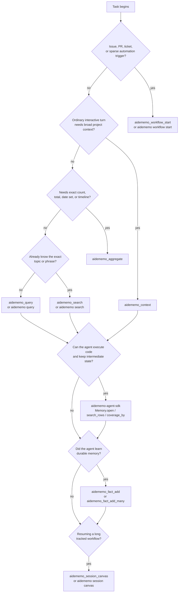

# Agent Workflows

AideMemo works best when agents start with one focused memory read, then branch
only when the task shape requires it. This page is the operating guide for that
choice. Configure your agent first with
[`Coding Agent Setup`](CODING_AGENTS.md): Claude Code, Codex, Hermes, and MCP
clients can call tools directly, while pi follows the same flow through its
installed skill and local CLI commands.



## Entry point by task shape

| Task shape | Use | Why |
|---|---|---|
| New issue, PR, ticket, or automation trigger | `aidememo_workflow_start` / `aidememo workflow start` | Creates a tracked session, stores the trigger, and returns relevant decisions, lessons, errors, recent facts, and search hits. |
| Opening a normal interactive turn | `aidememo_context` | One MCP round-trip for pinned facts, personalisation, recent activity, and topic context. |
| Follow-up topic dive | `aidememo_query` | Lighter retrieval when pinned and recent context are already loaded. |
| Pinpoint recall | `aidememo_search` | Fast direct search without graph or recent-context wrapping. |
| Exact totals, counts, date sets, or timelines | `aidememo_aggregate` | Deterministic arithmetic over matching facts. Use it for cross-fact calculations, not simple recall. |
| Learned one durable fact | `aidememo_fact_add` / `aidememo fact add` | Stores typed memory explicitly and can attach it to a workflow session. |
| Learned several durable facts | `aidememo_fact_add_many` | Batches writes so the disk sync cost is paid once. |
| Resuming a long workflow | `aidememo_session_canvas` / `aidememo session canvas` / `Memory.session_canvas(...)` | Returns a bounded Markdown and Mermaid map with fact-id drill-down commands. |
| Preparing compact project context | `aidememo_profile_export` / `aidememo profile export` / `Memory.project_profile(...)` | Generates a read-only profile from current typed facts while keeping the store as the evidence trail. |

## Sparse ticket pattern

Use workflow start when the agent only has a title, issue body, PR description,
or automation trigger.

```bash
aidememo workflow start "Fix Redis timeout in worker" \
  --body-file issue.md \
  --source "github:org/app#123" \
  --source-id team-a \
  --bm25-only
```

The returned `session_id` is the thread handle. Pass it back when adding facts
through MCP:

```json
{
  "content": "Lesson: the timeout was DNS resolution, not pool size.",
  "fact_type": "lesson",
  "entities": ["Redis", "Worker"],
  "session_id": "session-..."
}
```

For the CLI, evaluate the export printed by `aidememo workflow start` or set
`AIDEMEMO_SESSION_ID` yourself before follow-up `fact add` calls.

## Normal turn pattern

Use `aidememo_context` at the start of an ordinary agent turn when the user asks
about a project, preference, recent work, or known topic. It is broader than
search: it can include pinned memory, personalisation facts, recent activity,
topic search, graph traversal, and lessons/errors in one response.

After that first read, prefer `aidememo_query` for a narrower topic. Prefer
`aidememo_search` only when the agent already knows it needs direct ranked hits.

## Aggregation trigger

Do not call `aidememo_aggregate` just because a question is hard. Call it when
the answer requires deterministic arithmetic or set operations across facts.

| User question shape | Aggregate op |
|---|---|
| "How much total did I spend on X?" | `sum_currency` |
| "How many hours of Y?" | `sum_duration` |
| "How many distinct days had event Z?" | `count_distinct_dates` |
| "Timeline of all X events" | `timeline` |
| "How many times did I decide or try X?" | `count` or `enumerate` |

For "what did I say about X?", "when did I last do Y?", or "what is my
preference for Z?", answer from `aidememo_context`, `aidememo_query`, or
`aidememo_search` snippets instead.

## Fact typing

Classify facts before writing them. Type-aware ranking is useful only when the
store receives the right type.

| Cue | fact_type |
|---|---|
| "I prefer X", "my favorite is Y" | `preference` |
| "we decided to X", "go with Y" | `decision` |
| "tried X but hit Y", "turns out" | `lesson` |
| "avoid X", "never again" | `error` |
| "always X", "every time" | `convention` |
| "X uses Y for Z" | `pattern` |
| factual assertion | `claim` |
| catch-all context | `note` |

If `fact_type` is omitted, AideMemo applies deterministic strong-cue inference
for explicit `preference`, `lesson`, `error`, `decision`, and `convention`
phrases. Explicit `note` is preserved, but write responses may include
`fact_type_hint` when the content looks mistyped.

When a store is shared, always pass `source_id` or install MCP with
`AIDEMEMO_SOURCE_ID` through `aidememo --backend libsqlite mcp-install
--target <agent> --source-id <namespace>`. For pi, include `--source-id` in the
CLI calls selected by the skill because pi has no MCP registration step.

## Code-first pattern

Use the Python agent SDK when the agent can execute code and needs fanout
retrieval, dedupe, coverage checks, aggregation, or batch writes without routing
every intermediate row through model context.

```python
from aidememo_agent import Memory

mem = Memory.open(source_id="team-a", storage_backend="libsqlite")
rows = mem.search_rows([
    "Redis timeout decisions",
    {"query": "billing webhook duplicates", "topic": "Billing"},
])
coverage = mem.coverage_by(rows, ["fact_type"])
timeline = mem.aggregate_many([
    {"query": "Redis timeout", "op": "timeline"},
])
mem.remember([
    {
        "content": "Decision: Redis timeout fixes start with DNS metrics.",
        "fact_type": "decision",
        "entities": ["Redis", "Worker"],
    }
])
```

Use MCP when the model should call a small number of visible tools directly.
Use the SDK when code should keep intermediate memory state compact and only
return the final evidence or summary to the model.
