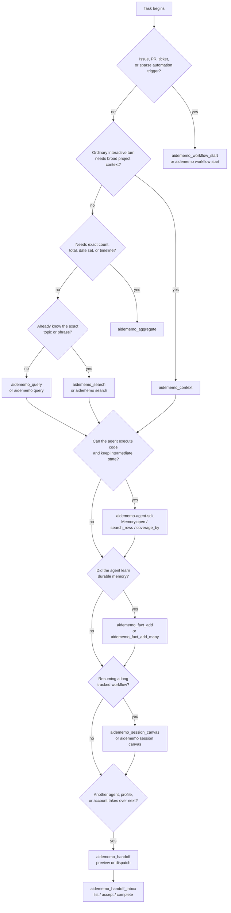

# Agent Workflows

AideMemo works best when agents start with one focused memory read, then branch
only when the task shape requires it. This page is the operating guide for that
choice. Configure your agent first with
[`Coding Agent Setup`](CODING_AGENTS.md): Claude Code, Codex, Hermes, and MCP
clients can call tools directly, while pi follows the same flow through its
installed skill and local CLI commands.



## Entry point by task shape

| Task shape | Use | Why |
|---|---|---|
| New issue, PR, ticket, or automation trigger | `aidememo_workflow_start` / `aidememo workflow start` | Creates a tracked session, stores the trigger, and returns relevant decisions, lessons, errors, recent facts, and search hits. |
| Opening a normal interactive turn | `aidememo_context` | One MCP round-trip for pinned facts, personalisation, recent activity, and topic context. |
| Follow-up topic dive | `aidememo_query` | Lighter retrieval when pinned and recent context are already loaded. |
| Pinpoint recall | `aidememo_search` | Fast direct search without graph or recent-context wrapping. |
| Exact totals, counts, date sets, or timelines | `aidememo_aggregate` | Deterministic arithmetic over matching facts. Use it for cross-fact calculations, not simple recall. |
| Learned one durable fact | `aidememo_fact_add` / `aidememo fact add` | Stores typed memory explicitly and can attach it to a workflow session. |
| Learned several durable facts | `aidememo_fact_add_many` | Batches writes so the disk sync cost is paid once. |
| Resuming a long workflow | `aidememo_session_canvas` / `aidememo session canvas` / `Memory.session_canvas(...)` | Returns a bounded Markdown and Mermaid map with fact-id drill-down commands. |
| Routing work across agent installations or accounts | `aidememo_handoff` + `aidememo_handoff_inbox` / CLI `handoff` / SDK handoff methods | Previews a packet or dispatches a pull-based pointer to the same workflow session, then explicitly accepts/completes it. An existing scheduler such as Hermes Kanban remains the owner of its internal task state. |
| Preparing compact project context | `aidememo_profile_export` / `aidememo profile export` / `Memory.project_profile(...)` | Generates a read-only profile from current typed facts while keeping the store as the evidence trail. |

## Cross-agent handoff pattern

For recurring local accounts, use the short path first:

```bash
aidememo agent add codex-two --type codex \
  --home /path/to/codex-two-home --workspace /path/to/repo \
  --source-id team-a
aidememo handoff send codex-two \
  --focus "Review the patch and run the focused regression test" \
  --done-when "Focused tests pass and findings are recorded"
aidememo handoff run codex-two
aidememo handoff show handoff-...
```

The active session and sender are read from `AIDEMEMO_SESSION_ID` and
`AIDEMEMO_ACTOR_ID`. Use the detailed route below only when an orchestrator
needs to override those inferred values.

AideMemo separates four concepts that orchestrators often collapse:

| Concept | Meaning |
|---|---|
| `session_id` | Continuity: which tracked workflow the next worker resumes. |
| `source_id` | Scope: which project/team/tenant facts are visible in a shared store. |
| `actor_id` | Address: a user-assigned account/installation alias such as `codex-one`. It is not authentication. |
| agent/profile route | Scheduling metadata: which runtime and role should receive the packet. It is not an authorization boundary. |

The outgoing worker should first attach any durable decision, lesson, error, or
open question to the session. Then create the packet:

```bash
aidememo session handoff \
  --from-actor codex-one \
  --to-actor codex-two \
  --from codex/coding \
  --to codex/reviewer \
  --source-id team-a \
  --focus "Review the patch and run the focused regression test" \
  --done-when "Focused tests pass and review findings are recorded on the session" \
  --dispatch \
  "$AIDEMEMO_SESSION_ID"
```

Routes use `AGENT[/PROFILE]`; the explicit `from_agent` / `from_profile` and
`to_agent` / `to_profile` fields remain available for compatibility. A
Hermes-to-Hermes evidence preview may use `--from hermes/coding --to
hermes/reviewer`, but a same-board profile transition must stay in Kanban and
must not create a second AideMemo assignment. Without `--dispatch` this is a
read-only packet preview. With dispatch, an external receiver calls
`aidememo_handoff_inbox` with `action=list`, then
`accept`; accept renders current session evidence and returns the structured
session/source/actor resume values. After persisting result evidence, the
receiver calls `return` with its fact id and outcome. The sender reads the
linked evidence through `outbox` or `status`. MCP callers pass the returned
`session_id` into later fact writes; shell users may evaluate the resume command.

For programmatic routing, call `Memory.handoff_packet(...)`. It returns the
same Markdown under `content` plus structured `session_id`, `source_id`, route,
`focus`, `done_when`, and `resume` fields. `Memory.handoff(...)` remains the
text-only shortcut for direct prompt injection.

For a manual shell handoff, the accept response also carries the same
`aidememo session resume` bootstrap used by read-only packets.

The assignment layer is not a message broker. It has no topics, offsets,
consumer groups, leases, retry delivery, or copied payload. Multiple clients
using the same actor alias can act on the same assignment, so give each
installation a unique non-secret alias. A successful `return` completes the
acknowledgement, while a failed return stays accepted for the orchestrator; it
does not schedule a retry or prove distributed task success.

The compatibility spelling for registration and execution remains available
to existing scripts:

```bash
aidememo installation add codex-two --agent codex \
  --config-home /path/to/codex-two-home --workspace /path/to/repo \
  --source-id team-a
aidememo handoff run --installation codex-two --next
```

The worker maps the config root to `CODEX_HOME` or `CLAUDE_CONFIG_DIR` and uses
the `core` environment policy by default. Credential values remain owned by
the coding agent and are never written into AideMemo configuration.

### Handoff use cases

| Use case | Route example | What must survive |
|---|---|---|
| Implementation to review | `codex/coding -> hermes/reviewer` | Decisions, known failures, focused tests, definition of done. |
| Two subscriptions of the same agent | `codex-one -> codex-two` | Same session despite vendor-local chat/session ids; reviewer writes back by returned session id. |
| Hermes Kanban to external worker | `hermes/research -> codex/coding` | Experiment result, rejected approaches, implementation target; Kanban still owns the card. |
| Incident shift change | `hermes/oncall -> claude-code/incident` | Timeline, mitigations already tried, active risk, next diagnostic. |
| Research to implementation | `hermes/research -> codex/coding` | Measured evidence, claim boundary, selected intervention. |
| Branch winner promotion | `codex/experiment -> codex/integrator` | Winning branch id, merge prerequisite, validation command, rollback condition. |

These patterns share the same continuity/scope/routing contract. A handoff
packet is not a distributed lock, authorization token, or proof that the next
model completed the task; `done_when` states the expected observable outcome,
while completion must still be validated separately.

## Hermes Kanban boundary

Do not mirror a Hermes card into the AideMemo assignment ledger. Kanban already
provides the durable queue and lifecycle state. Compose the two systems at the
memory and external-worker boundaries:

| Situation | Hermes Kanban | AideMemo |
|---|---|---|
| Same-board PM → coder → reviewer | Owns dependency edges, claims, comments, run summaries, review, and completion | Carries durable decisions/lessons/errors on a shared workflow session; no AideMemo dispatch. |
| Retry, stale claim, or worker crash | Owns retry/reclaim and immediate prior-attempt context | Recalls failures that matter beyond the current run or card. |
| Cross-board follow-up | Owns the new card only; boards remain isolated | Retrieves relevant evidence from the project `source_id`. |
| Hermes → Codex/Claude external lane | Card remains running/blocked until the external result is validated | Dispatches one session pointer to the addressed installation and returns current fact-linked evidence. |
| Fleet experiment → selected implementation | Owns fan-out, workspaces, and winner/reviewer gate | Stores comparable measurements and preserves the winning claim boundary. |

Use `source_id` for the project/team retrieval boundary. Keep the Hermes board
slug and task id as upstream references in the card/session metadata; they are
not `actor_id`. Reserve `actor_id` for an addressable external account or
installation. A worker should reuse an AideMemo `session_id` carried in the
parent handoff or card comment and pass it to `aidememo_fact_add` or
`aidememo_fact_add_many`.

### External CLI receiver

The Python SDK installs `aidememo-worker-lane` for the explicit external
boundary. It accepts one addressed assignment, starts Codex or Claude with the
current handoff packet on stdin, and writes the outcome back to the same
session:

```bash
aidememo-worker-lane handoff-... \
  --actor-id codex-two \
  --agent codex \
  --workspace "$PWD" \
  --source-id release-team \
  --kanban-task task-42
```

The runner invokes argv directly without a shell. A successful process adds a
session result before completing the AideMemo acknowledgement; a non-zero exit
or timeout adds an `error` fact and leaves it `accepted` for the upstream
scheduler. `--kanban-task` is correlation metadata only: the runner never
claims, retries, or completes a Hermes card. It also does not provide
authentication, exactly-once execution, or Hermes `spawn_fn` registration.

If the receiver runs on another machine, export and merge the fact delta with
branch logs first. The handoff packet routes the task; the branch segment moves
the source-of-truth records.

## Sparse ticket pattern

Use workflow start when the agent only has a title, issue body, PR description,
or automation trigger.

```bash
aidememo workflow start "Fix Redis timeout in worker" \
  --body-file issue.md \
  --source "github:org/app#123" \
  --source-id team-a \
  --bm25-only
```

The returned `session_id` is the thread handle. Pass it back when adding facts
through MCP:

```json
{
  "content": "Lesson: the timeout was DNS resolution, not pool size.",
  "fact_type": "lesson",
  "entities": ["Redis", "Worker"],
  "session_id": "session-..."
}
```

For the CLI, evaluate the export printed by `aidememo workflow start` or set
`AIDEMEMO_SESSION_ID` yourself before follow-up `fact add` calls.

## Normal turn pattern

Use `aidememo_context` at the start of an ordinary agent turn when the user asks
about a project, preference, recent work, or known topic. It is broader than
search: it can include pinned memory, personalisation facts, recent activity,
topic search, graph traversal, and lessons/errors in one response.

After that first read, prefer `aidememo_query` for a narrower topic. Prefer
`aidememo_search` only when the agent already knows it needs direct ranked hits.

## Aggregation trigger

Do not call `aidememo_aggregate` just because a question is hard. Call it when
the answer requires deterministic arithmetic or set operations across facts.

| User question shape | Aggregate op |
|---|---|
| "How much total did I spend on X?" | `sum_currency` |
| "How many hours of Y?" | `sum_duration` |
| "How many distinct days had event Z?" | `count_distinct_dates` |
| "Timeline of all X events" | `timeline` |
| "How many times did I decide or try X?" | `count` or `enumerate` |

For "what did I say about X?", "when did I last do Y?", or "what is my
preference for Z?", answer from `aidememo_context`, `aidememo_query`, or
`aidememo_search` snippets instead.

## Fact typing

Classify facts before writing them. Type-aware ranking is useful only when the
store receives the right type.

| Cue | fact_type |
|---|---|
| "I prefer X", "my favorite is Y" | `preference` |
| "we decided to X", "go with Y" | `decision` |
| "tried X but hit Y", "turns out" | `lesson` |
| "avoid X", "never again" | `error` |
| "always X", "every time" | `convention` |
| "X uses Y for Z" | `pattern` |
| factual assertion | `claim` |
| catch-all context | `note` |

If `fact_type` is omitted, AideMemo applies deterministic strong-cue inference
for explicit `preference`, `lesson`, `error`, `decision`, and `convention`
phrases. Explicit `note` is preserved, but write responses may include
`fact_type_hint` when the content looks mistyped.

When a store is shared, always pass `source_id` or install MCP with
`AIDEMEMO_SOURCE_ID` through `aidememo --backend libsqlite mcp-install
--target <agent> --source-id <namespace>`. For pi, include `--source-id` in the
CLI calls selected by the skill because pi has no MCP registration step.

## Code-first pattern

Use the Python agent SDK when the agent can execute code and needs fanout
retrieval, dedupe, coverage checks, aggregation, or batch writes without routing
every intermediate row through model context.

```python
from aidememo_agent import Memory

mem = Memory.open(source_id="team-a", storage_backend="libsqlite")
rows = mem.search_rows([
    "Redis timeout decisions",
    {"query": "billing webhook duplicates", "topic": "Billing"},
])
coverage = mem.coverage_by(rows, ["fact_type"])
timeline = mem.aggregate_many([
    {"query": "Redis timeout", "op": "timeline"},
])
mem.remember([
    {
        "content": "Decision: Redis timeout fixes start with DNS metrics.",
        "fact_type": "decision",
        "entities": ["Redis", "Worker"],
    }
])
```

Use MCP when the model should call a small number of visible tools directly.
Use the SDK when code should keep intermediate memory state compact and only
return the final evidence or summary to the model.
