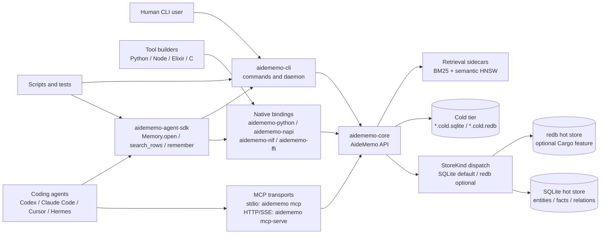
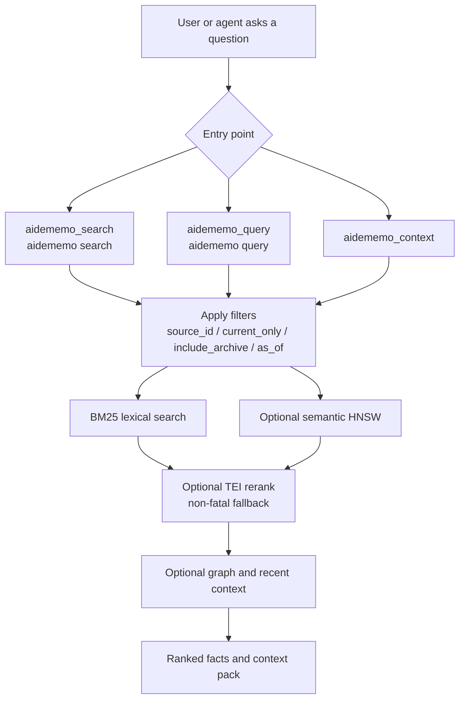
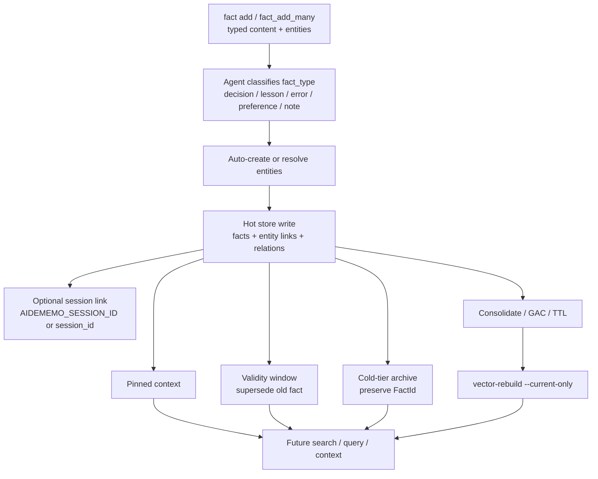
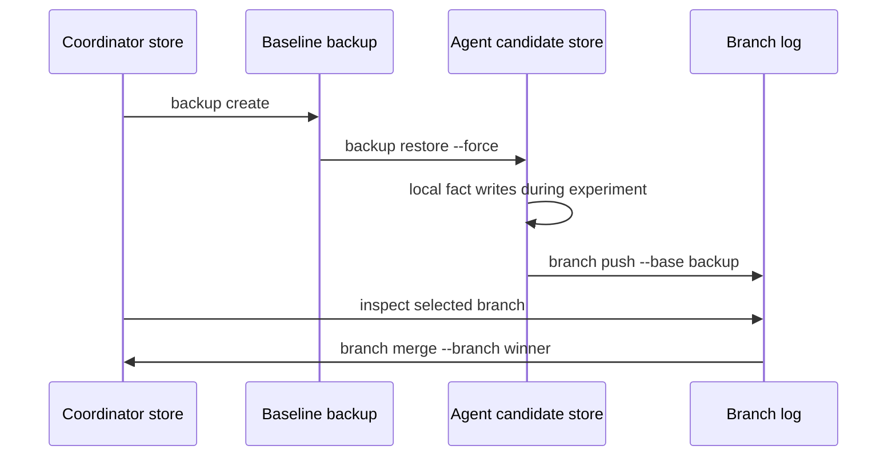

# Architecture

AideMemo is one Rust core with several access surfaces. The same typed facts,
entities, relations, validity windows, BM25 index, semantic HNSW sidecar, and
archive semantics are exposed through the CLI, MCP tools, Python agent SDK, and
native bindings.

## System map



The public dispatch point is `AideMemo` in `aidememo-core`. Storage selection is
centralized behind `StoreKind`: SQLite / `libsqlite` is the default runtime
backend, while `redb` is selected only when the crate is built with the optional
Cargo feature and the config or CLI asks for it.

## Retrieval flow



Use `search` for direct ranked hits, `query` for a focused context pack, and
`context` for the broad opening-turn envelope. The CLI defaults to the
auto-hybrid policy: a BM25 probe stays lexical when confidence is good and
promotes weak or CJK queries to semantic retrieval when the semantic path is
ready. `--hybrid` forces semantic ranking for every query. MCP callers can pass
`bm25_only:true` when they need deterministic low-latency behavior.

## Write and lifecycle flow



Facts are intentionally explicit. AideMemo does not need a built-in hosted
extractor for normal agent loops because the calling agent already has the
stronger model and should classify durable facts before writing them. The
`extract` and `pending` commands exist for opt-in capture and review workflows.

## Cloud and branch-log flow



Branch logs are append-only artifacts for cloud agents and speculative memory
experiments. They are not full multi-master conflict resolution: duplicate
records are skipped through `sync_import`, independent facts are appended, and
semantic conflicts between competing decisions remain application policy.

## Source map

| System area | Primary implementation | Public docs |
|---|---|---|
| CLI commands and parsers | `crates/aidememo-cli/src/cmd/mod.rs`, `crates/aidememo-cli/src/main.rs` | [`CLI Usage`](CLI.md), [`Feature Inventory`](FEATURES.md) |
| MCP tools and schemas | `crates/aidememo-cli/src/cmd/mcp_tools.rs` | [`MCP Setup`](MCP.md), [`Agent Workflows`](AGENT_WORKFLOWS.md) |
| Core API and retrieval | `crates/aidememo-core/src/lib.rs`, `search.rs`, `graph.rs` | [`Architecture`](ARCHITECTURE.md), [`Operations`](OPERATIONS.md) |
| Storage dispatch | `crates/aidememo-core/src/backend.rs`, `sqlite_store.rs`, `store.rs` | [`Operations`](OPERATIONS.md), [`Feature Inventory`](FEATURES.md) |
| Python agent SDK | `packages/aidememo-agent-sdk/src/aidememo_agent/sdk.py` | [`Python SDK`](SDK.md), [`Agent Workflows`](AGENT_WORKFLOWS.md) |
| Native bindings | `crates/aidememo-python`, `crates/aidememo-napi`, `crates/aidememo-nif`, `crates/aidememo-ffi` | [`Python SDK`](SDK.md), package READMEs |
| Validation and release gates | `scripts/changelog-release-check.py`, `scripts/registry-readiness-check.py`, `scripts/cargo-package-readiness.sh`, `scripts/docs-feature-gate.py`, `scripts/docs-site-e2e.py`, `scripts/*smoke*.sh`, `scripts/ci-local.sh` | [`Measurements`](MEASUREMENTS.md), [`Release Checklist`](RELEASE.md) |

## Documentation contract

Documentation validation has two layers:

`scripts/docs-feature-gate.py` is the source-level public-docs drift gate. It
currently checks:

- every top-level CLI command and subcommand listed by `aidememo --help` appears
  in [`Feature Inventory`](FEATURES.md);
- every MCP tool declared in `cmd/mcp_tools.rs::list_tools()` appears in
  [`Feature Inventory`](FEATURES.md);
- public numeric claims such as MCP tool counts, CLI command counts, architecture
  diagram counts, and AGENTS core-tool counts match implementation-derived
  values; the count-claim detector self-tests this rejection path on every run;
- core explanatory docs such as this page, [`Agent Workflows`](AGENT_WORKFLOWS.md),
  and [`Measurements`](MEASUREMENTS.md) are exposed through Docusaurus;
- Mermaid is enabled so system diagrams render as diagrams, not inert code;
- public wording keeps SQLite as the default backend and redb as the optional
  Cargo-feature backend.

`scripts/docs-site-e2e.py` is the rendered-site gate. It builds Docusaurus and
checks that the sitemap, sidebar, homepage cards, page H1s, baseUrl-scoped
links, static assets, anchors, and architecture-doc implementation paths still
match the current repo.

Run it before publishing docs:

```bash
python3 scripts/docs-feature-gate.py
python3 scripts/docs-site-e2e.py
```
