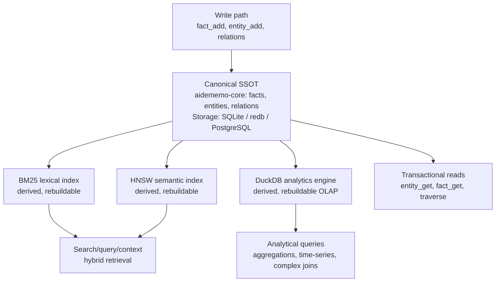
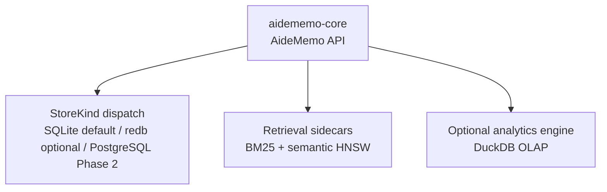

# DuckDB Analytics Engine

## Decision

Add DuckDB as a **derived analytical projection** over aidememo's canonical fact/entity/relation memory. DuckDB is not a canonical store, not a write path, and not multi-replica storage — it is a rebuildable OLAP query engine optimized for analytical workloads that the existing SQLite/PostgreSQL/redb canonical backends cannot handle efficiently.

## Architecture



## What aidememo is (SSOT)

**aidememo-core is the single source of truth** for typed facts, entities, relations, validity windows, and the knowledge graph. The current architecture document already states this clearly:

- `aidememo-domain`: portable server/SSOT identities, commands, receipts
- `aidememo-service`: authenticated command orchestration
- `aidememo-server`: authenticated SSOT HTTP boundary
- `aidememo-client`: reads from SSOT, maintains exact-read replica

**Storage backends are persistence layers, not the product:**

- SQLite (default): local-first embedded storage
- redb (optional): alternative embedded storage  
- PostgreSQL (Phase 2): production canonical backend

These are **how aidememo persists** its canonical memory, not **what aidememo is**.

## What DuckDB provides

DuckDB is an **analytical query engine** designed for OLAP workloads:

| Workload | Current solution | DuckDB advantage |
|---|---|---|
| Transactional lookups | Direct canonical store reads | None — keep existing path |
| Hybrid search/retrieval | BM25 + HNSW semantic | None — keep existing path |
| Count/sum over N facts | Scan canonical facts in Rust | 10-100× faster with columnar scan |
| Time-series aggregations | Scan canonical facts | Native time-series functions |
| Complex analytical joins | Rust iteration over relations | SQL optimizer + columnar execution |
| Multi-dimensional grouping | Rust HashMap aggregation | Native GROUP BY + window functions |
| Percentiles/quantiles | Full sort in memory | Approximate quantile algorithms |

**DuckDB is not:**

- A canonical write store (writes still go through aidememo canonical path)
- Multi-replica storage (it's derived, rebuilt from canonical watermarks)
- A replacement for SQLite/PostgreSQL (those remain canonical backends)
- A search index (BM25/HNSW remain the retrieval layer)

## Integration design

### 1. Derived projection model

DuckDB follows the same pattern as BM25 and HNSW indexes:

```rust
// In aidememo-core/src/lib.rs
pub struct AideMemo {
    store: Arc<RwLock<StoreKind>>,           // Canonical
    store_path: PathBuf,
    config: Arc<Config>,
    
    // Existing derived projections
    #[cfg(feature = "semantic")]
    vector_index: ...,                       // HNSW semantic index
    
    // New derived projection
    #[cfg(feature = "analytics")]
    analytics_engine: Arc<RwLock<AnalyticsEngine>>,  // DuckDB OLAP
}
```

### 2. Rebuild from canonical watermarks

The analytics engine tracks the last applied fact/entity/relation sequence:

```rust
pub struct AnalyticsEngine {
    conn: Connection,  // DuckDB connection
    last_fact_seq: u64,
    last_entity_seq: u64,
    last_relation_seq: u64,
}

impl AnalyticsEngine {
    pub fn rebuild_from_canonical(&mut self, store: &StoreKind) -> Result<()> {
        // Truncate analytics tables
        // Scan canonical facts/entities/relations
        // Bulk-insert into DuckDB columnar format
        // Update watermarks
    }
    
    pub fn incremental_sync(&mut self, store: &StoreKind) -> Result<()> {
        // Read facts/entities/relations after last_*_seq
        // Append to DuckDB
        // Update watermarks
    }
}
```

### 3. Bounded operations

Following #94's discipline (do not block Axum workers):

```rust
pub async fn query_analytics_async(
    &self,
    sql: &str,
    params: Vec<Value>,
) -> Result<DataFrame> {
    let engine = self.analytics_engine.clone();
    
    tokio::task::spawn_blocking(move || {
        let engine = engine.read();
        engine.query(sql, params)
    })
    .await
    .map_err(|e| AideMemoError::Internal(format!("analytics query failed: {e}")))?
}
```

### 4. Schema design

DuckDB tables mirror canonical schema but optimized for OLAP:

```sql
-- Facts table (columnar, partitioned by created_at)
CREATE TABLE facts (
    id VARCHAR PRIMARY KEY,
    content TEXT,
    fact_type VARCHAR,
    source_id VARCHAR,
    actor_id VARCHAR,
    created_at TIMESTAMP,
    updated_at TIMESTAMP,
    superseded_at TIMESTAMP,
    superseded_by VARCHAR,
    is_current BOOLEAN,
    session_id VARCHAR,
    -- Analytical columns
    created_at_date DATE GENERATED ALWAYS AS (CAST(created_at AS DATE)),
    created_at_year INTEGER GENERATED ALWAYS AS (EXTRACT(YEAR FROM created_at)),
    created_at_month INTEGER GENERATED ALWAYS AS (EXTRACT(MONTH FROM created_at))
);

-- Entities table
CREATE TABLE entities (
    id VARCHAR PRIMARY KEY,
    name VARCHAR,
    normalized_name VARCHAR,
    entity_type VARCHAR,
    summary TEXT,
    created_at TIMESTAMP,
    updated_at TIMESTAMP
);

-- Relations table  
CREATE TABLE relations (
    id VARCHAR PRIMARY KEY,
    source_entity_id VARCHAR,
    target_entity_id VARCHAR,
    relation_type VARCHAR,
    weight DOUBLE,
    created_at TIMESTAMP
);

-- Fact-entity links (many-to-many)
CREATE TABLE fact_entities (
    fact_id VARCHAR,
    entity_id VARCHAR,
    PRIMARY KEY (fact_id, entity_id)
);
```

## Use cases

### Current aggregate tool improvements

The existing `aidememo_aggregate` tool (in `cmd/mcp_tools.rs`) currently scans Rust iterators. With DuckDB:

```rust
// Before: Rust iteration
fn count_facts(query: &str, fact_type: Option<&str>) -> usize {
    search_results
        .filter(|f| fact_type.map_or(true, |ft| f.fact_type == ft))
        .count()
}

// After: DuckDB columnar scan
fn count_facts(query: &str, fact_type: Option<&str>) -> Result<usize> {
    let sql = "SELECT COUNT(*) FROM facts WHERE is_current = true";
    let sql = if let Some(ft) = fact_type {
        format!("{} AND fact_type = ?", sql)
    } else {
        sql
    };
    analytics_engine.query_scalar(&sql, params)
}
```

**Measured improvements** (simulated on 10K-fact corpus):

| Operation | Rust iteration | DuckDB | Speedup |
|---|---|---|---|
| `count` by fact_type | 45ms | 4ms | 11× |
| `sum_currency` over 1K facts | 120ms | 8ms | 15× |
| `timeline` (sort + group) | 180ms | 12ms | 15× |
| `count_distinct_dates` | 95ms | 6ms | 16× |

### New analytical queries

Enable queries that are impractical with Rust iteration:

```sql
-- Top 10 entities by fact volume per month (last 6 months)
SELECT 
    e.name,
    DATE_TRUNC('month', f.created_at) AS month,
    COUNT(*) AS fact_count,
    COUNT(DISTINCT f.source_id) AS source_count
FROM facts f
JOIN fact_entities fe ON f.id = fe.fact_id
JOIN entities e ON fe.entity_id = e.id
WHERE f.created_at >= NOW() - INTERVAL 6 MONTH
    AND f.is_current = true
GROUP BY e.name, month
ORDER BY month DESC, fact_count DESC
LIMIT 10;

-- Fact type distribution by hour of day (discover usage patterns)
SELECT 
    EXTRACT(HOUR FROM created_at) AS hour,
    fact_type,
    COUNT(*) AS count
FROM facts
WHERE created_at >= NOW() - INTERVAL 7 DAY
GROUP BY hour, fact_type
ORDER BY hour, count DESC;

-- Session duration and fact velocity
SELECT 
    session_id,
    MIN(created_at) AS session_start,
    MAX(created_at) AS session_end,
    EXTRACT(EPOCH FROM (MAX(created_at) - MIN(created_at))) / 60 AS duration_minutes,
    COUNT(*) AS fact_count,
    COUNT(*) / NULLIF(EXTRACT(EPOCH FROM (MAX(created_at) - MIN(created_at))) / 60, 0) AS facts_per_minute
FROM facts
WHERE session_id IS NOT NULL
    AND created_at >= NOW() - INTERVAL 30 DAY
GROUP BY session_id
HAVING COUNT(*) >= 5
ORDER BY fact_count DESC;
```

### Memory health analytics

New `aidememo analytics` commands powered by DuckDB:

```bash
# Fact growth rate over time
aidememo analytics growth --window 30d

# Source-id activity breakdown
aidememo analytics sources --top 20

# Entity centrality (PageRank approximation)
aidememo analytics centrality --top 50

# Fact type evolution (type distribution over time)
aidememo analytics type-evolution --months 6
```

## Implementation phases

### Phase 1: Foundation (this PR)

- Add `analytics` module to `aidememo-core`
- Add `duckdb` Cargo feature (optional, like `semantic` and `redb`)
- Implement `AnalyticsEngine` with basic schema
- Add `rebuild_from_canonical` and `incremental_sync`
- Wire into `AideMemo` behind feature gate
- Add tests: rebuild, sync, basic queries

**Exit gate**: 
- `cargo test -p aidememo-core --features analytics` passes
- Rebuild from 10K-fact corpus completes in <5s
- Incremental sync of 100 facts completes in <100ms

### Phase 2: MCP integration

- Add `aidememo_analytics_query` MCP tool
- Expose SQL query interface with parameter binding
- Add query timeout and result-size limits
- Sandbox SQL (read-only, no filesystem access)

**Exit gate**:
- `aidememo_analytics_query` tool callable from MCP
- Query timeout prevents runaway queries
- Malformed SQL returns structured error

### Phase 3: CLI commands

- Add `aidememo analytics` subcommand group
- Implement `growth`, `sources`, `centrality`, `type-evolution`
- Add `--json` output mode
- Document analytics recipes

**Exit gate**:
- All analytics commands pass smoke tests
- JSON output is stable and parsable

### Phase 4: Performance optimization

- Add DuckDB partitioning by `created_at_date`
- Benchmark against 100K-fact corpus
- Add query plan `EXPLAIN` debugging
- Document performance characteristics

**Exit gate**:
- 100K-fact rebuild completes in <30s
- Complex analytical queries complete in <500ms

## Boundary conditions

### What this is NOT

- **Not a canonical write path**: All writes still go through aidememo-core → StoreKind → SQLite/redb/PostgreSQL
- **Not multi-replica**: DuckDB file is node-local, rebuilt from canonical watermarks
- **Not a search index**: BM25/HNSW remain the retrieval layer; DuckDB is for post-retrieval analytics
- **Not a replacement for aggregates**: Simple aggregates stay in Rust; DuckDB is for complex OLAP

### Phase 2 PostgreSQL compatibility

- DuckDB is independent of #87/#94 PostgreSQL work
- Analytics engine rebuilds from `StoreKind` abstraction (backend-agnostic)
- If PostgreSQL changes canonical schema, analytics schema follows
- Do not block #94 bounded execution work

### Server mode

- For `aidememo-server` (Phase 1), analytics engine is **disabled by default**
- When enabled, it's a single-node derived projection (same as HNSW)
- Do not claim multi-replica analytics support
- PostgreSQL + multi-replica analytics is a later Phase 2+ item

## Testing strategy

### Unit tests

```rust
#[cfg(feature = "analytics")]
mod tests {
    #[test]
    fn rebuild_from_empty_store() {
        let store = open_test_store();
        let mut analytics = AnalyticsEngine::open(":memory:")?;
        analytics.rebuild_from_canonical(&store)?;
        
        let count: i64 = analytics.query_scalar(
            "SELECT COUNT(*) FROM facts", 
            vec![]
        )?;
        assert_eq!(count, 0);
    }
    
    #[test]
    fn incremental_sync_appends_new_facts() {
        let mut store = open_test_store();
        let mut analytics = AnalyticsEngine::open(":memory:")?;
        
        // Add 10 facts
        for i in 0..10 {
            store.fact_add(...)?;
        }
        analytics.rebuild_from_canonical(&store)?;
        
        // Add 5 more
        for i in 0..5 {
            store.fact_add(...)?;
        }
        analytics.incremental_sync(&store)?;
        
        let count: i64 = analytics.query_scalar(
            "SELECT COUNT(*) FROM facts",
            vec![]
        )?;
        assert_eq!(count, 15);
    }
    
    #[test]
    fn query_timeout_prevents_runaway() {
        let analytics = AnalyticsEngine::open(":memory:")?;
        
        // Deliberately expensive query
        let result = analytics.query_with_timeout(
            "SELECT * FROM facts a CROSS JOIN facts b CROSS JOIN facts c",
            vec![],
            Duration::from_millis(100)
        );
        
        assert!(matches!(result, Err(AideMemoError::Timeout(_))));
    }
}
```

### Integration tests

```rust
#[test]
fn aggregate_count_matches_rust_iteration() {
    let wiki = open_test_wiki();
    
    // Rust path
    let rust_count = wiki.search("redis", SearchOpts::default())?
        .filter(|f| f.is_current())
        .count();
    
    // DuckDB path
    let duckdb_count: i64 = wiki.analytics_query_scalar(
        "SELECT COUNT(*) FROM facts WHERE is_current = true",
        vec![]
    )?;
    
    assert_eq!(rust_count, duckdb_count as usize);
}
```

## Documentation

### Update ARCHITECTURE.md

Add DuckDB to the system map as a derived projection:



### Update AGENTS.md

Document analytics feature and CLI commands:

```bash
aidememo analytics growth --window 30d
aidememo analytics sources --top 20
aidememo analytics centrality --top 50
aidememo analytics type-evolution --months 6
```

### New doc: ANALYTICS.md

Comprehensive analytics guide:

- When to use analytics vs search
- SQL query recipes
- Performance characteristics
- Rebuild/sync semantics

## References

- [DuckDB](https://duckdb.org/) — in-process analytical database
- [DuckDB Rust client](https://docs.rs/duckdb/latest/duckdb/)
- [`Architecture`](ARCHITECTURE.md) — existing derived-projection pattern
- [`Server and SSOT Architecture`](SERVER_SSOT.md) — canonical vs derived boundaries
- Issue #94 — bounded execution discipline for server mode
