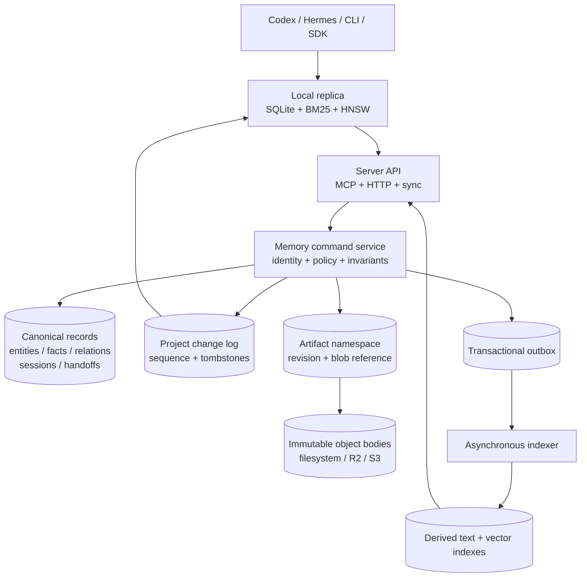

# Server and SSOT Architecture

> Status: accepted target direction. Phase 0 and a bounded single-node typed
> session/fact/handoff HTTP slice are implemented, but this is not the current
> production contract.

AideMemo is local-first today. One embedded store is opened by the Rust core and
can be coordinated through stdio MCP, the local daemon, or `aidememo mcp-serve`.
That remains the simplest mode for one person or a trusted agent fleet.

The server target changes the ownership boundary: the server becomes the source
of truth, while local stores become low-latency read caches and explicit offline
branches. This document fixes the invariants that must remain the same across a
single-node server, Cloudflare-hosted SaaS, and an on-premises Kubernetes
deployment. It is an architecture decision and implementation sequence, not a
claim that these deployment modes are already shipped.

## Decision

Build a portable memory service around structured domain records and an ordered
per-project change log. Keep search indexes and file-like artifacts as derived
or subordinate data planes.

The three deployment profiles share one protocol and conformance suite:

| Profile | Canonical records | Artifact bodies | Coordination |
|---|---|---|---|
| Embedded local | SQLite | Local filesystem | Process + SQLite transaction |
| Hosted SaaS | PostgreSQL initially; optional project Durable Object adapter later | S3-compatible storage, with R2 as the first preset | Database CAS; optional per-project Durable Object for active collaboration |
| On-premises Kubernetes | PostgreSQL | Customer S3-compatible storage | Database transaction and CAS |

Cloudflare is an efficient hosted profile, not the semantic definition of the
product. R2 is accessed through the S3-compatible contract. Durable Objects are
used at a project-sized coordination boundary and must not become one global
AideMemo singleton. A complete Durable Object record-store adapter is allowed
only after it passes the same conformance and logical export tests as the
PostgreSQL and local adapters.

## Current boundary versus server boundary

The current shared-store model is intentionally a cooperating-agent partition:

- `source_id` filters facts and source-visible graph data;
- `actor_id` records writer provenance;
- bearer-token bindings can prevent a network caller from overriding either
  value; and
- entity names and types still form one shared ontology inside the store.

That is not hostile tenant isolation. In particular, entities are shared
records and fact attachment is used to derive source-visible entity access.
The server model introduces independent identities instead of promoting
`source_id` into a tenant credential:

```text
tenant_id
  `- project_id
       |- source_id
       |- actor_id
       `- resources: entities, facts, relations, sessions, handoffs, artifacts
```

`tenant_id`, `project_id`, and `actor_id` are derived from authenticated server
context. A client may omit them, but must never be allowed to widen or replace
them in a command body. `source_id` remains an application namespace inside a
project; it is not the billing, authorization, or physical-isolation key.

Every canonical uniqueness constraint and lookup starts with tenant and
project identity. Representative constraints are:

```sql
UNIQUE (tenant_id, project_id, normalized_entity_name)
UNIQUE (tenant_id, project_id, source_id, content_hash)
UNIQUE (tenant_id, project_id, command_id)
```

## System model



The canonical transaction commits the domain mutation, change entry, audit
provenance, and outbox work together. Object upload and external indexing occur
outside that transaction through reservation/commit and idempotent workers.

## Command contract

All mutating surfaces, including MCP tools, REST calls, SDK methods, and offline
branch publication, map to one command envelope:

```json
{
  "command_id": "01K...",
  "project_id": "project_01K...",
  "expected_revision": 7,
  "operation": "fact.add",
  "payload": {}
}
```

The authenticated gateway supplies tenant and actor identity. The service must:

1. reject a project outside the authenticated membership;
2. return the stored receipt when `command_id` has already committed;
3. reject a stale `expected_revision` without partial writes;
4. update the domain rows and append the change/audit/outbox rows atomically;
5. return the committed project sequence and resource revision; and
6. never infer task success merely because a handoff worker process exited.

The currently implemented `/v1/commands` slice deliberately accepts only the
lower-level pairs `resource.put` + `upsert` and `resource.delete` + `delete`.
A delete payload must be JSON `null`, and the resource kind must use the
`custom.*` extension namespace. Reserved product kinds such as `fact`,
`session`, `handoff`, and `artifact` are rejected on the raw endpoint. Product
operations are never aliases accepted by this endpoint. The separate typed
routes now cover session creation, session-attached fact creation, and handoff
send/indexed inbox/outbox/accept/return/status; search, heartbeat, and MCP
integration remain open. This prevents the raw route from bypassing product
semantics.

The idempotency fingerprint binds project, revision precondition, operation,
payload, full resource coordinate, and upsert/delete change kind. Consequently,
reusing one `command_id` for another resource fails with `command_conflict`
instead of replaying the first resource's receipt.

Handoff claim and return invariants remain domain operations. A handoff result
fact must match the same tenant, project, session, source, receiving actor, and
active claim. A file written under an artifact path cannot complete a handoff
by itself. The first typed HTTP slice now enforces these checks, requires the
receiver to be an active writable project member, and keeps a failed return
eligible only for a new exclusive claim.

## Ordered change feed

Server sync uses one monotonic sequence per project instead of independent ULID
watermarks for each record class:

```json
{
  "project_epoch": "01K...",
  "after_seq": 18420,
  "limit": 1000
}
```

Each materialized entry carries `seq`, resource kind and ID, operation,
revision, actor provenance, commit time, and the canonical body or tombstone at
exactly that revision. The server persists metadata and body in the same command
transaction. The next cursor is acknowledged only after the local replica
commits the full batch and its revision-pinned resources together.

Handoffs add an actor projection on top of the project sequence: only the
authenticated sender and receiver may observe the handoff or its immutable
`handoff_context` packet through exact reads, snapshots, metadata changes, or
materialized changes. A projected batch can
therefore return no visible entries while still advancing across hidden project
sequences. The scanned `next_cursor` remains authoritative so a replica never
loops on another actor's handoff.

An empty exact-read replica bootstraps from `GET .../snapshot`, which reads the
complete current resource set and represented project head in one SQLite read
transaction. It then consumes only hydrated changes, so no cached resource can
run ahead of the durable cursor. This first snapshot endpoint is deliberately
bounded to 10,000 resources; pagination with a stable snapshot handle remains a
later scale-out item. Legacy schema-v3 change rows do not have historical
bodies and return `snapshot_required` rather than guessing from current state.
The replica file is pinned to tenant, project, epoch, and authenticated actor;
switching actor profiles requires `replica reset --force`. Legacy project-only
replicas migrate with an unbound actor and likewise require an explicit reset.
This is a sequence-consistent exact-read cache, not yet a BM25/HNSW retrieval
index.

`project_epoch` changes when an administrator restores or replaces canonical
history in a way that invalidates existing cursors. A mismatched epoch causes a
fail-closed pull; the operator must run `replica reset --force` before the next
pull bootstraps a fresh snapshot. It never attempts a best-effort merge across
history generations.

Offline writes do not create an implicit multi-primary system. They are stored
in an actor branch/outbox with command IDs and base revisions. Publication is
explicit and conflicts return structured stale-revision results.

## Artifact namespace

The artifact subsystem borrows the useful boundary from `cf-vfs` and JuiceFS:
strongly consistent metadata is separate from immutable object bodies.

```text
/projects/<project>/sessions/<session>/canvas.md
/projects/<project>/sessions/<session>/artifacts/<name>
/projects/<project>/handoffs/<handoff>/request.json
/projects/<project>/handoffs/<handoff>/result.json
/projects/<project>/branches/<actor>/<segment>.jsonl
/projects/<project>/snapshots/<sequence>/manifest.json
```

Small bounded bodies may be stored inline with metadata. Large bodies use an
immutable random generation in S3-compatible object storage. Publication uses:

1. reserve a path with its current mutation token and an expiry;
2. upload directly to the object store;
3. verify server-observed size, version, ETag, and optional digest;
4. recheck the path token and publish metadata atomically; and
5. queue unreachable generations for idempotent garbage collection.

The artifact layer does not promise POSIX open handles, locks, `mmap`, sparse
writes, or database-file semantics. AideMemo SQLite, redb, WAL, BM25, and HNSW
files must never be opened directly through this remote namespace. Optional
FUSE or Python `fsspec` clients expose a materialized workspace, not a shared
database volume.

### Artifact transport and garbage-collection decision

Research snapshot: 2026-08-02, with `cf-vfs` main inspected at
`69963db6072683ff030d629cfe3288ea565d6913`. The useful transfer is its opaque
body lifecycle, not its Bash runtime or POSIX-shaped namespace. AideMemo keeps
the smaller artifact contract already implemented in Rust and splits its next
adapter boundary into three roles:

| Role | Owns | Must not own |
|---|---|---|
| Metadata coordinator | authenticated scope, logical path, mutation token, reservation/verification leases, publication receipt, read retention, GC intent | large body bytes or provider credentials returned to an agent |
| Body store | conditional immutable create, `HEAD`, ranged/full read, idempotent delete, optional multipart operations | tenant authorization or logical-path conflict resolution |
| Upload authority | bounded local proxy or short-lived exact-key upload/download capability | publication truth or the ability to select another object key |

`LocalArtifactStore` is the Phase-1 reference adapter for these semantics, not
the final trait shape. The portable protocol remains Rust domain types plus
HTTP. It does not become dependent on Cloudflare bindings, an S3 SDK, FUSE, or
Python.

The local reference server now uses an opaque reservation ID rather than
putting an arbitrary logical path into a URL. Hosted adapters keep the same
control-plane shape while replacing the bounded body transfer:

| Route | Semantics |
|---|---|
| `POST /v1/projects/{project}/artifact-reservations` | Writer reserves a logical path and receives the opaque generation token and expiry. |
| `PUT /v1/projects/{project}/artifact-reservations/{reservation}/body` | Single-node/local bounded upload; hosted large bodies do not traverse this route. |
| `POST /v1/projects/{project}/artifact-reservations/{reservation}/upload-grants` | S3-feature writer receives a conditional, exact-length/type single-`PUT` capability that cannot outlive the reservation. |
| `POST /v1/projects/{project}/artifact-reservations/{reservation}/publish` | Coordinator obtains a trusted local observation or S3 `HEAD`, rechecks the path token and reservation, then publishes metadata atomically. Hosted publication includes expected `size_bytes`. |
| `DELETE /v1/projects/{project}/artifact-reservations/{reservation}` | Abort and durably schedule the generation for later deletion without changing the last published path. |
| `GET /v1/projects/{project}/artifacts/resolve?path=...` | Resolve current metadata under reader membership. |
| `POST /v1/projects/{project}/artifacts/{artifact}/downloads` | Return the bounded local body for an exact revision. |
| `POST /v1/projects/{project}/artifacts/{artifact}/download-grants` | S3-feature reader durably retains the exact current generation before receiving an ETag/version-bound GET capability. |

The catalog also persists a credential-free identity digest for its immutable
body adapter. Local storage is pinned to its repository layout; S3-compatible
storage is pinned to the exact bucket, prefix, endpoint, signing region, and
addressing mode. Server startup rejects a mismatch before serving traffic.
Changing any of those values therefore requires an explicit artifact migration
or a separate empty `--artifact-root`; it is never interpreted as an in-place
backend switch.

The bearer binding supplies tenant and actor identity on every control-plane
call. Readers may resolve/download; writers may reserve/upload/publish/abort.
The local reference keeps exact reservation and publication replay receipts for
24 hours after reservation expiry or publication, then prunes them in bounded
GC passes. Within that window, a publish retry returns its original reference
even if a later replacement and GC removed the original body.
An upload capability is itself a bearer credential. It is short-lived and
bound, where the provider supports it, to one random generation key, one
method, content type, expected size/checksum, expiry, and conditional create.
It is never logged or persisted in an artifact record. A presigned URL can be
reused until it expires, so it is not a one-shot guarantee: publication still
requires an immutable key, a trusted `HEAD`/checksum observation, and the
logical-path compare-and-swap. Provider support for conditional single and
multipart completion is an adapter conformance item, not an assumed property
of every product described as S3-compatible.

R2's direct Workers and S3 APIs are strongly consistent for object writes,
reads, deletes, and listings. A cached custom-domain response is not part of
that guarantee and must not be used for publish verification. Hosted upload
verification therefore uses the binding or S3 API directly. Single `PUT` is
the first portable hosted slice and is capped at the common 5 GB S3/R2 bound.
Multipart remains a separate future path; only trusted completion may create
its observed generation.

As checked on 2026-08-02, the official
[R2 S3 compatibility table](https://developers.cloudflare.com/r2/api/s3/api/)
lists conditional `PutObject`, including `If-None-Match`, and the
[presigned URL contract](https://developers.cloudflare.com/r2/api/s3/presigned-urls/)
supports exact-key `PUT`/`GET` grants that remain reusable until expiry. The
feature-gated Rust adapter therefore signs `If-None-Match: *`, exact content
length/type, and generation metadata; treats the URL as a redacted bearer
capability; verifies trusted `HEAD` size/generation/ETag; and refuses a signed
GET that outlives coordinator-persisted read retention. R2 does not document a
matching conditional `DeleteObject` header, so deletion relies on the stronger
AideMemo invariant that random generation keys are never reused.

Garbage collection is metadata-driven rather than bucket-list driven:

1. Replacement, abort, expiry, failed verification, or a lost publication CAS
   writes one durable GC candidate in the same metadata transaction that makes
   the generation unreachable.
2. `not_before` is at least the upload-capability expiry plus settlement grace,
   and at least the latest granted download retention. This prevents a late
   `PUT` from recreating an object just deleted and prevents an active signed
   download from losing its body.
3. A bounded worker leases due candidates and rechecks that no published path,
   live reservation, or read retention names the exact generation/version.
4. It issues idempotent exact-key deletes in bounded batches. Success removes
   the candidate; failure records attempts, error, and exponential retry time.
5. A slower reconciliation sweep may compare the adapter-owned object prefix
   with catalog reachability, but listing is repair evidence, never canonical
   liveness.

The same table/queue implementation can run from the single-node server or a
Kubernetes worker. In a Cloudflare profile, a project-sized Durable Object may
own the short metadata transactions and schedule its earliest expiry/GC retry
with one alarm. PostgreSQL remains the initial hosted canonical adapter, and a
Durable Object must not become a global singleton or a second implicit writer
beside PostgreSQL.

PyO3 is not a storage-server boundary. The existing Rust/Python binding can
later expose an `fsspec`-compatible materialization client, while upload,
publication, and conflict semantics continue through the same authenticated
HTTP protocol. A separate PyO3 VFS would duplicate authorization, CAS, retry,
and GC logic and would not help Workers, Node, or Kubernetes clients.

The implementation gate is failure-oriented:

- crash after reservation, upload, verification claim, metadata commit, and
  object delete;
- exact reserve/upload/publish retry versus changed-body or changed-command
  reuse;
- late upload after abort/expiry and concurrent replacement of one path;
- digest, size, ETag/version, tenant, project, actor-role, and object-prefix
  mismatch;
- signed-download retention racing replacement and GC;
- bounded batching/backoff with a permanently failing delete; and
- the same lifecycle suite against local filesystem, R2, AWS S3, and the
  selected on-premises S3-compatible implementation.

The local authenticated HTTP plus durable-GC slice and feature-gated S3/R2
server wiring are implemented. The hosted path issues writer-only upload
grants, publishes only a trusted `HEAD`, persists read retention before signing
a reader GET, and drains the same durable GC intents through exact-generation
provider deletion. A disposable local MinIO process now passes the real
presigned HTTP lifecycle through
`./scripts/artifact-s3-minio-conformance.sh`; managed R2/AWS runs remain open,
followed by multipart/resume and only then the optional project Durable Object
coordinator.

## Search consistency

Facts and graph records are authoritative; lexical and vector indexes are
rebuildable projections. Every index reports the highest project sequence it
has applied.

| Read | Consistency |
|---|---|
| Exact get by resource ID | Canonical record transaction |
| Handoff status or claim | Canonical record transaction |
| Search/query/context | Derived index plus `index_seq` watermark |
| Local offline search | Last applied replica sequence |

The default search may be eventually consistent, but callers can request
`at_least_seq`. The server then waits within a bounded deadline, falls back to a
canonical lexical path when available, or returns an explicit not-ready status.
It must not silently claim read-your-writes when the index is behind.

## Deployment profiles

### Single-node server

The first executable server profile keeps SQLite metadata and defaults to local
artifact bodies. A feature-gated process may instead keep the same catalog with
S3/R2/MinIO bodies. It supports exactly one application replica and proves the
remote identity, command, change-feed, artifact-lifecycle, and local-cache
contracts without claiming high availability.

The bounded foundation is now executable from the workspace. Generate a
high-entropy bearer token (not a password), keep the token file private, and
bootstrap one active membership:

```bash
openssl rand -hex 32 > /secure/aidememo-writer.token
chmod 600 /secure/aidememo-writer.token

cargo run -p aidememo-server -- bootstrap \
  --database /data/aidememo-ssot.sqlite \
  --tenant-id acme \
  --project-id memory \
  --actor-id codex-p1 \
  --token-file /secure/aidememo-writer.token

cargo run -p aidememo-server -- serve \
  --database /data/aidememo-ssot.sqlite \
  --artifact-root /data/aidememo-artifacts
```

If `--artifact-root` is omitted, the server uses
`<database>.artifacts`. For an R2 body store, keep that path as the separate
metadata/GC catalog and provide credentials through the standard AWS provider
chain rather than command-line arguments:

```bash
AWS_ACCESS_KEY_ID="$R2_ACCESS_KEY_ID" \
AWS_SECRET_ACCESS_KEY="$R2_SECRET_ACCESS_KEY" \
cargo run -p aidememo-server --features s3 -- serve \
  --database /data/aidememo-ssot.sqlite \
  --artifact-root /data/aidememo-artifact-catalog \
  --artifact-backend s3 \
  --artifact-s3-bucket aidememo \
  --artifact-s3-region auto \
  --artifact-s3-endpoint https://ACCOUNT_ID.r2.cloudflarestorage.com
```

Use `--artifact-s3-force-path-style` when the selected S3-compatible provider,
such as a local MinIO deployment, requires path-style addressing. Capability
URLs are bearer credentials and must not be logged.

Bootstrap stores only the SHA-256 token digest and reuses an existing project
epoch on retry. Existing labels and timestamps are retained; conflicting epoch,
actor kind, membership role, or token ownership fails closed. The server binds
to `127.0.0.1:3030` by default. A non-loopback plaintext bind is rejected unless
`--allow-insecure-http` is explicit; production bearer traffic still requires a
TLS ingress.

The current HTTP surface is intentionally small:

| Endpoint | Contract |
|---|---|
| `GET /health` | Process mode and SQLite schema version |
| `GET /v1/projects/{project}/identity` | Resolve the bearer-bound tenant, project, actor, and active membership role |
| `POST /v1/commands` | Authenticated `custom.*` `resource.put` / `resource.delete`, idempotent receipt, revision CAS |
| `GET /v1/projects/{project}/resources/{kind}/{id}` | Exact canonical body or tombstone; handoffs and handoff contexts are sender/receiver-only |
| `GET /v1/projects/{project}/changes` | Ordered metadata-only change entries after an epoch/sequence cursor |
| `GET /v1/projects/{project}/changes/materialized` | Ordered changes with the exact canonical body or tombstone at each revision |
| `GET /v1/projects/{project}/snapshot` | Atomic bounded current-state bootstrap plus represented project head |
| `POST /v1/projects/{project}/sessions` | Create one typed session; `source_id` is fixed here |
| `POST /v1/projects/{project}/facts` | Create one fact attached to an existing session; source and actor are inherited server-side |
| `POST /v1/projects/{project}/handoff-contexts` | Create one immutable bounded sender packet scoped to the exact handoff route |
| `POST /v1/projects/{project}/handoffs` | Send the session pointer to another active writer |
| `GET /v1/projects/{project}/handoffs?box=inbox\|outbox` | Authenticated actor's indexed mailbox; optional `source_id`, `include_completed`, `before_seq`, and bounded `limit` |
| `POST .../handoffs/{id}/accept` | Claim with `expected_revision` and an exclusive `claim_id` |
| `POST .../handoffs/{id}/return` | Validate claim plus result fact session/source/actor and return an outcome |
| `GET .../handoffs/{id}` | Sender/receiver-only typed status |
| `POST /v1/projects/{project}/artifact-reservations` | Writer-only idempotent logical-path reservation |
| `PUT .../artifact-reservations/{reservation}/body` | Writer-only direct local upload, capped at 64 MiB |
| `POST .../artifact-reservations/{reservation}/upload-grants` | S3-feature writer-only conditional single-`PUT` capability |
| `POST .../artifact-reservations/{reservation}/publish` | Re-observe local bytes or trusted S3 `HEAD` and atomically publish the reserved generation |
| `DELETE .../artifact-reservations/{reservation}` | Abort without replacing the current path and queue eventual deletion |
| `GET /v1/projects/{project}/artifacts/resolve?path=...` | Reader-visible current artifact metadata |
| `POST .../artifacts/{artifact}/downloads` | Reader-visible exact-revision local body download |
| `POST .../artifacts/{artifact}/download-grants` | S3-feature reader-only retained exact-generation GET capability |

Create requests use `{"command_id":"...","payload":{...}}`. Transitions also
carry the revision observed by the client:

```json
{
  "command_id": "command_accept_01",
  "expected_revision": 1,
  "payload": {"claim_id": "worker_attempt_01"}
}
```

Create requests derive a stable command ID from the resource ID for exact-body
transport retry. Receiver transitions additionally derive the claim from the
authenticated actor and attempt number, and derive return commands from the
claim plus exact result evidence. The CLI retries the identical POST body once
after a transport error. Before re-reading mutable handoff state, the server
verifies and replays an existing receipt; a later CLI/MCP invocation also
recognizes an already-applied exact accept or return and reports
`recovered: true`. A different actor cannot replay the first actor's command ID.

This guarantee is resource-bound. A brand-new `send` invocation currently
mints a new handoff/context pair and therefore represents a new assignment; it
does not deduplicate an uncertain prior invocation. Until a client operation
key or offline outbox exists, callers inspect the sender outbox and continue by
handoff ID instead of blindly rerunning `send`.

Mailbox actor identity is always taken from the bearer binding; an `actor_id`
query parameter is rejected. Results are newest-first and include each
handoff's current resource `revision` plus latest `project_seq`. When another
page exists, `next_before_seq` is the exclusive cursor for the next request.
Inbox excludes completed work by default; outbox includes it by default. The
SQLite schema v3 mailbox index is updated in the same transaction as canonical
handoff state, receipt, change, and audit rows. Opening a v2 ledger backfills
the index from canonical handoff resources and their latest change sequence.

Every protected request hashes the bearer value, resolves the persisted tenant
and actor, and reloads active project membership. Exact resource, snapshot, and
change-feed responses apply the same sender/receiver visibility to handoffs and
their context packets as the typed status route. Command JSON uses
`deny_unknown_fields`; tenant or actor identity in the body is rejected rather
than ignored. Canonical resource bodies, receipt, resource revision, project
sequence, change entry, and audit row commit in one SQLite transaction.

This process supports one application replica and has no built-in TLS, token
rotation/revocation command, rate limits, PostgreSQL/S3, search, heartbeat,
HTTP MCP gateway profile, retrieval-index replica, or offline outbox yet. Its
separate local artifact repository is wired to authenticated reader/writer
routes and proves idempotent reservation, immutable upload, trusted
SHA-256/size re-observation, CAS publication, exact-revision reads, abort, and
restart-safe durable GC. Direct bodies are capped at 64 MiB; this is not the
future hosted streaming contract.
The CLI and stdio MCP support named connected handoff profiles, and
the client can maintain a separate exact-read replica, but this is not a general
remote storage backend. Typed facts are result evidence in the canonical ledger
and are not indexed by the existing embedded retrieval engine. This is a server
contract executable, not a released SaaS or a replacement for `aidememo mcp-serve`.

### Hosted Cloudflare edge

A portable hosted profile uses a Worker for TLS, authentication, limits, and
routing; Hyperdrive can connect the Worker or origin service to PostgreSQL; R2
implements the S3 artifact contract. A per-project Durable Object may own active
WebSocket presence, short leases, or heavily contended session/handoff
coordination. Durable state remains project-scoped.

A future Cloudflare-native canonical adapter may place project records and the
change log in the same SQLite-backed Durable Object. It must provide logical
snapshot/export, restore, tenant deletion, cross-version migration, and storage
conformance before it is called an SSOT backend.

### Kubernetes and on-premises

The production chart keeps application pods replaceable:

```text
aidememo-api       Deployment
aidememo-indexer   Deployment
aidememo-migrate   Job
aidememo-gc        CronJob
PostgreSQL         external or operator-managed
S3-compatible      external
```

Production defaults use bring-your-own PostgreSQL and S3-compatible storage.
A development values file may install single-node dependencies, but that is not
the high-availability profile. API replicas never share a live embedded SQLite
file through a read-write-many volume.

## Code boundaries

Six foundation crates now exist; the same boundary map includes one next
canonical adapter:

```text
aidememo-domain          portable IDs, commands, records, invariants
aidememo-service         command/query orchestration and authorization context
aidememo-store-local     SQLite command ledger and transactional handoff index
aidememo-client          authenticated transport and isolated exact-read replica
aidememo-artifacts       local lifecycle + optional S3/R2 direct-transfer adapter
aidememo-store-postgres  planned server canonical adapter
aidememo-server          bounded authenticated HTTP resource/change/handoff surface
```

`aidememo-domain` must remain free of native model and filesystem assumptions so
its invariant tests can run against local, PostgreSQL, and optional Durable
Object adapters. The existing large synchronous `StoreBackend` remains the
embedded implementation boundary; a remote HTTP backend should not pretend to
be a local `Path`-opened store.

`aidememo-domain` provides validated tenant, project, actor, membership,
command, revision, audit, change-feed, tombstone, artifact-reference, typed
session/fact, and handoff state-machine types.
Every lookup and feed batch carries the composite tenant-project scope.
`aidememo-service` binds authenticated identity and membership to the untrusted
envelope, recursively canonicalizes its JSON fields, and computes the command
fingerprint. `aidememo-store-local` persists receipt, resource revision, change,
audit, project sequence, and actor-relative handoff index in one SQLite
transaction in a database separate from the existing embedded store.
`aidememo-server` persists token bindings and memberships in that ledger,
derives identity outside the request body, and exposes bootstrap, exact
resource reads, extension resource commands, typed session/fact/handoff and
mailbox routes, a change feed, and health over a loopback-first Axum process.
`aidememo-client` authenticates that route, keeps a separate SQLite
scope/epoch/actor cursor and exact canonical resource cache, applies each fully materialized
change batch atomically, and requires explicit reset on scope or epoch changes.
It does not open or reinterpret the embedded search store.
`aidememo-artifacts` keeps a separate SQLite logical-path catalog and immutable
generation files. It requires the current published mutation token for
replacement, rejects live competing reservations, re-hashes bytes before local
publication, preserves the prior version on abort, and never resolves a logical
artifact path as an OS path. Replacement, abort, and expired reservations write
durable exact-generation GC intents; a leased bounded worker rechecks liveness,
deletes idempotently, and backs off failures. Its direct local upload is bounded
to 64 MiB. The `s3` feature now provides validated provider configuration,
credential-chain loading, conditional presigned single-`PUT`, trusted `HEAD`,
read-retention-bounded exact GET grants, bounded exact reads, and immutable-key
delete. Presigned capability values redact their URL from `Debug`. The server
feature connects those capabilities to authenticated writer/reader routes,
permits a nullable digest only for trusted hosted observations, persists read
retention before signing GET, and runs provider deletion from the durable GC
queue. The ignored provider test and local MinIO harness cover conditional
presigned PUT, replay rejection, trusted HEAD, exact presigned/SDK GET, and
idempotent delete against a real S3-compatible process. Managed R2/AWS
conformance and multipart transfer remain open.

The backend-neutral `conformance::run` fixture checks exact idempotent receipt
replay, command-ID conflicts, stale revision rejection, monotonic project
sequences, deletion tombstones, fail-closed epoch changes, and rejection of
cursors ahead of canonical history. Both its in-memory reference and the real
SQLite adapter pass. SQLite integration tests
also cover process reopen, duplicate submission through two concurrent
connections, and identical project IDs isolated under two tenants. HTTP tests
cover missing and unknown bearer rejection, identity-field injection, writer
replay/conflict behavior, reader-only sync, role enforcement, and a
`codex-p1 -> codex-p2 -> Hermes` typed handoff chain. A binary-level CLI test
also stores two bearer profiles for one URL and completes both CLI and installed
stdio MCP `codex-p1 -> codex-p2` flows through
send/inbox/accept/return/outbox, then bootstraps the exact-read replica, reads a
completed handoff after the server stops, and exercises guarded reset. No
PostgreSQL, Durable Object, search adapter, HTTP MCP gateway profile, retrieval
projection, or offline outbox is wired yet. Artifact HTTP tests cover
reader/writer authorization, exact reservation and publication replay, changed
request reuse, revision-pinned local download, hosted upload/download grants,
durable read retention, replacement, abort, expiry, and local/S3 garbage
collection through a mock provider.
All six
foundation crates are `publish = false` until a server-facing public API and
release order are approved, so they do not silently enter the existing v0.1.0
crate publication workflow.

## Phased delivery gates

### Phase 0 — freeze the server contract

- Add tenant, project, membership, actor, command, revision, change, audit, and
  artifact-reference schemas.
- Specify error codes and cursor/epoch behavior.
- Add backend-neutral conformance fixtures.
- Preserve the current local API and file formats.

Exit gate: two independent clients cannot override identity; duplicate command
submission produces one mutation; stale revisions fail; deletion reaches a
replica through a tombstone.

Current status: the Phase 0 code exit gate passes against the separate SQLite
adapter and authenticated HTTP tests without changing the existing embedded API
or file formats. The bounded `aidememo-server` executable remains workspace-only
and unpublished; named CLI and stdio MCP profiles now exercise its typed
handoff surface.

### Phase 1 — single-node remote SSOT

- Run the service over one SQLite database and local artifact directory.
- Make the CLI and MCP installations use one authenticated remote profile.
- Add local read-cache bootstrap, incremental pull, reset, and offline outbox.

Exit gate: Codex primary, Codex secondary, and Hermes complete a handoff through
one remote project; an unavailable server preserves cached reads and creates no
silent multi-primary writes.

Current status: the first item is complete for the bounded single-node profile:
canonical inline JSON resources, an authenticated local immutable artifact
repository, persisted bearer
identity/membership, exact reads, incremental
change retrieval, and typed session/fact/handoff commands. An HTTP integration
test completes a `codex-p1 -> codex-p2 -> Hermes` chain. Named CLI profiles can
hold distinct bearer tokens for one URL/project; the connected CLI path now
completes `send -> inbox -> accept -> return -> outbox` while rejecting actor
overrides, materializing the participant-scoped context into a separate
receiver store, and validating local result provenance against the
authenticated server identity. `mcp-install --remote-profile` verifies that identity, pins the
derived actor plus profile name to one agent config, and the binary integration
test runs the installed arguments and environment through the same round trip.
`replica pull --remote-profile` bootstraps from one actor-projected atomic
current-state snapshot, then incrementally advances `<store>.replica.sqlite` only after
revision-pinned resources commit with the whole batch. Scope and epoch
mismatches and authenticated actor changes fail closed until
`replica reset --force`; `replica status/get` are network-free and tested after
server shutdown. Legacy unhydrated change ranges require a fresh snapshot
instead of being reconstructed from newer state. Combined domain and HTTP tests reject wrong actor, claim,
source/session evidence, read-only mutation, non-participant reads, and mailbox
actor-filter injection. Indexed inbox/outbox queries support completed/source
filters and exclusive sequence pagination; schema v2 migration backfill is
tested. Artifact reservations and publication are retry-safe, local direct upload is
authorized before its body is read, exact-revision download is reader-visible,
and the S3 feature adds authenticated direct grants plus durable retention and
provider GC. Replacement/abort/expiry feed the same leased worker. HTTP MCP gateway
wiring, retrieval indexing, and offline write outbox remain open, so the full
Phase 1 exit gate is not yet closed.

### Phase 2 — portable production backend

- Add PostgreSQL and run managed R2/AWS S3 plus selected production on-premises
  conformance for the wired S3-compatible artifact lifecycle. The disposable
  local MinIO profile already passes the opt-in lifecycle harness.
- Add transactional outbox indexers and sequence watermarks.
- Add logical backup/restore and tenant export/delete drills.

Exit gate: concurrent claim/return, restore, replica rebuild, tenant-isolation,
and index-rebuild suites pass against both SQLite and PostgreSQL.

### Phase 3 — Cloudflare hosted profile

- Add the Worker gateway, Hyperdrive/R2 configuration, and optional active
  project Durable Objects.
- Keep Durable Objects out of the cross-project global query path.
- Measure Korea-region end-to-end latency, cold starts, object operations, and
  index lag instead of importing local benchmark claims.

Exit gate: hosted results meet the same conformance suite and document measured
cost, latency, recovery, and region-placement boundaries.

### Phase 4 — Kubernetes distribution

- Publish a Helm chart with external PostgreSQL/S3 defaults.
- Add migrations, network policy, disruption budgets, observability, backup,
  restore, and rolling-upgrade tests.
- Publish a compatibility matrix and an air-gapped installation path.

Exit gate: a clean cluster install, upgrade, node disruption, database restore,
and complete tenant export/import are reproducible from documented commands.

## Non-goals

- A distributed POSIX filesystem for arbitrary applications.
- Opening SQLite, WAL, redb, BM25, or HNSW files over R2, FUSE, or a remote VFS.
- Exactly-once external side effects; the service provides idempotent command
  receipts and an at-least-once outbox.
- Hidden conflict resolution for offline writers.
- Treating `actor_id`, an agent alias, or `source_id` as authentication.
- Treating worker exit, artifact upload, or handoff delivery as proof of task
  success.

## References

- [`Architecture`](ARCHITECTURE.md) — the implemented embedded system map.
- [`Shared Memory Layer`](SHARED_MEMORY.md) — the current trusted-fleet deployment boundary.
- [`Branch Logs`](BRANCHES.md) — the existing append-oriented offline experiment path.
- [Cloudflare Durable Objects rules](https://developers.cloudflare.com/durable-objects/best-practices/rules-of-durable-objects/)
- [Cloudflare SQLite-backed Durable Object storage](https://developers.cloudflare.com/durable-objects/api/sqlite-storage-api/)
- [Cloudflare R2 S3 compatibility](https://developers.cloudflare.com/r2/api/s3/api/)
- [Cloudflare R2 consistency](https://developers.cloudflare.com/r2/reference/consistency/)
- [Cloudflare R2 presigned URLs](https://developers.cloudflare.com/r2/api/s3/presigned-urls/)
- [Cloudflare R2 limits](https://developers.cloudflare.com/r2/platform/limits/)
- [Amazon S3 conditional writes](https://docs.aws.amazon.com/AmazonS3/latest/userguide/conditional-writes.html)
- [Amazon S3 multipart checksums](https://docs.aws.amazon.com/AmazonS3/latest/userguide/checking-object-integrity-upload.html)
- [Cloudflare Hyperdrive](https://developers.cloudflare.com/hyperdrive/)
- [Kubernetes workloads](https://kubernetes.io/docs/concepts/workloads/)
- [`cf-vfs` architecture at the researched revision](https://github.com/corca-ai/cf-vfs/blob/69963db6072683ff030d629cfe3288ea565d6913/docs/architecture.md) — revisioned namespace and immutable-object lifecycle reference, not a POSIX storage backend for AideMemo databases.
