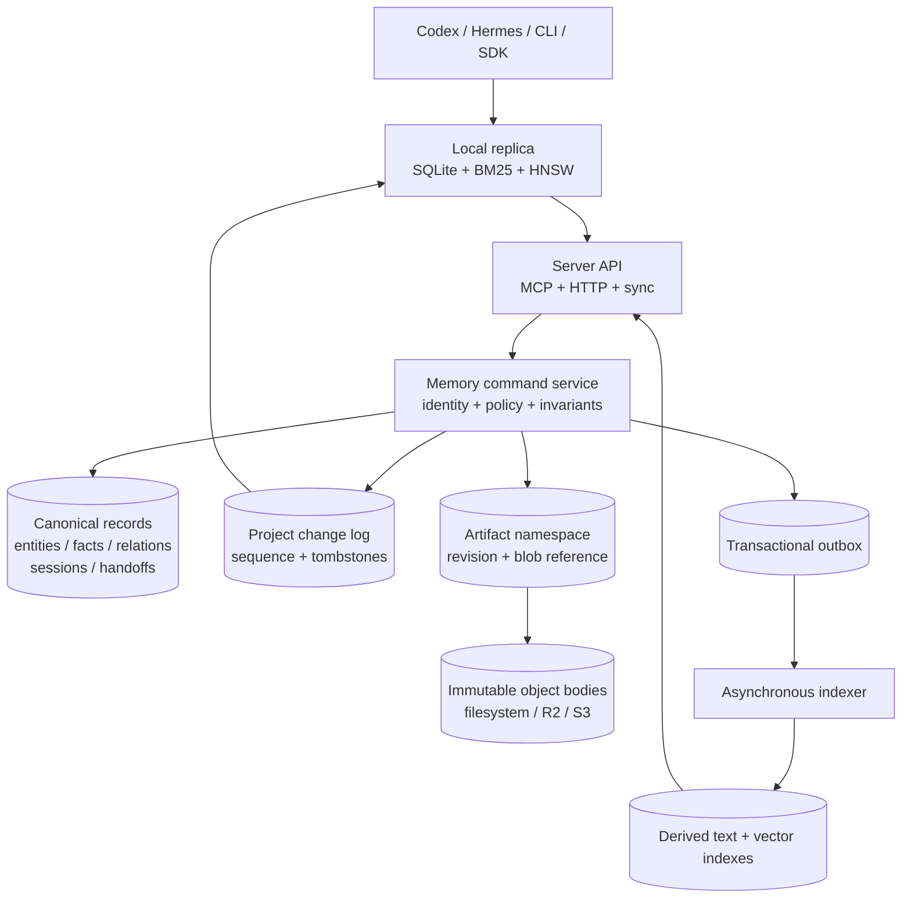

# Server and SSOT Architecture

> Status: accepted target direction. Phase 0 and a bounded single-node typed
> session/fact/handoff HTTP slice are implemented, but this is not the current
> production contract.

AideMemo is local-first today. One embedded store is opened by the Rust core and
can be coordinated through stdio MCP, the local daemon, or `aidememo mcp-serve`.
That remains the simplest mode for one person or a trusted agent fleet.

The server target changes the ownership boundary: the server becomes the source
of truth, while local stores become low-latency read caches and explicit offline
branches. This document fixes the invariants that must remain the same across a
single-node server, Cloudflare-hosted SaaS, and an on-premises Kubernetes
deployment. It is an architecture decision and implementation sequence, not a
claim that these deployment modes are already shipped.

## Decision

Build a portable memory service around structured domain records and an ordered
per-project change log. Keep search indexes and file-like artifacts as derived
or subordinate data planes.

The three deployment profiles share one protocol and conformance suite:

| Profile | Canonical records | Artifact bodies | Coordination |
|---|---|---|---|
| Embedded local | SQLite | Local filesystem | Process + SQLite transaction |
| Hosted SaaS | PostgreSQL initially; optional project Durable Object adapter later | S3-compatible storage, with R2 as the first preset | Database CAS; optional per-project Durable Object for active collaboration |
| On-premises Kubernetes | PostgreSQL | Customer S3-compatible storage | Database transaction and CAS |

Cloudflare is an efficient hosted profile, not the semantic definition of the
product. R2 is accessed through the S3-compatible contract. Durable Objects are
used at a project-sized coordination boundary and must not become one global
AideMemo singleton. A complete Durable Object record-store adapter is allowed
only after it passes the same conformance and logical export tests as the
PostgreSQL and local adapters.

## Current boundary versus server boundary

The current shared-store model is intentionally a cooperating-agent partition:

- `source_id` filters facts and source-visible graph data;
- `actor_id` records writer provenance;
- bearer-token bindings can prevent a network caller from overriding either
  value; and
- entity names and types still form one shared ontology inside the store.

That is not hostile tenant isolation. In particular, entities are shared
records and fact attachment is used to derive source-visible entity access.
The server model introduces independent identities instead of promoting
`source_id` into a tenant credential:

```text
tenant_id
  `- project_id
       |- source_id
       |- actor_id
       `- resources: entities, facts, relations, sessions, handoffs, artifacts
```

`tenant_id`, `project_id`, and `actor_id` are derived from authenticated server
context. A client may omit them, but must never be allowed to widen or replace
them in a command body. `source_id` remains an application namespace inside a
project; it is not the billing, authorization, or physical-isolation key.

Every canonical uniqueness constraint and lookup starts with tenant and
project identity. Representative constraints are:

```sql
UNIQUE (tenant_id, project_id, normalized_entity_name)
UNIQUE (tenant_id, project_id, source_id, content_hash)
UNIQUE (tenant_id, project_id, command_id)
```

## System model



The canonical transaction commits the domain mutation, change entry, audit
provenance, and outbox work together. Object upload and external indexing occur
outside that transaction through reservation/commit and idempotent workers.

## Command contract

All mutating surfaces, including MCP tools, REST calls, SDK methods, and offline
branch publication, map to one command envelope:

```json
{
  "command_id": "01K...",
  "project_id": "project_01K...",
  "expected_revision": 7,
  "operation": "fact.add",
  "payload": {}
}
```

The authenticated gateway supplies tenant and actor identity. The service must:

1. reject a project outside the authenticated membership;
2. return the stored receipt when `command_id` has already committed;
3. reject a stale `expected_revision` without partial writes;
4. update the domain rows and append the change/audit/outbox rows atomically;
5. return the committed project sequence and resource revision; and
6. never infer task success merely because a handoff worker process exited.

The currently implemented `/v1/commands` slice deliberately accepts only the
lower-level pairs `resource.put` + `upsert` and `resource.delete` + `delete`.
A delete payload must be JSON `null`, and the resource kind must use the
`custom.*` extension namespace. Reserved product kinds such as `fact`,
`session`, `handoff`, and `artifact` are rejected on the raw endpoint. Product
operations are never aliases accepted by this endpoint. The separate typed
routes now cover session creation, session-attached fact creation, and handoff
send/accept/return/status; search, inbox/outbox, heartbeat, and MCP integration
remain open. This prevents the raw route from bypassing product semantics.

The idempotency fingerprint binds project, revision precondition, operation,
payload, full resource coordinate, and upsert/delete change kind. Consequently,
reusing one `command_id` for another resource fails with `command_conflict`
instead of replaying the first resource's receipt.

Handoff claim and return invariants remain domain operations. A handoff result
fact must match the same tenant, project, session, source, receiving actor, and
active claim. A file written under an artifact path cannot complete a handoff
by itself. The first typed HTTP slice now enforces these checks, requires the
receiver to be an active writable project member, and keeps a failed return
eligible only for a new exclusive claim.

## Ordered change feed

Server sync uses one monotonic sequence per project instead of independent ULID
watermarks for each record class:

```json
{
  "project_epoch": "01K...",
  "after_seq": 18420,
  "limit": 1000
}
```

Each returned entry carries `seq`, resource kind and ID, operation, revision,
actor provenance, and commit time. Deletions are durable tombstones. The next
cursor is acknowledged only after the local replica commits the full batch.

`project_epoch` changes when an administrator restores or replaces canonical
history in a way that invalidates existing cursors. A mismatched epoch causes a
fail-closed snapshot refresh rather than a best-effort incremental merge.

Offline writes do not create an implicit multi-primary system. They are stored
in an actor branch/outbox with command IDs and base revisions. Publication is
explicit and conflicts return structured stale-revision results.

## Artifact namespace

The artifact subsystem borrows the useful boundary from `cf-vfs` and JuiceFS:
strongly consistent metadata is separate from immutable object bodies.

```text
/projects/<project>/sessions/<session>/canvas.md
/projects/<project>/sessions/<session>/artifacts/<name>
/projects/<project>/handoffs/<handoff>/request.json
/projects/<project>/handoffs/<handoff>/result.json
/projects/<project>/branches/<actor>/<segment>.jsonl
/projects/<project>/snapshots/<sequence>/manifest.json
```

Small bounded bodies may be stored inline with metadata. Large bodies use an
immutable random generation in S3-compatible object storage. Publication uses:

1. reserve a path with its current mutation token and an expiry;
2. upload directly to the object store;
3. verify server-observed size, version, ETag, and optional digest;
4. recheck the path token and publish metadata atomically; and
5. queue unreachable generations for idempotent garbage collection.

The artifact layer does not promise POSIX open handles, locks, `mmap`, sparse
writes, or database-file semantics. AideMemo SQLite, redb, WAL, BM25, and HNSW
files must never be opened directly through this remote namespace. Optional
FUSE or Python `fsspec` clients expose a materialized workspace, not a shared
database volume.

## Search consistency

Facts and graph records are authoritative; lexical and vector indexes are
rebuildable projections. Every index reports the highest project sequence it
has applied.

| Read | Consistency |
|---|---|
| Exact get by resource ID | Canonical record transaction |
| Handoff status or claim | Canonical record transaction |
| Search/query/context | Derived index plus `index_seq` watermark |
| Local offline search | Last applied replica sequence |

The default search may be eventually consistent, but callers can request
`at_least_seq`. The server then waits within a bounded deadline, falls back to a
canonical lexical path when available, or returns an explicit not-ready status.
It must not silently claim read-your-writes when the index is behind.

## Deployment profiles

### Single-node server

The first executable server profile keeps SQLite and local artifacts, binds one
durable data directory, and supports exactly one application replica. It proves
the remote identity, command, change-feed, and local-cache contracts without
claiming high availability.

The bounded foundation is now executable from the workspace. Generate a
high-entropy bearer token (not a password), keep the token file private, and
bootstrap one active membership:

```bash
openssl rand -hex 32 > /secure/aidememo-writer.token
chmod 600 /secure/aidememo-writer.token

cargo run -p aidememo-server -- bootstrap \
  --database /data/aidememo-ssot.sqlite \
  --tenant-id acme \
  --project-id memory \
  --actor-id codex-p1 \
  --token-file /secure/aidememo-writer.token

cargo run -p aidememo-server -- serve \
  --database /data/aidememo-ssot.sqlite
```

Bootstrap stores only the SHA-256 token digest and reuses an existing project
epoch on retry. Existing labels and timestamps are retained; conflicting epoch,
actor kind, membership role, or token ownership fails closed. The server binds
to `127.0.0.1:3030` by default. A non-loopback plaintext bind is rejected unless
`--allow-insecure-http` is explicit; production bearer traffic still requires a
TLS ingress.

The current HTTP surface is intentionally small:

| Endpoint | Contract |
|---|---|
| `GET /health` | Process mode and SQLite schema version |
| `POST /v1/commands` | Authenticated `custom.*` `resource.put` / `resource.delete`, idempotent receipt, revision CAS |
| `GET /v1/projects/{project}/resources/{kind}/{id}` | Exact canonical body or tombstone |
| `GET /v1/projects/{project}/changes` | Ordered change entries after an epoch/sequence cursor |
| `POST /v1/projects/{project}/sessions` | Create one typed session; `source_id` is fixed here |
| `POST /v1/projects/{project}/facts` | Create one fact attached to an existing session; source and actor are inherited server-side |
| `POST /v1/projects/{project}/handoffs` | Send the session pointer to another active writer |
| `POST .../handoffs/{id}/accept` | Claim with `expected_revision` and an exclusive `claim_id` |
| `POST .../handoffs/{id}/return` | Validate claim plus result fact session/source/actor and return an outcome |
| `GET .../handoffs/{id}` | Sender/receiver-only typed status |

Create requests use `{"command_id":"...","payload":{...}}`. Transitions also
carry the revision observed by the client:

```json
{
  "command_id": "command_accept_01",
  "expected_revision": 1,
  "payload": {"claim_id": "worker_attempt_01"}
}
```

Clients generate stable command and resource IDs so transport retries are
deterministic. Before re-reading mutable handoff state, the server verifies and
replays an existing receipt. This means a delayed accept retry still returns
its original receipt even if the handoff has since completed. A different actor
cannot replay the first actor's command ID.

Every protected request hashes the bearer value, resolves the persisted tenant
and actor, and reloads active project membership. Command JSON uses
`deny_unknown_fields`; tenant or actor identity in the body is rejected rather
than ignored. Canonical resource bodies, receipt, resource revision, project
sequence, change entry, and audit row commit in one SQLite transaction.

This process supports one application replica and has no built-in TLS, token
rotation/revocation command, rate limits, artifact directory, PostgreSQL,
search, handoff inbox/outbox index, heartbeat, MCP remote profile, local read
replica, or offline outbox yet. Typed facts are result evidence in the canonical
ledger and are not indexed by the existing embedded retrieval engine. This is a
server contract executable, not a released SaaS or a replacement for
`aidememo mcp-serve`.

### Hosted Cloudflare edge

A portable hosted profile uses a Worker for TLS, authentication, limits, and
routing; Hyperdrive can connect the Worker or origin service to PostgreSQL; R2
implements the S3 artifact contract. A per-project Durable Object may own active
WebSocket presence, short leases, or heavily contended session/handoff
coordination. Durable state remains project-scoped.

A future Cloudflare-native canonical adapter may place project records and the
change log in the same SQLite-backed Durable Object. It must provide logical
snapshot/export, restore, tenant deletion, cross-version migration, and storage
conformance before it is called an SSOT backend.

### Kubernetes and on-premises

The production chart keeps application pods replaceable:

```text
aidememo-api       Deployment
aidememo-indexer   Deployment
aidememo-migrate   Job
aidememo-gc        CronJob
PostgreSQL         external or operator-managed
S3-compatible      external
```

Production defaults use bring-your-own PostgreSQL and S3-compatible storage.
A development values file may install single-node dependencies, but that is not
the high-availability profile. API replicas never share a live embedded SQLite
file through a read-write-many volume.

## Code boundaries

The first four foundation crates now exist. The remaining names still describe
intended boundaries and do not exist yet:

```text
aidememo-domain          portable IDs, commands, records, invariants
aidememo-service         command/query orchestration and authorization context
aidememo-store-local     separate single-node SQLite command ledger
aidememo-store-postgres  server canonical adapter
aidememo-artifacts       local and S3-compatible reservation/commit contract
aidememo-server          bounded authenticated HTTP resource/change/health surface
aidememo-client          remote transport, local replica, and offline outbox
```

`aidememo-domain` must remain free of native model and filesystem assumptions so
its invariant tests can run against local, PostgreSQL, and optional Durable
Object adapters. The existing large synchronous `StoreBackend` remains the
embedded implementation boundary; a remote HTTP backend should not pretend to
be a local `Path`-opened store.

`aidememo-domain` provides validated tenant, project, actor, membership,
command, revision, audit, change-feed, tombstone, artifact-reference, typed
session/fact, and handoff state-machine types.
Every lookup and feed batch carries the composite tenant-project scope.
`aidememo-service` binds authenticated identity and membership to the untrusted
envelope, recursively canonicalizes its JSON fields, and computes the command
fingerprint. `aidememo-store-local` persists receipt, resource revision, change,
audit, and project sequence in one SQLite transaction in a database separate
from the existing embedded store. `aidememo-server` persists token bindings and
memberships in that ledger, derives identity outside the request body, and
exposes bootstrap, exact resource reads, extension resource commands, typed
session/fact/handoff routes, a change feed, and health over a loopback-first
Axum process.

The backend-neutral `conformance::run` fixture checks exact idempotent receipt
replay, command-ID conflicts, stale revision rejection, monotonic project
sequences, deletion tombstones, fail-closed epoch changes, and rejection of
cursors ahead of canonical history. Both its in-memory reference and the real
SQLite adapter pass. SQLite integration tests
also cover process reopen, duplicate submission through two concurrent
connections, and identical project IDs isolated under two tenants. HTTP tests
cover missing and unknown bearer rejection, identity-field injection, writer
replay/conflict behavior, reader-only sync, role enforcement, and a
`codex-p1 -> codex-p2 -> Hermes` typed handoff chain. No PostgreSQL, Durable
Object, artifact body, handoff inbox index, search adapter, MCP remote profile,
or local replica adapter is wired yet. All four foundation crates are
`publish = false` until a server-facing public API and release order are
approved, so they do not silently enter the existing v0.1.0 crate publication
workflow.

## Phased delivery gates

### Phase 0 — freeze the server contract

- Add tenant, project, membership, actor, command, revision, change, audit, and
  artifact-reference schemas.
- Specify error codes and cursor/epoch behavior.
- Add backend-neutral conformance fixtures.
- Preserve the current local API and file formats.

Exit gate: two independent clients cannot override identity; duplicate command
submission produces one mutation; stale revisions fail; deletion reaches a
replica through a tombstone.

Current status: the Phase 0 code exit gate passes against the separate SQLite
adapter and authenticated HTTP tests without changing the existing embedded API
or file formats. The bounded `aidememo-server` executable is reachable only as a
workspace, unpublished resource API; it is not wired to the existing CLI or MCP
product surfaces.

### Phase 1 — single-node remote SSOT

- Run the service over one SQLite database and local artifact directory.
- Make the CLI and MCP installations use one authenticated remote profile.
- Add local read-cache bootstrap, incremental pull, reset, and offline outbox.

Exit gate: Codex primary, Codex secondary, and Hermes complete a handoff through
one remote project; an unavailable server preserves cached reads and creates no
silent multi-primary writes.

Current status: the first item is partially complete for canonical inline JSON
resources, persisted bearer identity/membership, exact reads, incremental
change retrieval, and typed session/fact/handoff commands. An HTTP integration
test completes a `codex-p1 -> codex-p2 -> Hermes` chain. Combined domain and
HTTP tests reject wrong actor, claim, source/session evidence, read-only
receiver, and non-participant reads.
Actual CLI/MCP profile wiring, inbox/outbox indexes, local artifacts, replica
bootstrap/reset, and unavailable-server offline behavior remain open, so the
full Phase 1 exit gate is not yet closed.

### Phase 2 — portable production backend

- Add PostgreSQL and S3-compatible artifact adapters.
- Add transactional outbox indexers and sequence watermarks.
- Add logical backup/restore and tenant export/delete drills.

Exit gate: concurrent claim/return, restore, replica rebuild, tenant-isolation,
and index-rebuild suites pass against both SQLite and PostgreSQL.

### Phase 3 — Cloudflare hosted profile

- Add the Worker gateway, Hyperdrive/R2 configuration, and optional active
  project Durable Objects.
- Keep Durable Objects out of the cross-project global query path.
- Measure Korea-region end-to-end latency, cold starts, object operations, and
  index lag instead of importing local benchmark claims.

Exit gate: hosted results meet the same conformance suite and document measured
cost, latency, recovery, and region-placement boundaries.

### Phase 4 — Kubernetes distribution

- Publish a Helm chart with external PostgreSQL/S3 defaults.
- Add migrations, network policy, disruption budgets, observability, backup,
  restore, and rolling-upgrade tests.
- Publish a compatibility matrix and an air-gapped installation path.

Exit gate: a clean cluster install, upgrade, node disruption, database restore,
and complete tenant export/import are reproducible from documented commands.

## Non-goals

- A distributed POSIX filesystem for arbitrary applications.
- Opening SQLite, WAL, redb, BM25, or HNSW files over R2, FUSE, or a remote VFS.
- Exactly-once external side effects; the service provides idempotent command
  receipts and an at-least-once outbox.
- Hidden conflict resolution for offline writers.
- Treating `actor_id`, an agent alias, or `source_id` as authentication.
- Treating worker exit, artifact upload, or handoff delivery as proof of task
  success.

## References

- [`Architecture`](ARCHITECTURE.md) — the implemented embedded system map.
- [`Shared Memory Layer`](SHARED_MEMORY.md) — the current trusted-fleet deployment boundary.
- [`Branch Logs`](BRANCHES.md) — the existing append-oriented offline experiment path.
- [Cloudflare Durable Objects rules](https://developers.cloudflare.com/durable-objects/best-practices/rules-of-durable-objects/)
- [Cloudflare SQLite-backed Durable Object storage](https://developers.cloudflare.com/durable-objects/api/sqlite-storage-api/)
- [Cloudflare R2 S3 compatibility](https://developers.cloudflare.com/r2/api/s3/api/)
- [Cloudflare Hyperdrive](https://developers.cloudflare.com/hyperdrive/)
- [Kubernetes workloads](https://kubernetes.io/docs/concepts/workloads/)
- [`cf-vfs`](https://github.com/corca-ai/cf-vfs) — revisioned namespace and immutable-object lifecycle reference, not a POSIX storage backend for AideMemo databases.
