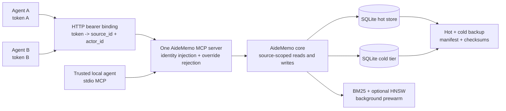

# Shared Memory Layer

AideMemo can serve one durable memory store to multiple coding agents while
keeping project context and writer provenance explicit. The intended boundary
is a trusted agent fleet: use `source_id` to choose the memory namespace,
`actor_id` to record who wrote a fact, and bearer-token bindings when a network
caller must not be allowed to choose either value.

This guide is the deployment-level view. For individual MCP tool schemas, see
[`MCP Setup`](MCP.md). For locking, backup, and sync details, see
[`Operations`](OPERATIONS.md).

## Choose the deployment model

| Situation | Recommended layout |
|---|---|
| One person, one project | One local SQLite store, stdio MCP, no `source_id` required |
| Several agents sharing one project | One store and one project `source_id`; give each writer a distinct `actor_id` |
| Several trusted projects on one server | One SQLite store, one `mcp-serve`, and a fixed token binding per source/actor |
| Mutually untrusted tenants | Separate stores and preferably separate AideMemo processes |
| Cloud or speculative agent runs | Restore a baseline backup, write locally, then merge only the selected branch log |

SQLite / `libsqlite` is the default shared-store backend. Prefer one daemon or
HTTP server as the writer coordinator. The optional redb backend is useful for
embedded single-process workloads, but its single-writer file lock makes a
shared server the practical multi-agent path.

## Reference architecture



The server binds its listener before semantic prewarm starts. Lexical requests
and `/health` therefore remain available while the model is warming.
`/admin/status.semantic_prewarm` reports `warming`, `ready`, `failed`, or
`disabled` to an unbound administrator.

## Identity and visibility rules

Keep these three concepts separate:

| Value | Purpose | Security meaning |
|---|---|---|
| `source_id` | Select the project, team, or upstream memory namespace | Filters facts, pinned context, entity visibility, graph reads, and mutations |
| `actor_id` | Record the writer profile or agent instance | Provenance only; it does not grant read access |
| Bearer token | Authenticate an HTTP caller | With a binding file, fixes both identities and rejects caller overrides |

The storage and read contracts are:

| Surface | Scoped behavior |
|---|---|
| Exact-content deduplication | Keyed by normalized `(source_id, content_hash)`; the same text in two sources creates two facts |
| Fact get/list/search/pin/mutations | The fact must belong to the selected source |
| Entity get/list | Returned only when the entity has a fact in the selected source; unscoped summary metadata is omitted |
| Traverse/path/graph | Both visible entities and relation provenance must match the exact source namespace |
| Context/query/recent/aggregate | Only source-visible facts participate before limits or arithmetic are applied |
| Global admin and sync export | Denied to source-bound HTTP tokens |

Entity names and entity types remain a shared ontology inside one store. This
is why `source_id` is a strong cooperating-team partition, not a hostile
multi-tenant database boundary. Separate stores are the isolation unit when
even entity names, resource usage, or administrator access must not be shared.

## Share one project between local agents

Choose one stable project source and a different actor for each writer:

```bash
aidememo --backend libsqlite --store ~/.aidememo/team.sqlite \
  mcp-install --target codex --source-id project:payments --actor-id codex:primary

aidememo --backend libsqlite --store ~/.aidememo/team.sqlite \
  mcp-install --target claude --source-id project:payments --actor-id claude:reviewer
```

Both agents see the same project facts because the `source_id` matches. Their
writes remain attributable because the `actor_id` differs. These installed
environment defaults are appropriate for trusted local processes; explicit MCP
arguments can still override them.

For shared writes, keep one warm coordinator running:

```bash
aidememo --backend libsqlite daemon start \
  --store ~/.aidememo/team.sqlite --port 3000
```

## Bind network callers to fixed identities

For independently authenticated HTTP agents, create a mode-`0600` binding
file. Each token must have a non-empty token, source, and actor, and duplicate
tokens are rejected.

```json
{
  "tokens": [
    {
      "token": "replace-with-agent-a-secret",
      "source_id": "project:payments",
      "actor_id": "codex:primary"
    },
    {
      "token": "replace-with-agent-b-secret",
      "source_id": "project:search",
      "actor_id": "claude:reviewer"
    }
  ]
}
```

```bash
chmod 600 ./token-bindings.json

aidememo --backend libsqlite --store ~/.aidememo/shared.sqlite \
  mcp-serve --bind 127.0.0.1 --port 3000 \
  --auth-bindings-file ./token-bindings.json
```

For every authenticated `tools/call`, the server injects the bound `source_id`
and `actor_id`. A different top-level value, or a different value inside an
`aidememo_fact_add_many` item, is rejected. Bound callers cannot read
`/admin/status` or `/sync/since`; `/health` returns only health and prewarm
state.

`mcp-serve` is plain HTTP. Keep it on loopback, or put any non-loopback bind
behind a TLS-terminating reverse proxy or encrypted private tunnel with rate
limits appropriate for the deployment.

## Use the shared-memory loop

The normal agent loop needs few calls:

1. Open with `aidememo_context` or start ticket work with
   `aidememo_workflow_start`.
2. Use `aidememo_query` for a topic dive.
3. Use `aidememo_aggregate` only for deterministic cross-fact counting,
   currency, duration, or timelines.
4. Persist durable outcomes with `aidememo_fact_add` or
   `aidememo_fact_add_many`, keeping `decision`, `lesson`, `error`, and
   `preference` types explicit.

With a bound token, clients should omit identity fields. The server supplies
them. With a trusted stdio install, the MCP environment supplies defaults.

## Protect continuity

For SQLite stores, a backup includes the hot database and an existing
`<store>.cold.sqlite` archive in one manifest with independent sizes and
SHA-256 checksums:

```bash
aidememo --store ~/.aidememo/shared.sqlite backup create ~/backups/aidememo
aidememo --store ~/.aidememo/shared.sqlite backup restore ~/backups/aidememo --force
```

Restore validates both tiers and preserves complete previous-store safety
snapshots before replacement. Stop writers before restore.

Incremental sync is canonical-writer and pull-only. Cursor persistence is
process-locked and atomic, relation additions and updates replicate, and
relation deletion is not represented. Use branch logs for disposable cloud
agents or what-if memory experiments rather than treating sync as
multi-primary conflict resolution.

## Production checklist

- Use an absolute store path and keep the suffix aligned with the backend.
- Give every shared project a stable `source_id` and every writer a stable
  `actor_id`.
- Use token bindings whenever an HTTP caller must not select its own scope.
- Keep `mcp-serve` on loopback or terminate TLS before it reaches clients.
- Run `aidememo doctor --json` to inspect store health and sharing guidance.
- Back up both hot and cold tiers before upgrades or destructive maintenance.
- Use one daemon/server for sustained shared writes.
- Treat relation deletes and competing semantic decisions as application-level
  coordination concerns.
