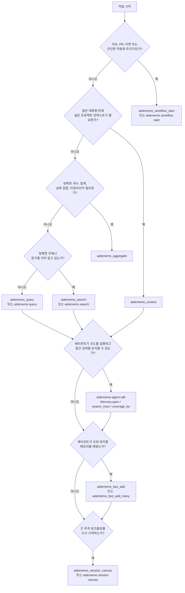

# 에이전트 워크플로

AideMemo는 에이전트가 하나의 집중된 메모리 읽기로 시작하고 작업 형태가
요구할 때만 분기할 때 가장 잘 동작합니다. 이 페이지는 그 선택을 위한 운영
가이드입니다.



## 작업 형태별 진입점

| 작업 형태 | 사용 | 이유 |
|---|---|---|
| 새 이슈, PR, 티켓, 자동화 트리거 | `aidememo_workflow_start` / `aidememo workflow start` | 추적 세션을 만들고 트리거를 저장한 뒤 관련 결정, 교훈, 오류, 최근 팩트, 검색 결과를 반환합니다. |
| 일반 대화형 턴 시작 | `aidememo_context` | 고정 팩트, 개인화, 최근 활동, 주제 컨텍스트를 한 번의 MCP 호출로 가져옵니다. |
| 후속 주제 탐색 | `aidememo_query` | 고정 및 최근 컨텍스트가 이미 로드된 뒤 더 가볍게 검색합니다. |
| 정확한 대상 회상 | `aidememo_search` | 그래프나 최근 컨텍스트 래핑 없이 빠르게 직접 검색합니다. |
| 정확한 합계, 개수, 날짜 집합, 타임라인 | `aidememo_aggregate` | 일치하는 팩트에 대해 결정적인 계산을 수행합니다. 단순 회상이 아닌 팩트 간 계산에 사용합니다. |
| 오래 유지할 팩트 하나를 학습 | `aidememo_fact_add` / `aidememo fact add` | 타입 지정 메모리를 명시적으로 저장하고 워크플로 세션에 연결할 수 있습니다. |
| 오래 유지할 여러 팩트를 학습 | `aidememo_fact_add_many` | 쓰기를 배치해 디스크 동기화 비용을 한 번만 지불합니다. |
| 긴 워크플로 다시 시작 | `aidememo_session_canvas` / `aidememo session canvas` / `Memory.session_canvas(...)` | 팩트 ID 상세 조회 명령을 포함하는 제한된 Markdown 및 Mermaid 지도를 반환합니다. |
| 간결한 프로젝트 컨텍스트 준비 | `aidememo_profile_export` / `aidememo profile export` / `Memory.project_profile(...)` | 현재 타입 지정 팩트로 읽기 전용 프로필을 만들고 저장소를 근거 기록으로 유지합니다. |

## 간단한 티켓 패턴

에이전트에 제목, 이슈 본문, PR 설명, 자동화 트리거만 있을 때 workflow
start를 사용합니다.

```bash
aidememo workflow start "Fix Redis timeout in worker" \
  --body-file issue.md \
  --source "github:org/app#123" \
  --source-id team-a \
  --bm25-only
```

반환된 `session_id`가 스레드 핸들입니다. MCP로 팩트를 추가할 때 다시
전달합니다.

```json
{
  "content": "Lesson: the timeout was DNS resolution, not pool size.",
  "fact_type": "lesson",
  "entities": ["Redis", "Worker"],
  "session_id": "session-..."
}
```

CLI에서는 `aidememo workflow start`가 출력한 export 명령을 적용하거나 후속
`fact add` 호출 전에 `AIDEMEMO_SESSION_ID`를 직접 설정합니다.

## 일반 턴 패턴

사용자가 프로젝트, 선호, 최근 작업, 알려진 주제를 물으면 일반적인 에이전트
턴 시작에 `aidememo_context`를 사용합니다. 검색보다 넓은 응답으로 고정
메모리, 개인화 팩트, 최근 활동, 주제 검색, 그래프 탐색, 교훈과 오류를 한 번에
포함할 수 있습니다.

첫 읽기 뒤에는 더 좁은 주제에 `aidememo_query`를 사용합니다. 에이전트가
직접 순위 검색이 필요하다는 것을 이미 알 때만 `aidememo_search`를 사용합니다.

## 집계 트리거

질문이 어렵다는 이유만으로 `aidememo_aggregate`를 호출하지 않습니다. 답이
여러 팩트에 대한 결정적 계산이나 집합 연산을 요구할 때 호출합니다.

| 사용자 질문 형태 | Aggregate 연산 |
|---|---|
| "X에 총 얼마를 썼나?" | `sum_currency` |
| "Y에 몇 시간을 썼나?" | `sum_duration` |
| "Z 이벤트가 발생한 날짜는 며칠인가?" | `count_distinct_dates` |
| "모든 X 이벤트의 타임라인" | `timeline` |
| "X를 결정하거나 시도한 횟수는?" | `count` 또는 `enumerate` |

"X에 대해 내가 무엇을 말했나?", "마지막으로 Y를 한 때는?", "Z에 대한 내
선호는?"과 같은 질문은 `aidememo_context`, `aidememo_query`,
`aidememo_search` 스니펫에서 답합니다.

## 팩트 타입 지정

쓰기 전에 팩트를 분류합니다. 타입 인식 순위는 저장소가 올바른 타입을 받을
때만 유용합니다.

| 단서 | fact_type |
|---|---|
| "I prefer X", "my favorite is Y" | `preference` |
| "we decided to X", "go with Y" | `decision` |
| "tried X but hit Y", "turns out" | `lesson` |
| "avoid X", "never again" | `error` |
| "always X", "every time" | `convention` |
| "X uses Y for Z" | `pattern` |
| 사실 주장 | `claim` |
| 기타 컨텍스트 | `note` |

`fact_type`이 생략되면 AideMemo는 명시적인 `preference`, `lesson`, `error`,
`decision`, `convention` 문구에 결정적 strong-cue 추론을 적용합니다. 명시된
`note`는 유지하지만 내용의 타입이 잘못된 것으로 보이면 쓰기 응답에
`fact_type_hint`가 포함될 수 있습니다.

저장소를 공유할 때는 항상 `source_id`를 전달하거나
`aidememo --backend libsqlite mcp-install --target codex --source-id
<namespace>`로 `AIDEMEMO_SOURCE_ID`를 포함한 MCP를 설치합니다.

## 코드 우선 패턴

에이전트가 코드를 실행할 수 있고 모든 중간 행을 모델 컨텍스트로 전달하지
않은 채 fanout 검색, 중복 제거, coverage 확인, 집계, 배치 쓰기가 필요하면
Python 에이전트 SDK를 사용합니다.

```python
from aidememo_agent import Memory

mem = Memory.open(source_id="team-a", storage_backend="libsqlite")
rows = mem.search_rows([
    "Redis timeout decisions",
    {"query": "billing webhook duplicates", "topic": "Billing"},
])
coverage = mem.coverage_by(rows, ["fact_type"])
timeline = mem.aggregate_many([
    {"query": "Redis timeout", "op": "timeline"},
])
mem.remember([
    {
        "content": "Decision: Redis timeout fixes start with DNS metrics.",
        "fact_type": "decision",
        "entities": ["Redis", "Worker"],
    }
])
```

모델이 소수의 보이는 도구를 직접 호출해야 하면 MCP를 사용합니다. 코드가
중간 메모리 상태를 간결하게 유지하고 최종 근거나 요약만 모델에 반환해야
하면 SDK를 사용합니다.
