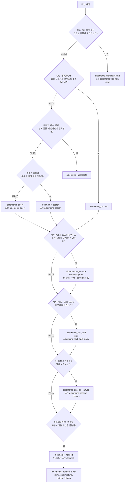

# 에이전트 워크플로

AideMemo는 에이전트가 하나의 집중된 메모리 읽기로 시작하고 작업 형태가
요구할 때만 분기할 때 가장 잘 동작합니다. 이 페이지는 그 선택을 위한 운영
가이드입니다. 먼저 [`코딩 에이전트 설치`](CODING_AGENTS.md)에 따라
에이전트를 설정하세요. Claude Code, Codex, Hermes와 MCP 클라이언트는 도구를
직접 호출하고, pi는 설치된 스킬과 로컬 CLI 명령으로 같은 흐름을 따릅니다.



## 작업 형태별 진입점

| 작업 형태 | 사용 | 이유 |
|---|---|---|
| 새 이슈, PR, 티켓, 자동화 트리거 | `aidememo_workflow_start` / `aidememo workflow start` | 추적 세션을 만들고 트리거를 저장한 뒤 관련 결정, 교훈, 오류, 최근 팩트, 검색 결과를 반환합니다. |
| 일반 대화형 턴 시작 | `aidememo_context` | 고정 팩트, 개인화, 최근 활동, 주제 컨텍스트를 한 번의 MCP 호출로 가져옵니다. |
| 후속 주제 탐색 | `aidememo_query` | 고정 및 최근 컨텍스트가 이미 로드된 뒤 더 가볍게 검색합니다. |
| 정확한 대상 회상 | `aidememo_search` | 그래프나 최근 컨텍스트 래핑 없이 빠르게 직접 검색합니다. |
| 정확한 합계, 개수, 날짜 집합, 타임라인 | `aidememo_aggregate` | 일치하는 팩트에 대해 결정적인 계산을 수행합니다. 단순 회상이 아닌 팩트 간 계산에 사용합니다. |
| 오래 유지할 팩트 하나를 학습 | `aidememo_fact_add` / `aidememo fact add` | 타입 지정 메모리를 명시적으로 저장하고 워크플로 세션에 연결할 수 있습니다. |
| 오래 유지할 여러 팩트를 학습 | `aidememo_fact_add_many` | 쓰기를 배치해 디스크 동기화 비용을 한 번만 지불합니다. |
| 긴 워크플로 다시 시작 | `aidememo_session_canvas` / `aidememo session canvas` / `Memory.session_canvas(...)` | 팩트 ID 상세 조회 명령을 포함하는 제한된 Markdown 및 Mermaid 지도를 반환합니다. |
| 에이전트 설치 또는 계정 사이로 작업 라우팅 | `aidememo_handoff` + `aidememo_handoff_inbox` / CLI `handoff` / SDK handoff 메서드 | packet을 미리 보거나 같은 워크플로 세션 포인터를 dispatch하고 명시적으로 accept/complete합니다. Hermes Kanban 같은 기존 스케줄러는 내부 작업 상태를 계속 소유합니다. |
| 간결한 프로젝트 컨텍스트 준비 | `aidememo_profile_export` / `aidememo profile export` / `Memory.project_profile(...)` | 현재 타입 지정 팩트로 읽기 전용 프로필을 만들고 저장소를 근거 기록으로 유지합니다. |

## 에이전트 간 핸드오프 패턴

AideMemo는 오케스트레이터가 자주 혼합하는 네 가지 개념을 분리합니다.

| 개념 | 의미 |
|---|---|
| `session_id` | 연속성: 다음 작업자가 이어받을 추적 워크플로입니다. |
| `source_id` | 범위: 공유 저장소에서 볼 수 있는 프로젝트/팀/테넌트 팩트입니다. |
| `actor_id` | 주소: `codex-one` 같은 사용자 지정 계정/설치 별칭이며 인증이 아닙니다. |
| 에이전트/프로필 경로 | 스케줄링 메타데이터: 패킷을 받을 런타임과 역할이며 권한 경계가 아닙니다. |

보내는 작업자는 먼저 지속할 결정, 교훈, 오류, 열린 질문을 세션에
연결합니다. 그다음 패킷을 만듭니다.

```bash
aidememo session handoff \
  --from-actor codex-one \
  --to-actor codex-two \
  --from codex/coding \
  --to codex/reviewer \
  --source-id team-a \
  --focus "패치를 검토하고 집중 회귀 테스트 실행" \
  --done-when "집중 테스트가 통과하고 리뷰 결과가 세션에 기록됨" \
  --dispatch \
  "$AIDEMEMO_SESSION_ID"
```

route는 `AGENT[/PROFILE]` 형식이며 기존 `from_agent` / `from_profile`,
`to_agent` / `to_profile` 상세 필드도 계속 지원합니다. Hermes 간 근거
미리보기에는 `--from hermes/coding --to hermes/reviewer`를 사용할 수 있지만,
같은 보드의 프로필 전환은 Kanban에 남겨 두고 두 번째 AideMemo 할당을 만들지
않아야 합니다. `--dispatch`가 없으면 읽기 전용 packet 미리보기입니다. 외부
수신자에게 dispatch한 경우
`aidememo_handoff_inbox`의 `list`, `accept`를 호출하며, accept는 현재 세션
근거와 구조화된 session/source/actor resume 값을 반환합니다. 수신자는 결과
fact를 쓴 뒤 `return`하고, 발신자는 `outbox` 또는 `status`에서 그 fact를
확인합니다. MCP 후속 쓰기는 반환된 `session_id`를 전달합니다.

반복 사용하는 계정은 자격 증명 없이 실행 메타데이터만 등록합니다.

```bash
aidememo agent add codex-two --type codex \
  --home /path/to/codex-two-home --workspace /path/to/repo \
  --source-id team-a
aidememo handoff send codex-two --focus "패치 검토"
aidememo handoff run codex-two
aidememo handoff show handoff-...
```

Codex config root는 `CODEX_HOME`으로 전달되며 기본 `core` 환경 정책은 무관한
계정 토큰을 자식 프로세스에 상속하지 않습니다.

프로그래밍 방식 라우팅에는 `Memory.handoff_packet(...)`을 사용합니다. 동일한
Markdown을 `content`에 담고 `session_id`, `source_id`, route, `focus`,
`done_when`, `resume`을 구조화해 반환합니다. `Memory.handoff(...)`은 prompt에
텍스트를 바로 주입할 때 쓰는 단축 호출로 유지됩니다.

수동 shell 핸드오프에서 accept 결과는 읽기 전용 packet과 같은
`aidememo session resume` bootstrap도 제공합니다.

할당 계층은 메시지 broker가 아닙니다. topic, offset, consumer group, lease,
재전송, payload 복제가 없습니다. 같은 actor 별칭을 여러 client가 사용하면 같은
할당에 접근할 수 있으므로 설치마다 고유한 비밀 아닌 별칭을 사용합니다.

### 핸드오프 유즈케이스

| 유즈케이스 | route 예시 | 반드시 이어져야 하는 것 |
|---|---|---|
| 구현에서 리뷰로 | `codex/coding -> hermes/reviewer` | 결정, 알려진 실패, 집중 테스트, 완료 조건 |
| 같은 에이전트 구독 두 개 | `codex-one -> codex-two` | vendor-local chat ID와 무관한 동일 세션과 리뷰 결과 |
| Hermes Kanban에서 외부 작업자로 | `hermes/research -> codex/coding` | 실험 결과, 기각한 접근, 구현 목표. Kanban은 계속 카드를 소유합니다. |
| 장애 대응 교대 | `hermes/oncall -> claude-code/incident` | 타임라인, 시도한 완화책, 활성 위험, 다음 진단 |
| 연구에서 구현으로 | `hermes/research -> codex/coding` | 측정 근거, 주장 경계, 선택한 개입 |
| branch winner 승격 | `codex/experiment -> codex/integrator` | 승자 branch id, merge 전제, 검증 명령, rollback 조건 |

이 패턴들은 동일한 continuity/scope/routing 계약을 사용합니다. handoff packet은
분산 lock이나 권한 token이 아니며 다음 모델이 작업을 완료했다는 증거도
아닙니다. `done_when`은 관찰 가능한 기대 결과를 명시하고 실제 완료는 별도로
검증해야 합니다.

## Hermes Kanban 경계

Hermes 카드를 AideMemo 할당 원장에 복제하지 마세요. Kanban은 이미 지속성
있는 큐와 수명주기 상태를 제공합니다. 두 시스템은 메모리와 외부 작업자
경계에서 조합합니다.

| 상황 | Hermes Kanban | AideMemo |
|---|---|---|
| 같은 보드의 PM → coder → reviewer | dependency edge, claim, comment, run summary, review, completion을 소유 | 공유 워크플로 세션에 지속할 decision/lesson/error를 기록하며 AideMemo dispatch는 사용하지 않음 |
| retry, stale claim, worker crash | retry/reclaim과 즉시 사용할 이전 시도 컨텍스트를 소유 | 현재 run이나 card보다 오래 유지해야 하는 실패를 회상 |
| 보드를 넘는 후속 작업 | 새 card만 소유하고 board는 격리 | 프로젝트 `source_id`에서 관련 근거를 검색 |
| Hermes → Codex/Claude 외부 lane | 외부 결과를 검증할 때까지 card를 running/blocked로 유지 | 주소가 지정된 설치에 한 session pointer를 dispatch하고 현재 fact-linked evidence를 반환 |
| fleet experiment → 선택한 구현 | fan-out, workspace, winner/reviewer gate를 소유 | 비교 가능한 측정값과 선택한 주장의 경계를 저장 |

프로젝트/팀 검색 경계에는 `source_id`를 사용합니다. Hermes board slug와 task
id는 card/session metadata의 upstream reference로 유지하며 `actor_id`로 쓰지
않습니다. `actor_id`는 주소를 지정할 수 있는 외부 계정 또는 설치에만
사용합니다. worker는 parent handoff나 card comment에 담긴 AideMemo
`session_id`를 재사용해 `aidememo_fact_add` 또는 `aidememo_fact_add_many`에
전달해야 합니다.

### 외부 CLI 수신자

Python SDK는 명시적인 외부 경계를 위한 `aidememo-worker-lane`을 설치합니다.
주소가 지정된 assignment 하나를 accept하고, 현재 handoff packet을 stdin으로
Codex 또는 Claude에 전달한 뒤 결과를 같은 session에 기록합니다.

```bash
aidememo-worker-lane handoff-... \
  --actor-id codex-two \
  --agent codex \
  --workspace "$PWD" \
  --source-id release-team \
  --kanban-task task-42
```

runner는 shell 없이 argv를 직접 실행합니다. 성공한 process는 session result를
추가한 뒤 AideMemo acknowledgement를 complete하고, non-zero exit 또는 timeout은
`error` fact를 추가하고 upstream scheduler가 처리할 수 있도록 `accepted`로
남깁니다. `--kanban-task`는 correlation metadata일 뿐이며 runner가 Hermes card를
claim, retry, complete하지 않습니다. 또한 authentication, exactly-once execution,
Hermes `spawn_fn` registration을 제공하지 않습니다.

수신자가 다른 머신에서 실행되면 먼저 branch log로 팩트 델타를 내보내고
병합합니다. handoff packet은 작업을 라우팅하고 branch segment는 원본 레코드를
이동합니다.

## 간단한 티켓 패턴

에이전트에 제목, 이슈 본문, PR 설명, 자동화 트리거만 있을 때 workflow
start를 사용합니다.

```bash
aidememo workflow start "Fix Redis timeout in worker" \
  --body-file issue.md \
  --source "github:org/app#123" \
  --source-id team-a \
  --bm25-only
```

반환된 `session_id`가 스레드 핸들입니다. MCP로 팩트를 추가할 때 다시
전달합니다.

```json
{
  "content": "Lesson: the timeout was DNS resolution, not pool size.",
  "fact_type": "lesson",
  "entities": ["Redis", "Worker"],
  "session_id": "session-..."
}
```

CLI에서는 `aidememo workflow start`가 출력한 export 명령을 적용하거나 후속
`fact add` 호출 전에 `AIDEMEMO_SESSION_ID`를 직접 설정합니다.

## 일반 턴 패턴

사용자가 프로젝트, 선호, 최근 작업, 알려진 주제를 물으면 일반적인 에이전트
턴 시작에 `aidememo_context`를 사용합니다. 검색보다 넓은 응답으로 고정
메모리, 개인화 팩트, 최근 활동, 주제 검색, 그래프 탐색, 교훈과 오류를 한 번에
포함할 수 있습니다.

첫 읽기 뒤에는 더 좁은 주제에 `aidememo_query`를 사용합니다. 에이전트가
직접 순위 검색이 필요하다는 것을 이미 알 때만 `aidememo_search`를 사용합니다.

## 집계 트리거

질문이 어렵다는 이유만으로 `aidememo_aggregate`를 호출하지 않습니다. 답이
여러 팩트에 대한 결정적 계산이나 집합 연산을 요구할 때 호출합니다.

| 사용자 질문 형태 | Aggregate 연산 |
|---|---|
| "X에 총 얼마를 썼나?" | `sum_currency` |
| "Y에 몇 시간을 썼나?" | `sum_duration` |
| "Z 이벤트가 발생한 날짜는 며칠인가?" | `count_distinct_dates` |
| "모든 X 이벤트의 타임라인" | `timeline` |
| "X를 결정하거나 시도한 횟수는?" | `count` 또는 `enumerate` |

"X에 대해 내가 무엇을 말했나?", "마지막으로 Y를 한 때는?", "Z에 대한 내
선호는?"과 같은 질문은 `aidememo_context`, `aidememo_query`,
`aidememo_search` 스니펫에서 답합니다.

## 팩트 타입 지정

쓰기 전에 팩트를 분류합니다. 타입 인식 순위는 저장소가 올바른 타입을 받을
때만 유용합니다.

| 단서 | fact_type |
|---|---|
| "I prefer X", "my favorite is Y" | `preference` |
| "we decided to X", "go with Y" | `decision` |
| "tried X but hit Y", "turns out" | `lesson` |
| "avoid X", "never again" | `error` |
| "always X", "every time" | `convention` |
| "X uses Y for Z" | `pattern` |
| 사실 주장 | `claim` |
| 기타 컨텍스트 | `note` |

`fact_type`이 생략되면 AideMemo는 명시적인 `preference`, `lesson`, `error`,
`decision`, `convention` 문구에 결정적 strong-cue 추론을 적용합니다. 명시된
`note`는 유지하지만 내용의 타입이 잘못된 것으로 보이면 쓰기 응답에
`fact_type_hint`가 포함될 수 있습니다.

저장소를 공유할 때는 항상 `source_id`를 전달하거나
`aidememo --backend libsqlite mcp-install --target <agent> --source-id
<namespace>`로 `AIDEMEMO_SOURCE_ID`를 포함한 MCP를 설치합니다. pi에는 MCP
등록 단계가 없으므로 스킬이 선택한 CLI 호출에 `--source-id`를 포함합니다.

## 코드 우선 패턴

에이전트가 코드를 실행할 수 있고 모든 중간 행을 모델 컨텍스트로 전달하지
않은 채 fanout 검색, 중복 제거, coverage 확인, 집계, 배치 쓰기가 필요하면
Python 에이전트 SDK를 사용합니다.

```python
from aidememo_agent import Memory

mem = Memory.open(source_id="team-a", storage_backend="libsqlite")
rows = mem.search_rows([
    "Redis timeout decisions",
    {"query": "billing webhook duplicates", "topic": "Billing"},
])
coverage = mem.coverage_by(rows, ["fact_type"])
timeline = mem.aggregate_many([
    {"query": "Redis timeout", "op": "timeline"},
])
mem.remember([
    {
        "content": "Decision: Redis timeout fixes start with DNS metrics.",
        "fact_type": "decision",
        "entities": ["Redis", "Worker"],
    }
])
```

모델이 소수의 보이는 도구를 직접 호출해야 하면 MCP를 사용합니다. 코드가
중간 메모리 상태를 간결하게 유지하고 최종 근거나 요약만 모델에 반환해야
하면 SDK를 사용합니다.
