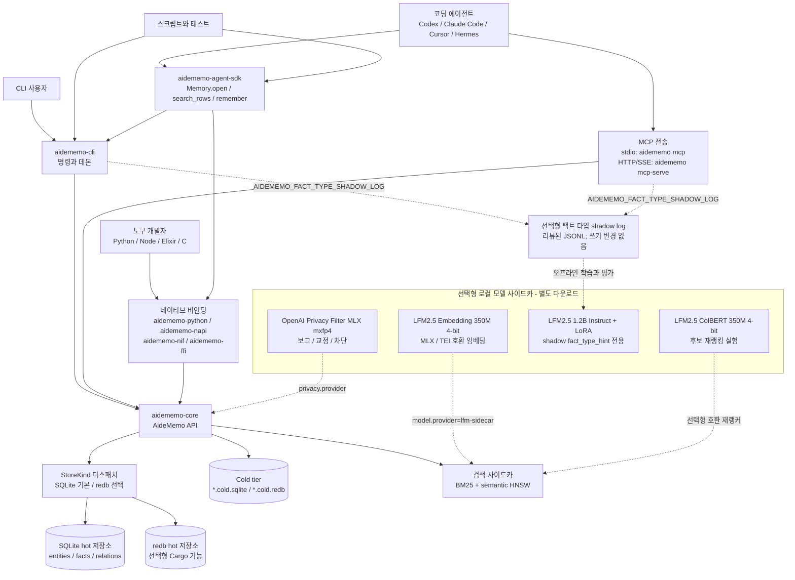
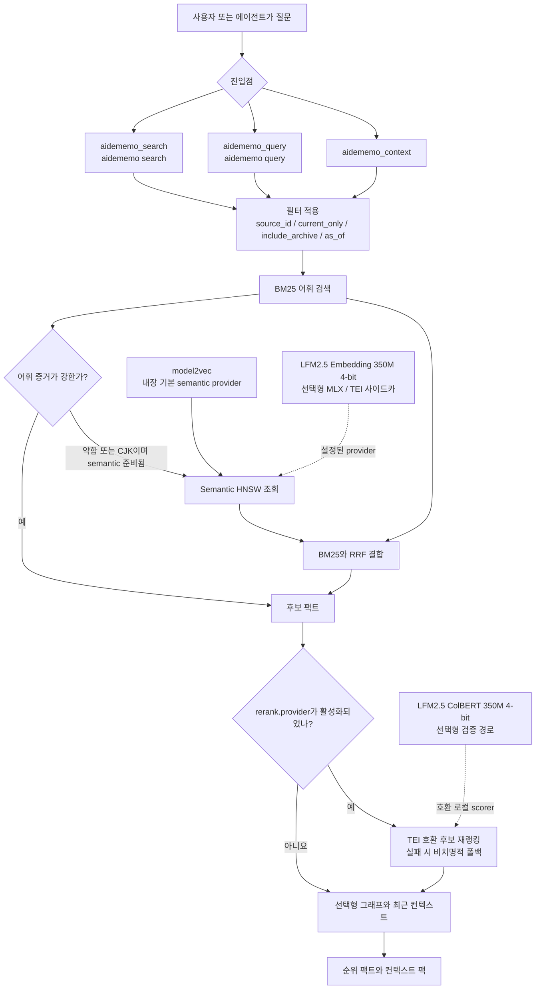
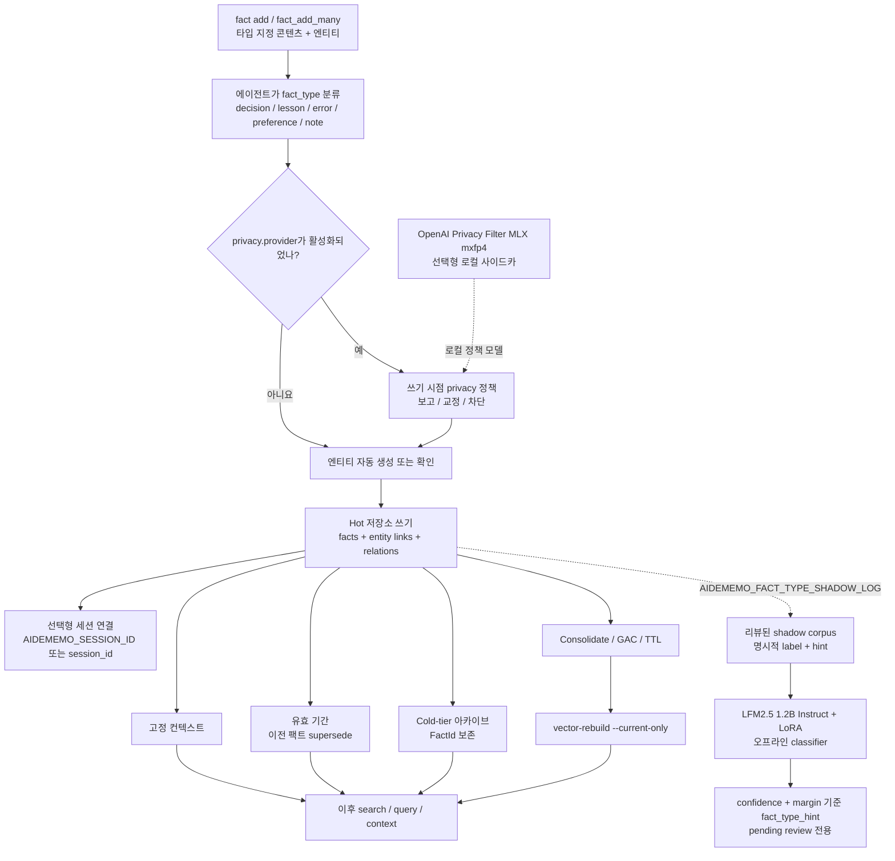
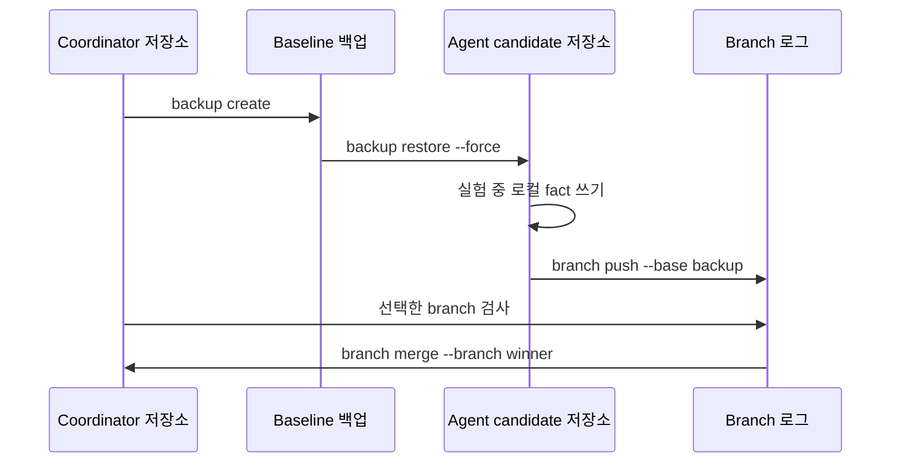

# 아키텍처

AideMemo는 여러 접근 표면을 가진 하나의 Rust 코어입니다. 동일한 타입 지정
팩트, 엔티티, 관계, 유효 기간, BM25 인덱스, semantic HNSW 사이드카, 아카이브
동작을 CLI, MCP 도구, Python 에이전트 SDK, 네이티브 바인딩에서 제공합니다.

## 시스템 지도



공개 디스패치 지점은 `aidememo-core`의 `AideMemo`입니다. 저장소 선택은
`StoreKind` 뒤에 집중되어 있습니다. SQLite / `libsqlite`가 기본 런타임
백엔드이며, `redb`는 선택형 Cargo 기능으로 빌드하고 설정 또는 CLI에서
요청할 때만 선택됩니다.

실선 저장 및 검색 경로는 외부 LLM API 없이 동작합니다. 점선 모델 경로는
숨은 의존성이 아니라 명시적인 로컬 선택 사항입니다. LFM2.5 Embedding은 기존
HNSW 경로에 벡터를 공급하고, ColBERT는 이미 recall된 후보를 재정렬하며,
1.2B LoRA 경로는 shadow 데이터에서 리뷰 전용 `fact_type_hint`를 만들고,
privacy 모델은 정책이 활성화된 경우 저장 전에 실행됩니다.

| 경계 | 측정 경로에서 사용한 구체적인 선택 사항 |
|---|---|
| Semantic fallback | `mlx-community/LFM2.5-Embedding-350M-4bit`와 `model.provider=lfm-sidecar` |
| 후보 재랭킹 | `mlx-community/LFM2.5-ColBERT-350M-4bit`와 호환 로컬 scorer |
| Shadow 팩트 분류 | `LiquidAI/LFM2.5-1.2B-Instruct-MLX-4bit` + LoRA, 리뷰 hint 전용 |
| 쓰기 시점 privacy | OpenAI Privacy Filter MLX `mxfp4`, 정책 선택형 |

## 검색 흐름



직접 순위 결과에는 `search`, 집중된 컨텍스트 팩에는 `query`, 넓은 턴 시작
범위에는 `context`를 사용합니다. CLI 기본값은 auto-hybrid 정책입니다.
BM25 증거가 충분하면 어휘 경로를 유지하고, semantic 경로가 준비된 상태에서
약한 쿼리 또는 CJK 쿼리를 semantic 검색으로 승격합니다. `--hybrid`는 모든
쿼리에 semantic 순위를 강제합니다. MCP 호출자는 결정적인 저지연 동작이
필요하면 `bm25_only:true`를 전달할 수 있습니다.

`model2vec`가 전역 기본 semantic provider로 유지됩니다. LFM embedding
사이드카는 `model.provider=lfm-sidecar`일 때만 선택되며 동일한 auto-hybrid +
HNSW 계약에 참여합니다. 해당 경로가 설정되면 daemon 시작 시 미리 웜업합니다.
ColBERT는 기본 비활성 상태이며 검색을 대체하지 않고 후보 recall 뒤에 둡니다.

## 쓰기와 생명주기 흐름



팩트는 의도적으로 명시적입니다. 일반 에이전트 루프에서 호출하는 에이전트가
이미 더 강한 모델을 가지고 있고 쓰기 전에 오래 유지할 팩트를 분류해야 하므로
AideMemo에 내장 호스팅 extractor가 필요하지 않습니다. `extract`와 `pending`
명령은 선택형 캡처 및 리뷰 워크플로를 위해 제공됩니다.
로컬 1.2B + LoRA 경로는 의도적으로 persistence 경계 밖에 있습니다. 리뷰한
shadow log에서 학습해 hint를 만들지만 명시적 타입을 조용히 바꾸거나 팩트를
쓰지 않습니다. Privacy 사이드카는 반대 위치에 있습니다. 활성화되면 해당
정책이 persistence 전에 동기적으로 실행됩니다.

## 클라우드와 브랜치 로그 흐름



브랜치 로그는 클라우드 에이전트와 추측성 메모리 실험을 위한 append-only
아티팩트입니다. 완전한 multi-master 충돌 해결은 아닙니다. `sync_import`로
중복 레코드를 건너뛰고 독립 팩트를 추가하며, 경쟁하는 결정 사이의 semantic
충돌은 애플리케이션 정책으로 남깁니다.

## 소스 지도

| 시스템 영역 | 주요 구현 | 공개 문서 |
|---|---|---|
| CLI 명령과 파서 | `crates/aidememo-cli/src/cmd/mod.rs`, `crates/aidememo-cli/src/main.rs` | [`CLI 사용법`](CLI.md), [`기능 목록`](FEATURES.md) |
| MCP 도구와 스키마 | `crates/aidememo-cli/src/cmd/mcp_tools.rs` | [`MCP 설정`](MCP.md), [`에이전트 워크플로`](AGENT_WORKFLOWS.md) |
| 코어 API와 검색 | `crates/aidememo-core/src/lib.rs`, `search.rs`, `graph.rs` | [`아키텍처`](ARCHITECTURE.md), [`운영`](OPERATIONS.md) |
| 저장소 디스패치 | `crates/aidememo-core/src/backend.rs`, `sqlite_store.rs`, `store.rs` | [`운영`](OPERATIONS.md), [`기능 목록`](FEATURES.md) |
| Python 에이전트 SDK | `packages/aidememo-agent-sdk/src/aidememo_agent/sdk.py` | [`Python SDK`](SDK.md), [`에이전트 워크플로`](AGENT_WORKFLOWS.md) |
| 네이티브 바인딩 | `crates/aidememo-python`, `crates/aidememo-napi`, `crates/aidememo-nif`, `crates/aidememo-ffi` | [`Python SDK`](SDK.md), 패키지 README |
| 로컬 모델 사이드카와 평가 | `scripts/lfm_mlx_embedding_sidecar.py`, `scripts/lfm_colbert_rerank.py`, `scripts/lfm_fact_type_sidecar.py`, `scripts/privacy_filter_mlx_sidecar.py` | [`운영`](OPERATIONS.md), [`측정 원장`](MEASUREMENTS.md) |
| 검증과 릴리스 게이트 | `scripts/changelog-release-check.py`, `scripts/registry-readiness-check.py`, `scripts/cargo-package-readiness.sh`, `scripts/docs-feature-gate.py`, `scripts/docs-i18n-status.py`, `scripts/docs-site-e2e.py`, `scripts/*smoke*.sh`, `scripts/ci-local.sh` | [`측정 원장`](MEASUREMENTS.md), [`릴리스 체크리스트`](RELEASE.md) |

## 문서 계약

문서 검증은 두 계층으로 구성됩니다.

`scripts/docs-feature-gate.py`는 소스 수준 공개 문서 드리프트 게이트이며 다음을
확인합니다.

- `aidememo --help`에 표시되는 모든 최상위 CLI 명령과 하위 명령이
  [`기능 목록`](FEATURES.md)에 포함되어 있는지 확인합니다.
- `cmd/mcp_tools.rs::list_tools()`의 모든 MCP 도구가
  [`기능 목록`](FEATURES.md)에 포함되어 있는지 확인합니다.
- MCP 도구 수, CLI 명령 수, 아키텍처 다이어그램 수, AGENTS 핵심 도구 수와
  같은 공개 수치가 구현에서 계산한 값과 일치하는지 확인합니다.
- 이 페이지, [`에이전트 워크플로`](AGENT_WORKFLOWS.md),
  [`측정 원장`](MEASUREMENTS.md) 같은 핵심 설명 문서가 Docusaurus에
  노출되는지 확인합니다.
- Mermaid가 활성화되어 시스템 다이어그램이 코드가 아닌 다이어그램으로
  렌더되는지 확인합니다.
- README와 영어/한국어 아키텍처 다이어그램이 기본 로컬 경로와 선택형 LFM
  embedding, ColBERT rerank, 팩트 타입 hint, privacy 사이드카 경계를 계속
  포함하는지 확인합니다.
- 한국어 번역 범위와 원문 fingerprint가 공개 영어 문서와 일치하고, 의도한
  영어 폴백이 명시적으로 기록되어 있는지 확인합니다.
- 공개 문구가 SQLite를 기본 백엔드, redb를 선택형 Cargo 기능 백엔드로
  유지하는지 확인합니다.

`scripts/docs-site-e2e.py`는 렌더된 사이트 게이트입니다. Docusaurus를
빌드하고 영어와 한국어 sitemap, sidebar, homepage card, 페이지 H1,
baseUrl 범위 링크, 정적 자산, anchor, 아키텍처 문서의 구현 경로가 현재
저장소와 일치하는지 확인합니다.

문서를 배포하기 전에 다음 명령을 실행합니다.

```bash
python3 scripts/docs-feature-gate.py
python3 scripts/docs-site-e2e.py
```
