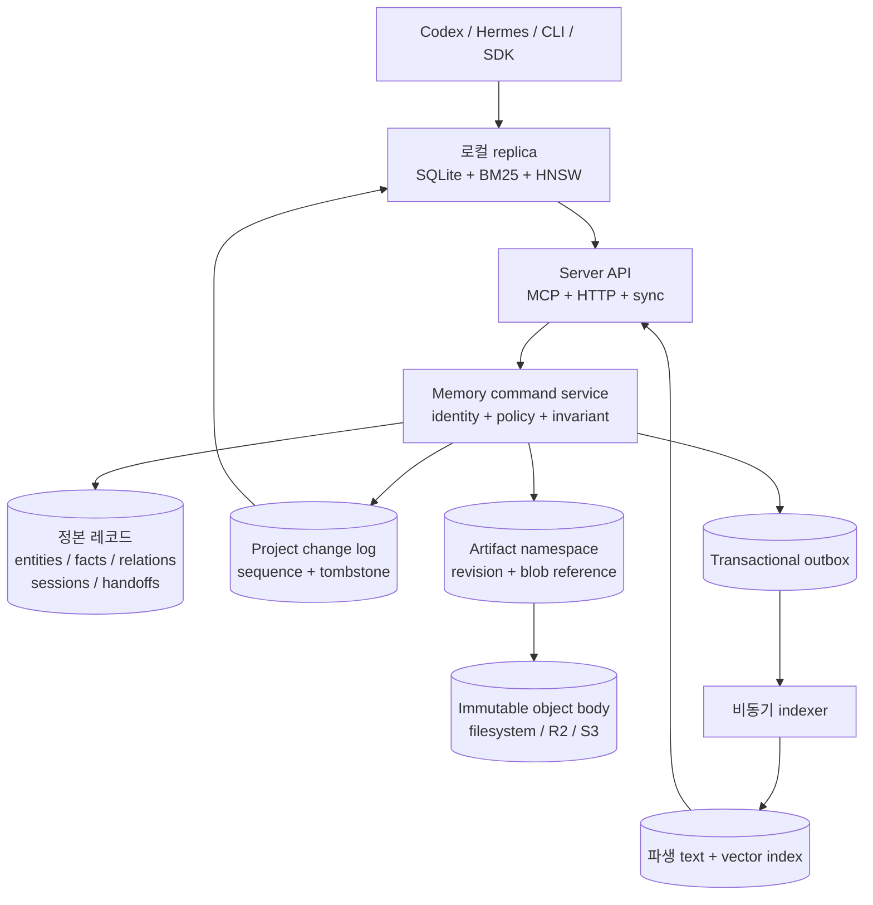

# 서버 및 SSOT 아키텍처

> 상태: 채택된 목표 방향입니다. Phase 0과 제한된 단일 노드 HTTP resource
> 구간은 구현됐지만 현재 프로덕션 계약은 아닙니다.

현재 AideMemo는 로컬 우선 시스템입니다. Rust 코어가 하나의 임베디드
저장소를 열고 stdio MCP, 로컬 daemon 또는 `aidememo mcp-serve`를 통해 이를
조정합니다. 이 방식은 한 사용자 또는 신뢰된 에이전트 집단에 계속 가장 단순한
모드입니다.

서버 목표에서는 소유권 경계가 바뀝니다. 서버가 정본이 되고 로컬 저장소는
지연이 낮은 읽기 cache와 명시적인 offline branch가 됩니다. 이 문서는 단일 노드
서버, Cloudflare 기반 SaaS, 온프레미스 Kubernetes 배포에서 동일하게 유지할
invariant를 고정합니다. 아직 이 배포 모드가 출시됐다는 주장이 아니라 아키텍처
결정과 구현 순서입니다.

## 결정

구조화된 도메인 레코드와 프로젝트별 순서가 있는 change log를 중심으로 이식
가능한 메모리 서비스를 만듭니다. 검색 index와 파일형 artifact는 파생 또는 하위
데이터 plane으로 둡니다.

세 배포 profile은 하나의 protocol과 conformance suite를 공유합니다.

| Profile | 정본 레코드 | Artifact 본문 | 조정 |
|---|---|---|---|
| 임베디드 로컬 | SQLite | 로컬 파일시스템 | 프로세스 + SQLite transaction |
| 호스팅 SaaS | 초기 PostgreSQL, 이후 선택형 project Durable Object adapter | S3 호환 저장소, 첫 preset은 R2 | Database CAS, 활성 협업에는 선택형 project Durable Object |
| 온프레미스 Kubernetes | PostgreSQL | 고객의 S3 호환 저장소 | Database transaction과 CAS |

Cloudflare는 효율적인 호스팅 profile이지 제품 의미론의 정의가 아닙니다. R2는
S3 호환 계약을 통해 접근합니다. Durable Object는 프로젝트 크기의 coordination
경계에 사용하며 하나의 전역 AideMemo singleton이 되어서는 안 됩니다. 완전한
Durable Object 레코드 저장 adapter는 PostgreSQL 및 로컬 adapter와 동일한
conformance와 논리 export 검사를 통과한 뒤에만 허용합니다.

## 현재 경계와 서버 경계

현재 공유 저장소 모델은 의도적으로 협력하는 에이전트용 partition입니다.

- `source_id`는 fact와 source에서 볼 수 있는 graph 데이터를 필터링합니다.
- `actor_id`는 작성자 provenance를 기록합니다.
- bearer-token binding은 네트워크 호출자가 두 값을 재정의하지 못하게 할 수
  있습니다.
- entity name과 type은 저장소 내부의 하나의 공유 ontology를 유지합니다.

이는 상호 불신 tenant 격리가 아닙니다. 특히 entity는 공유 레코드이고 fact
attachment를 통해 source에서 볼 수 있는 entity 접근을 계산합니다. 서버 모델은
`source_id`를 tenant credential로 승격하지 않고 독립된 identity를 도입합니다.

```text
tenant_id
  `- project_id
       |- source_id
       |- actor_id
       `- resources: entities, facts, relations, sessions, handoffs, artifacts
```

`tenant_id`, `project_id`, `actor_id`는 인증된 서버 context에서 파생합니다.
클라이언트는 이를 생략할 수 있지만 command body에서 범위를 넓히거나 교체할 수
없습니다. `source_id`는 프로젝트 내부의 애플리케이션 namespace이며 billing,
authorization 또는 물리적 격리 key가 아닙니다.

모든 정본 unique constraint와 lookup은 tenant와 project identity로 시작합니다.

```sql
UNIQUE (tenant_id, project_id, normalized_entity_name)
UNIQUE (tenant_id, project_id, source_id, content_hash)
UNIQUE (tenant_id, project_id, command_id)
```

## 시스템 모델



정본 transaction은 도메인 mutation, change entry, audit provenance, outbox
작업을 함께 commit합니다. Object upload와 외부 indexing은 reservation/commit 및
idempotent worker를 통해 transaction 밖에서 수행합니다.

## Command 계약

MCP tool, REST 호출, SDK method, offline branch publish를 포함한 모든 변경
surface는 하나의 command envelope로 매핑합니다.

```json
{
  "command_id": "01K...",
  "project_id": "project_01K...",
  "expected_revision": 7,
  "operation": "fact.add",
  "payload": {}
}
```

인증된 gateway가 tenant와 actor identity를 제공합니다. 서비스는 다음을
보장해야 합니다.

1. 인증 membership 밖의 project를 거부합니다.
2. 이미 commit된 `command_id`는 저장된 receipt를 반환합니다.
3. 오래된 `expected_revision`은 부분 쓰기 없이 거부합니다.
4. 도메인 row와 change/audit/outbox row를 원자적으로 갱신합니다.
5. commit된 project sequence와 resource revision을 반환합니다.
6. handoff worker process가 종료됐다는 이유만으로 task 성공을 추론하지 않습니다.

현재 구현된 `/v1/commands` 구간은 의도적으로 저수준 조합인
`resource.put` + `upsert`와 `resource.delete` + `delete`만 받습니다. Delete
payload는 JSON `null`이어야 합니다. `fact.add`, `session.handoff`, search, MCP
같은 제품 작업에는 아직 도메인 adapter가 필요하며 이 endpoint의 alias로 받지
않습니다. 첫 서버 실행 파일이 아직 강제하지 않는 애플리케이션 의미론까지
지원한다고 주장하지 않기 위한 경계입니다.

Handoff claim과 return invariant는 계속 도메인 작업입니다. Handoff 결과 fact는
같은 tenant, project, session, source, 수신 actor, 활성 claim과 일치해야 합니다.
Artifact path에 파일을 쓰는 것만으로는 handoff가 완료되지 않습니다.

## 순서가 있는 change feed

서버 sync는 record 종류별 ULID watermark 대신 프로젝트별 monotonic sequence
하나를 사용합니다.

```json
{
  "project_epoch": "01K...",
  "after_seq": 18420,
  "limit": 1000
}
```

각 entry는 `seq`, resource kind와 ID, operation, revision, actor provenance,
commit 시각을 포함합니다. 삭제는 durable tombstone입니다. 로컬 replica가 batch
전체를 commit한 뒤에만 다음 cursor를 확인합니다.

관리자가 기존 cursor를 무효화하는 방식으로 정본 history를 restore하거나
교체하면 `project_epoch`가 바뀝니다. Epoch가 다르면 best-effort incremental
merge가 아니라 fail-closed snapshot refresh를 수행합니다.

Offline write는 암묵적인 multi-primary 시스템을 만들지 않습니다. Command ID와
base revision을 포함한 actor branch/outbox에 저장하고 명시적으로 publish합니다.
충돌은 구조화된 stale-revision 결과로 반환합니다.

## Artifact namespace

Artifact subsystem은 `cf-vfs`와 JuiceFS의 유용한 경계를 차용합니다. 강한
일관성의 metadata와 immutable object body를 분리합니다.

```text
/projects/<project>/sessions/<session>/canvas.md
/projects/<project>/sessions/<session>/artifacts/<name>
/projects/<project>/handoffs/<handoff>/request.json
/projects/<project>/handoffs/<handoff>/result.json
/projects/<project>/branches/<actor>/<segment>.jsonl
/projects/<project>/snapshots/<sequence>/manifest.json
```

작고 제한된 body는 metadata와 함께 inline으로 저장할 수 있습니다. 큰 body는
S3 호환 object storage의 immutable random generation을 사용합니다.

1. 현재 mutation token과 만료 시간을 사용해 path를 reserve합니다.
2. Object store에 직접 upload합니다.
3. 서버가 관찰한 size, version, ETag와 선택형 digest를 검증합니다.
4. Path token을 다시 확인하고 metadata를 원자적으로 publish합니다.
5. 도달할 수 없는 generation을 idempotent garbage collection queue에 넣습니다.

Artifact layer는 POSIX open handle, lock, `mmap`, sparse write 또는 database-file
의미론을 보장하지 않습니다. AideMemo SQLite, redb, WAL, BM25, HNSW 파일은 이
원격 namespace를 통해 직접 열면 안 됩니다. 선택형 FUSE 또는 Python `fsspec`
client는 공유 database volume이 아니라 materialized workspace를 노출합니다.

## 검색 일관성

Fact와 graph 레코드가 정본이며 lexical/vector index는 재구축 가능한
projection입니다. 모든 index는 적용한 가장 높은 project sequence를 보고합니다.

| 읽기 | 일관성 |
|---|---|
| Resource ID의 exact get | 정본 record transaction |
| Handoff status 또는 claim | 정본 record transaction |
| Search/query/context | 파생 index + `index_seq` watermark |
| 로컬 offline search | 마지막 적용 replica sequence |

기본 search는 eventual consistency일 수 있지만 호출자는 `at_least_seq`를 요청할
수 있습니다. 서버는 제한된 deadline 동안 기다리고, 가능한 경우 정본 lexical
경로로 폴백하거나 명시적인 not-ready 상태를 반환합니다. Index가 뒤처졌는데
read-your-writes를 조용히 주장하면 안 됩니다.

## 배포 profile

### 단일 노드 서버

첫 실행 가능한 server profile은 SQLite와 로컬 artifact를 유지하고 하나의
durable data directory를 binding하며 애플리케이션 replica를 정확히 하나만
지원합니다. 고가용성을 주장하지 않고 원격 identity, command, change feed,
로컬 cache 계약을 검증합니다.

제한된 기반은 이제 workspace에서 실행할 수 있습니다. Password가 아닌 높은
entropy의 bearer token을 생성하고 token file을 비공개로 유지한 뒤 활성 membership
하나를 bootstrap합니다.

```bash
openssl rand -hex 32 > /secure/aidememo-writer.token
chmod 600 /secure/aidememo-writer.token

cargo run -p aidememo-server -- bootstrap \
  --database /data/aidememo-ssot.sqlite \
  --tenant-id acme \
  --project-id memory \
  --actor-id codex-p1 \
  --token-file /secure/aidememo-writer.token

cargo run -p aidememo-server -- serve \
  --database /data/aidememo-ssot.sqlite
```

Bootstrap은 SHA-256 token digest만 저장하고 재시도 시 기존 project epoch를
재사용합니다. 처음 저장한 label과 timestamp를 유지하며 epoch, actor kind,
membership role, token 소유권 충돌은 fail closed로 처리합니다. 서버는 기본적으로
`127.0.0.1:3030`에 binding합니다. Loopback이 아닌 plaintext binding은
`--allow-insecure-http`를 명시하지 않으면 거부되며 프로덕션 bearer traffic에는
여전히 TLS ingress가 필요합니다.

현재 HTTP surface는 의도적으로 작습니다.

| Endpoint | 계약 |
|---|---|
| `GET /health` | Process mode와 SQLite schema version |
| `POST /v1/commands` | 인증된 `resource.put` / `resource.delete`, idempotent receipt, revision CAS |
| `GET /v1/projects/{project}/resources/{kind}/{id}` | 정확한 정본 body 또는 tombstone |
| `GET /v1/projects/{project}/changes` | Epoch/sequence cursor 이후 순서가 있는 change entry |

보호된 모든 요청은 bearer 값을 hash하고 저장된 tenant와 actor를 찾은 뒤 활성
project membership을 다시 읽습니다. Command JSON은 `deny_unknown_fields`를
사용하므로 body의 tenant 또는 actor identity를 무시하지 않고 거부합니다. 정본
resource body, receipt, resource revision, project sequence, change entry, audit
row는 한 SQLite transaction으로 commit됩니다.

현재 process는 application replica 하나만 지원하며 내장 TLS, token
rotation/revocation command, rate limit, artifact directory, PostgreSQL, search,
제품 fact/session/handoff command, MCP remote profile, 로컬 read replica, offline
outbox가 아직 없습니다. 서버 계약 실행 파일이지 출시된 SaaS나 `aidememo
mcp-serve`의 대체물이 아닙니다.

### Cloudflare edge 호스팅

이식 가능한 호스팅 profile은 Worker를 TLS, 인증, limit, routing에 사용합니다.
Hyperdrive는 Worker 또는 origin service를 PostgreSQL에 연결할 수 있고 R2는 S3
artifact 계약을 구현합니다. Project별 Durable Object는 활성 WebSocket
presence, 짧은 lease 또는 경쟁이 심한 session/handoff coordination을 소유할 수
있습니다. Durable state는 계속 project 범위입니다.

향후 Cloudflare-native 정본 adapter는 project 레코드와 change log를 하나의
SQLite-backed Durable Object에 배치할 수 있습니다. Logical snapshot/export,
restore, tenant deletion, version 간 migration, storage conformance를 제공하기
전에는 SSOT backend라고 부르지 않습니다.

### Kubernetes 및 온프레미스

프로덕션 chart는 애플리케이션 pod를 교체 가능하게 유지합니다.

```text
aidememo-api       Deployment
aidememo-indexer   Deployment
aidememo-migrate   Job
aidememo-gc        CronJob
PostgreSQL         external or operator-managed
S3-compatible      external
```

프로덕션 기본값은 사용자가 제공하는 PostgreSQL과 S3 호환 저장소입니다. 개발용
values file은 단일 노드 의존성을 설치할 수 있지만 고가용성 profile은 아닙니다.
API replica는 read-write-many volume을 통해 live embedded SQLite 파일을 공유하지
않습니다.

## 코드 경계

첫 네 개의 기반 crate가 이제 존재합니다. 나머지 이름은 여전히 의도한
경계를 설명하며 아직 존재하지 않습니다.

```text
aidememo-domain          portable ID, command, record, invariant
aidememo-service         command/query orchestration과 authorization context
aidememo-store-local     별도 single-node SQLite command ledger
aidememo-store-postgres  서버 정본 adapter
aidememo-artifacts       local 및 S3 호환 reservation/commit 계약
aidememo-server          제한된 인증 HTTP resource/change/health surface
aidememo-client          remote transport, local replica, offline outbox
```

`aidememo-domain`은 native model과 filesystem 가정이 없어야 하며 invariant
test를 local, PostgreSQL, 선택형 Durable Object adapter에 공통 실행할 수 있어야
합니다. 기존의 큰 동기식 `StoreBackend`는 embedded 구현 경계로 남깁니다. 원격
HTTP backend가 로컬 `Path`로 여는 store인 것처럼 동작해서는 안 됩니다.

`aidememo-domain`은 검증된 tenant, project, actor, membership, command, revision,
audit, change-feed, tombstone, artifact reference type을 제공합니다. 모든 lookup과
feed batch는 tenant-project 복합 scope를 가집니다. `aidememo-service`는 인증 identity와
membership을 untrusted envelope에 결합하고 JSON field를 재귀적으로 canonicalize하여
command fingerprint를 계산합니다. `aidememo-store-local`은 기존 embedded store와
분리된 SQLite database에서 receipt, resource revision, change, audit, project sequence를
한 transaction으로 저장합니다. `aidememo-server`는 token binding과 membership을
그 ledger에 저장하고 request body 밖에서 identity를 결정하며, loopback 우선 Axum
process로 bootstrap, exact resource read, resource command, change feed, health를
노출합니다.

Backend 중립 `conformance::run` fixture는 정확한 idempotent receipt replay, command ID
충돌, stale revision 거부, 단조 증가 project sequence, 삭제 tombstone, fail-closed
epoch 변경, 정본 이력보다 앞선 cursor 거부를 검사합니다. In-memory reference와
실제 SQLite adapter가 모두 통과합니다. SQLite integration test는 process reopen,
두 concurrent connection의 duplicate submission, 두 tenant 아래 같은 project ID
격리도 검증합니다. HTTP test는 누락·미등록 bearer 거부, identity field injection,
writer replay/conflict, reader 전용 sync, role 강제도 검사합니다. PostgreSQL,
Durable Object, artifact body, 제품 도메인 API, MCP remote profile, 로컬 replica
adapter는 아직 연결되지 않았습니다. 네 기반 crate는 server-facing 공개 API와
release 순서를 승인할 때까지 모두 `publish = false`이며 기존 v0.1.0 crate 배포
흐름에 조용히 포함되지 않습니다.

## 단계별 delivery gate

### Phase 0 — 서버 계약 고정

- Tenant, project, membership, actor, command, revision, change, audit,
  artifact-reference schema를 추가합니다.
- Error code와 cursor/epoch 동작을 명세합니다.
- Backend 중립 conformance fixture를 추가합니다.
- 현재 로컬 API와 파일 format을 보존합니다.

종료 gate: 두 독립 client가 identity를 재정의할 수 없고, 중복 command submission이
mutation 하나만 만들며, stale revision이 실패하고, 삭제가 tombstone으로
replica에 도착합니다.

현재 상태: 기존 embedded API나 파일 format을 변경하지 않고 별도 SQLite adapter와
인증 HTTP test가 Phase 0 code 종료 gate를 통과합니다. 제한된
`aidememo-server` 실행 파일은 workspace의 미배포 resource API로만 접근할 수 있고
기존 CLI나 MCP 제품 surface에는 연결되지 않았습니다.

### Phase 1 — 단일 노드 원격 SSOT

- SQLite database 하나와 로컬 artifact directory 위에서 서비스를 실행합니다.
- CLI와 MCP 설치가 인증된 원격 profile 하나를 사용하게 합니다.
- 로컬 read-cache bootstrap, incremental pull, reset, offline outbox를 추가합니다.

종료 gate: Codex primary, Codex secondary, Hermes가 하나의 원격 project를 통해
handoff를 완료합니다. 서버가 중단되면 cache read는 유지되지만 조용한
multi-primary write는 만들지 않습니다.

현재 상태: 정본 inline JSON resource, 저장된 bearer identity/membership, exact
read, incremental change 조회에 대해서는 첫 항목이 일부 완료됐습니다. 로컬
artifact body, 제품 도메인 command, CLI/MCP remote profile, replica
bootstrap/reset, offline 동작, 세 agent handoff 종료 scenario는 열린 상태입니다.

### Phase 2 — 이식 가능한 프로덕션 backend

- PostgreSQL과 S3 호환 artifact adapter를 추가합니다.
- Transactional outbox indexer와 sequence watermark를 추가합니다.
- Logical backup/restore 및 tenant export/delete 훈련을 추가합니다.

종료 gate: concurrent claim/return, restore, replica rebuild, tenant isolation,
index rebuild suite가 SQLite와 PostgreSQL 모두에서 통과합니다.

### Phase 3 — Cloudflare 호스팅 profile

- Worker gateway, Hyperdrive/R2 설정, 선택형 active-project Durable Object를
  추가합니다.
- Durable Object를 project 간 global query 경로에서 제외합니다.
- 로컬 benchmark 주장을 가져오지 않고 한국 지역 end-to-end latency, cold start,
  object operation, index lag를 측정합니다.

종료 gate: 호스팅 결과가 동일한 conformance suite를 통과하고 측정된 cost,
latency, recovery, region placement 경계를 문서화합니다.

### Phase 4 — Kubernetes 배포판

- 외부 PostgreSQL/S3 기본값을 가진 Helm chart를 배포합니다.
- Migration, network policy, disruption budget, observability, backup, restore,
  rolling-upgrade test를 추가합니다.
- Compatibility matrix와 air-gapped 설치 경로를 배포합니다.

종료 gate: 깨끗한 cluster 설치, upgrade, node disruption, database restore, 완전한
tenant export/import를 문서 명령으로 재현할 수 있습니다.

## 비목표

- 임의 애플리케이션을 위한 분산 POSIX filesystem.
- R2, FUSE, 원격 VFS에서 SQLite, WAL, redb, BM25, HNSW 파일 열기.
- 외부 side effect의 exactly-once. 서비스는 idempotent command receipt와
  at-least-once outbox를 제공합니다.
- Offline writer를 위한 숨겨진 conflict resolution.
- `actor_id`, agent alias 또는 `source_id`를 인증으로 취급하기.
- Worker exit, artifact upload 또는 handoff delivery를 task 성공 증거로 취급하기.

## 참고 자료

- [`아키텍처`](ARCHITECTURE.md) — 구현된 embedded system map.
- [`공용 메모리 레이어`](SHARED_MEMORY.md) — 현재 trusted-fleet 배포 경계.
- [`브랜치 로그`](BRANCHES.md) — 기존 append 중심 offline experiment 경로.
- [Cloudflare Durable Objects 규칙](https://developers.cloudflare.com/durable-objects/best-practices/rules-of-durable-objects/)
- [Cloudflare SQLite-backed Durable Object storage](https://developers.cloudflare.com/durable-objects/api/sqlite-storage-api/)
- [Cloudflare R2 S3 호환성](https://developers.cloudflare.com/r2/api/s3/api/)
- [Cloudflare Hyperdrive](https://developers.cloudflare.com/hyperdrive/)
- [Kubernetes workload](https://kubernetes.io/docs/concepts/workloads/)
- [`cf-vfs`](https://github.com/corca-ai/cf-vfs) — AideMemo database용 POSIX backend가 아니라 revisioned namespace와 immutable-object lifecycle 참고 구현.
