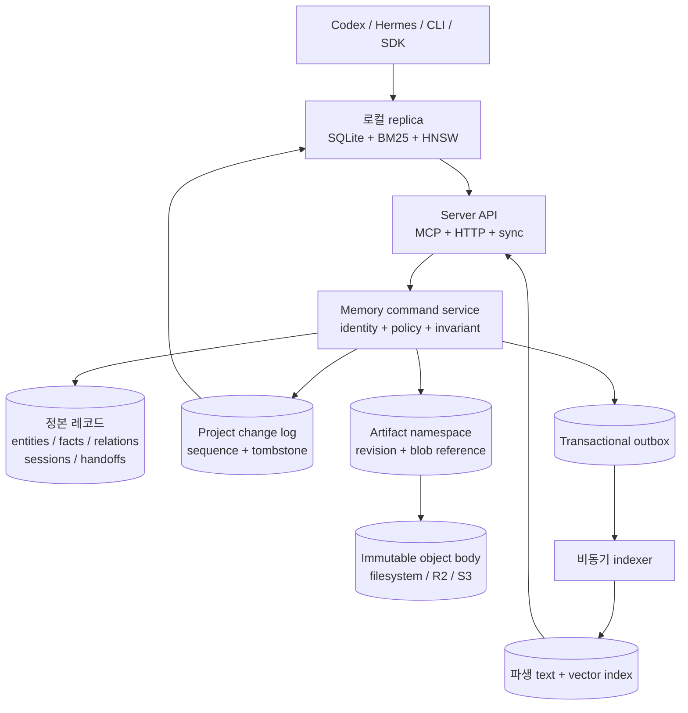

# 서버 및 SSOT 아키텍처

> 상태: 채택된 목표 방향입니다. Phase 0과 제한된 단일 노드 typed
> session/fact/handoff HTTP 구간은 구현됐지만 현재 프로덕션 계약은 아닙니다.

현재 AideMemo는 로컬 우선 시스템입니다. Rust 코어가 하나의 임베디드
저장소를 열고 stdio MCP, 로컬 daemon 또는 `aidememo mcp-serve`를 통해 이를
조정합니다. 이 방식은 한 사용자 또는 신뢰된 에이전트 집단에 계속 가장 단순한
모드입니다.

서버 목표에서는 소유권 경계가 바뀝니다. 서버가 정본이 되고 로컬 저장소는
지연이 낮은 읽기 cache와 명시적인 offline branch가 됩니다. 이 문서는 단일 노드
서버, Cloudflare 기반 SaaS, 온프레미스 Kubernetes 배포에서 동일하게 유지할
invariant를 고정합니다. 아직 이 배포 모드가 출시됐다는 주장이 아니라 아키텍처
결정과 구현 순서입니다.

## 결정

구조화된 도메인 레코드와 프로젝트별 순서가 있는 change log를 중심으로 이식
가능한 메모리 서비스를 만듭니다. 검색 index와 파일형 artifact는 파생 또는 하위
데이터 plane으로 둡니다.

세 배포 profile은 하나의 protocol과 conformance suite를 공유합니다.

| Profile | 정본 레코드 | Artifact 본문 | 조정 |
|---|---|---|---|
| 임베디드 로컬 | SQLite | 로컬 파일시스템 | 프로세스 + SQLite transaction |
| 호스팅 SaaS | 초기 PostgreSQL, 이후 선택형 project Durable Object adapter | S3 호환 저장소, 첫 preset은 R2 | Database CAS, 활성 협업에는 선택형 project Durable Object |
| 온프레미스 Kubernetes | PostgreSQL | 고객의 S3 호환 저장소 | Database transaction과 CAS |

Cloudflare는 효율적인 호스팅 profile이지 제품 의미론의 정의가 아닙니다. R2는
S3 호환 계약을 통해 접근합니다. Durable Object는 프로젝트 크기의 coordination
경계에 사용하며 하나의 전역 AideMemo singleton이 되어서는 안 됩니다. 완전한
Durable Object 레코드 저장 adapter는 PostgreSQL 및 로컬 adapter와 동일한
conformance와 논리 export 검사를 통과한 뒤에만 허용합니다.

## 현재 경계와 서버 경계

현재 공유 저장소 모델은 의도적으로 협력하는 에이전트용 partition입니다.

- `source_id`는 fact와 source에서 볼 수 있는 graph 데이터를 필터링합니다.
- `actor_id`는 작성자 provenance를 기록합니다.
- bearer-token binding은 네트워크 호출자가 두 값을 재정의하지 못하게 할 수
  있습니다.
- entity name과 type은 저장소 내부의 하나의 공유 ontology를 유지합니다.

이는 상호 불신 tenant 격리가 아닙니다. 특히 entity는 공유 레코드이고 fact
attachment를 통해 source에서 볼 수 있는 entity 접근을 계산합니다. 서버 모델은
`source_id`를 tenant credential로 승격하지 않고 독립된 identity를 도입합니다.

```text
tenant_id
  `- project_id
       |- source_id
       |- actor_id
       `- resources: entities, facts, relations, sessions, handoffs, artifacts
```

`tenant_id`, `project_id`, `actor_id`는 인증된 서버 context에서 파생합니다.
클라이언트는 이를 생략할 수 있지만 command body에서 범위를 넓히거나 교체할 수
없습니다. `source_id`는 프로젝트 내부의 애플리케이션 namespace이며 billing,
authorization 또는 물리적 격리 key가 아닙니다.

모든 정본 unique constraint와 lookup은 tenant와 project identity로 시작합니다.

```sql
UNIQUE (tenant_id, project_id, normalized_entity_name)
UNIQUE (tenant_id, project_id, source_id, content_hash)
UNIQUE (tenant_id, project_id, command_id)
```

## 시스템 모델



정본 transaction은 도메인 mutation, change entry, audit provenance, outbox
작업을 함께 commit합니다. Object upload와 외부 indexing은 reservation/commit 및
idempotent worker를 통해 transaction 밖에서 수행합니다.

## Command 계약

MCP tool, REST 호출, SDK method, offline branch publish를 포함한 모든 변경
surface는 하나의 command envelope로 매핑합니다.

```json
{
  "command_id": "01K...",
  "project_id": "project_01K...",
  "expected_revision": 7,
  "operation": "fact.add",
  "payload": {}
}
```

인증된 gateway가 tenant와 actor identity를 제공합니다. 서비스는 다음을
보장해야 합니다.

1. 인증 membership 밖의 project를 거부합니다.
2. 이미 commit된 `command_id`는 저장된 receipt를 반환합니다.
3. 오래된 `expected_revision`은 부분 쓰기 없이 거부합니다.
4. 도메인 row와 change/audit/outbox row를 원자적으로 갱신합니다.
5. commit된 project sequence와 resource revision을 반환합니다.
6. handoff worker process가 종료됐다는 이유만으로 task 성공을 추론하지 않습니다.

현재 구현된 `/v1/commands` 구간은 의도적으로 저수준 조합인
`resource.put` + `upsert`와 `resource.delete` + `delete`만 받습니다. Delete
payload는 JSON `null`이어야 하고 resource kind는 `custom.*` 확장 namespace를
사용해야 합니다. `fact`, `session`, `handoff`, `artifact` 같은 예약 제품 kind는
원시 endpoint에서 거부합니다. 제품 작업은 이 endpoint의 alias로 받지 않습니다.
별도의 typed route는 이제 session 생성, session에 연결된 fact 생성, handoff
send/indexed inbox/outbox/accept/return/status를 지원합니다. Search, heartbeat, MCP
연결은 아직 열려 있습니다. 이 경계는 원시 route가 제품 의미론을 우회하지 못하게
합니다.

Idempotency fingerprint는 project, revision precondition, operation, payload,
전체 resource 좌표, upsert/delete change kind를 결합합니다. 따라서 하나의
`command_id`를 다른 resource에 재사용하면 첫 resource receipt를 replay하지 않고
`command_conflict`로 실패합니다.

Handoff claim과 return invariant는 계속 도메인 작업입니다. Handoff 결과 fact는
같은 tenant, project, session, source, 수신 actor, 활성 claim과 일치해야 합니다.
Artifact path에 파일을 쓰는 것만으로는 handoff가 완료되지 않습니다. 첫 typed
HTTP 구간은 이 검사를 강제하고, 수신자가 활성 writer membership을 가져야 하며,
실패한 return은 새 exclusive claim으로만 재시도할 수 있게 합니다.

## 순서가 있는 change feed

서버 sync는 record 종류별 ULID watermark 대신 프로젝트별 monotonic sequence
하나를 사용합니다.

```json
{
  "project_epoch": "01K...",
  "after_seq": 18420,
  "limit": 1000
}
```

각 materialized entry는 `seq`, resource kind와 ID, operation, revision, actor
provenance, commit 시각과 정확히 해당 revision의 canonical body 또는 tombstone을
포함합니다. 서버는 metadata와 body를 같은 command transaction에 저장합니다. 로컬
replica가 revision-pinned resource와 batch 전체를 함께 commit한 뒤에만 다음 cursor를
확인합니다.

Handoff에는 project sequence 위에 actor projection이 적용됩니다. 인증된 sender와
receiver만 exact read, snapshot, metadata change, materialized change에서 해당
handoff를 볼 수 있습니다. 따라서 projection된 batch는 보이는 entry가 없어도 숨겨진
project sequence를 지나 cursor를 전진시킬 수 있습니다. Replica가 다른 actor의
handoff에서 반복하지 않도록 scan된 `next_cursor`를 그대로 신뢰합니다.

빈 exact-read replica는 `GET .../snapshot`으로 bootstrap합니다. 이 endpoint는 현재
resource 전체와 그 상태를 대표하는 project head를 하나의 SQLite read transaction에서
읽습니다. 이후 hydrated change만 적용하므로 cached resource가 durable cursor보다
앞설 수 없습니다. 첫 snapshot endpoint는 의도적으로 resource 10,000개로 제한하며,
stable snapshot handle을 사용하는 pagination은 이후 scale-out 항목입니다. 과거 body가
없는 schema v3 change row는 현재 상태를 추정하지 않고 `snapshot_required`를 반환합니다.
Replica 파일은 tenant, project, epoch, 인증 actor에 고정되며 actor profile을 바꾸려면
`replica reset --force`가 필요합니다. 기존 project-only replica는 actor가 미지정된
상태로 migration되므로 마찬가지로 명시적 reset이 필요합니다. 이는
sequence-consistent exact-read cache이며 아직 BM25/HNSW retrieval index는 아닙니다.

관리자가 기존 cursor를 무효화하는 방식으로 정본 history를 restore하거나
교체하면 `project_epoch`가 바뀝니다. Epoch가 다르면 pull은 fail-closed하고,
operator가 `replica reset --force`를 실행한 뒤 다음 pull이 새 snapshot으로
bootstrap합니다. 서로 다른 history generation을 best-effort로 merge하지 않습니다.

Offline write는 암묵적인 multi-primary 시스템을 만들지 않습니다. Command ID와
base revision을 포함한 actor branch/outbox에 저장하고 명시적으로 publish합니다.
충돌은 구조화된 stale-revision 결과로 반환합니다.

## Artifact namespace

Artifact subsystem은 `cf-vfs`와 JuiceFS의 유용한 경계를 차용합니다. 강한
일관성의 metadata와 immutable object body를 분리합니다.

```text
/projects/<project>/sessions/<session>/canvas.md
/projects/<project>/sessions/<session>/artifacts/<name>
/projects/<project>/handoffs/<handoff>/request.json
/projects/<project>/handoffs/<handoff>/result.json
/projects/<project>/branches/<actor>/<segment>.jsonl
/projects/<project>/snapshots/<sequence>/manifest.json
```

작고 제한된 body는 metadata와 함께 inline으로 저장할 수 있습니다. 큰 body는
S3 호환 object storage의 immutable random generation을 사용합니다.

1. 현재 mutation token과 만료 시간을 사용해 path를 reserve합니다.
2. Object store에 직접 upload합니다.
3. 서버가 관찰한 size, version, ETag와 선택형 digest를 검증합니다.
4. Path token을 다시 확인하고 metadata를 원자적으로 publish합니다.
5. 도달할 수 없는 generation을 idempotent garbage collection queue에 넣습니다.

Artifact layer는 POSIX open handle, lock, `mmap`, sparse write 또는 database-file
의미론을 보장하지 않습니다. AideMemo SQLite, redb, WAL, BM25, HNSW 파일은 이
원격 namespace를 통해 직접 열면 안 됩니다. 선택형 FUSE 또는 Python `fsspec`
client는 공유 database volume이 아니라 materialized workspace를 노출합니다.

### Artifact transport 및 garbage collection 결정

연구 snapshot은 2026-08-02이며 `cf-vfs` main의
`69963db6072683ff030d629cfe3288ea565d6913`을 검토했습니다. 차용할 부분은 Bash
runtime이나 POSIX 형태 namespace가 아니라 opaque body lifecycle입니다. AideMemo는
이미 Rust로 구현한 더 작은 artifact 계약을 유지하고 다음 adapter 경계를 세 역할로
분리합니다.

| 역할 | 소유하는 것 | 소유하면 안 되는 것 |
|---|---|---|
| Metadata coordinator | 인증된 scope, 논리 path, mutation token, reservation/verification lease, publication receipt, read retention, GC intent | 큰 body byte 또는 agent에게 반환되는 provider credential |
| Body store | 조건부 immutable create, `HEAD`, range/full read, idempotent delete, 선택형 multipart operation | tenant authorization 또는 논리 path conflict resolution |
| Upload authority | 제한된 local proxy 또는 수명이 짧고 exact-key에 고정된 upload/download capability | publication 정본 또는 다른 object key를 선택할 권한 |

`LocalArtifactStore`는 이 의미론의 Phase-1 reference adapter이지 최종 trait 형태가
아닙니다. Portable protocol은 Rust domain type과 HTTP로 유지합니다. Cloudflare
binding, S3 SDK, FUSE 또는 Python에 의존하는 계약으로 만들지 않습니다.

로컬 reference server는 임의의 논리 path를 URL에 직접 넣지 않고 opaque
reservation ID를 사용합니다. Hosted adapter는 제한된 body 전송만 교체하고 같은
control-plane 형태를 유지합니다.

| Route | 의미론 |
|---|---|
| `POST /v1/projects/{project}/artifact-reservations` | Writer가 논리 path를 reserve하고 opaque generation token과 만료 시간을 받습니다. |
| `PUT /v1/projects/{project}/artifact-reservations/{reservation}/body` | 단일 노드/local 제한 업로드입니다. Hosted large body는 이 route를 통과하지 않습니다. |
| `POST /v1/projects/{project}/artifact-reservations/{reservation}/upload-grants` | S3 feature의 writer가 reservation보다 오래 지속되지 않는 conditional, exact-length/type single-`PUT` capability를 받습니다. |
| `POST /v1/projects/{project}/artifact-reservations/{reservation}/publish` | Coordinator가 신뢰된 local observation 또는 S3 `HEAD`를 얻고 path token과 reservation을 다시 확인한 뒤 metadata를 원자적으로 publish합니다. Hosted publication에는 예상 `size_bytes`가 포함됩니다. |
| `DELETE /v1/projects/{project}/artifact-reservations/{reservation}` | 마지막 published path를 바꾸지 않고 abort하고 generation의 추후 삭제를 durable하게 예약합니다. |
| `GET /v1/projects/{project}/artifacts/resolve?path=...` | Reader membership으로 현재 metadata를 resolve합니다. |
| `POST /v1/projects/{project}/artifacts/{artifact}/downloads` | 정확한 revision의 제한된 local body를 반환합니다. |
| `POST /v1/projects/{project}/artifacts/{artifact}/download-grants` | S3 feature의 reader에게 ETag/version 고정 GET capability를 주기 전에 정확한 현재 generation을 durable하게 retain합니다. |

Catalog는 immutable body adapter의 credential-free identity digest도 저장합니다. Local
storage는 repository layout에 고정되고 S3-compatible storage는 정확한 bucket, prefix,
endpoint, signing region, addressing mode에 고정됩니다. 서버는 traffic을 받기 전에
불일치를 거부합니다. 따라서 이 값 중 하나를 바꾸려면 명시적인 artifact migration
또는 비어 있는 별도 `--artifact-root`가 필요하며, in-place backend switch로 해석하지
않습니다.

모든 control-plane call에서 bearer binding이 tenant와 actor identity를 제공합니다.
Reader는 resolve/download, writer는 reserve/upload/publish/abort할 수 있습니다. Upload
Local reference는 reservation expiry 또는 publication 후 24시간 동안 exact
reservation/publication replay receipt를 유지한 뒤 bounded GC pass에서 정리합니다.
이 기간에는 이후 replacement와 GC로 원래 body가 삭제됐어도 publish retry가 최초
reference를 반환합니다.
capability 자체도 bearer credential입니다. 수명이 짧고 provider가 지원하는 범위에서
하나의 random generation key, method, content type, expected size/checksum, expiry,
conditional create에 고정합니다. 이를 log에 남기거나 artifact record에 저장하지
않습니다. Presigned URL은 만료 전 재사용할 수 있으므로 one-shot 보장이 아닙니다.
Publication에는 여전히 immutable key, 신뢰된 `HEAD`/checksum observation, 논리 path
compare-and-swap이 모두 필요합니다. 조건부 single 및 multipart completion 지원은
모든 S3-compatible 제품에 있다고 가정하지 않고 adapter conformance 항목으로
검증합니다.

R2의 직접 Workers 및 S3 API는 object write, read, delete, list에 strong consistency를
제공합니다. Cache가 활성화된 custom-domain response는 이 보장에 포함되지 않으며
publish 검증에 사용하면 안 됩니다. Hosted upload 검증은 binding 또는 S3 API를 직접
사용합니다. Portable hosted 첫 slice는 single `PUT`이며 공통 S3/R2 5 GB 경계로
제한됩니다. Multipart는 별도 향후 경로이고 신뢰된 completion만 observed generation을
생성할 수 있습니다.

2026-08-02에 확인한 공식
[R2 S3 compatibility table](https://developers.cloudflare.com/r2/api/s3/api/)은
`If-None-Match`를 포함한 conditional `PutObject`를 지원하며,
[presigned URL contract](https://developers.cloudflare.com/r2/api/s3/presigned-urls/)은
만료 전까지 재사용 가능한 exact-key `PUT`/`GET` grant를 지원합니다. 따라서
feature-gated Rust adapter는 `If-None-Match: *`, 정확한 content length/type,
generation metadata를 signing하고 URL을 redacted bearer capability로 취급합니다.
또한 trusted `HEAD`의 size/generation/ETag를 확인하고 signed GET이 coordinator에
저장된 read retention보다 오래 유지되는 것을 거부합니다. R2는 이에 대응하는
conditional `DeleteObject` header를 문서화하지 않으므로 delete는 random generation
key를 절대 재사용하지 않는 더 강한 AideMemo invariant에 의존합니다.

Garbage collection은 bucket listing이 아니라 metadata로 구동합니다.

1. Replacement, abort, expiry, verification 실패 또는 publication CAS 상실 시 generation을
   unreachable하게 만드는 같은 metadata transaction에서 durable GC candidate 하나를
   기록합니다.
2. `not_before`는 upload-capability expiry와 settlement grace의 합보다 이르지 않고,
   마지막으로 부여한 download retention보다도 이르지 않습니다. 늦은 `PUT`이 방금
   삭제한 object를 재생성하거나 활성 signed download가 body를 잃는 것을 막습니다.
3. 제한된 worker가 due candidate를 lease한 뒤 published path, live reservation 또는
   read retention이 exact generation/version을 참조하지 않는지 다시 확인합니다.
4. 제한된 batch로 idempotent exact-key delete를 실행합니다. 성공하면 candidate를
   제거하고 실패하면 attempt, error, exponential retry time을 기록합니다.
5. 느린 reconciliation sweep이 adapter-owned object prefix와 catalog reachability를
   비교할 수 있지만 listing은 repair evidence일 뿐 canonical liveness가 아닙니다.

같은 table/queue 구현은 단일 노드 서버 또는 Kubernetes worker에서 실행할 수
있습니다. Cloudflare profile에서는 project 단위 Durable Object가 짧은 metadata
transaction을 소유하고 하나의 alarm으로 가장 이른 expiry/GC retry를 예약할 수
있습니다. PostgreSQL은 초기 hosted canonical adapter로 유지하며 Durable Object를
global singleton이나 PostgreSQL 옆의 두 번째 암묵적 writer로 만들면 안 됩니다.

PyO3는 storage-server 경계가 아닙니다. 기존 Rust/Python binding이 추후
`fsspec`-compatible materialization client를 노출할 수 있지만 upload, publication,
conflict 의미론은 동일한 인증 HTTP protocol을 사용합니다. 별도 PyO3 VFS는
authorization, CAS, retry, GC를 중복 구현하고 Workers, Node 또는 Kubernetes client에는
도움이 되지 않습니다.

구현 gate는 failure-oriented합니다.

- Reservation, upload, verification claim, metadata commit, object delete 직후 crash
- 정확한 reserve/upload/publish retry와 changed-body 또는 changed-command 재사용 구분
- Abort/expiry 이후 늦은 upload와 동일 path의 concurrent replacement
- Digest, size, ETag/version, tenant, project, actor role, object prefix mismatch
- Signed-download retention과 replacement/GC race
- 영구 실패 delete에서 bounded batching/backoff
- Local filesystem, R2, AWS S3, 선택한 on-premises S3-compatible 구현에 같은 lifecycle suite 적용

Local authenticated HTTP와 durable GC 구간, feature-gated S3/R2 server wiring은
구현됐습니다. Hosted 경로는 writer-only upload grant를 발급하고 신뢰된 `HEAD`만
publish하며, reader GET을 signing하기 전에 read retention을 저장하고 같은 durable
GC intent를 exact-generation provider delete로 처리합니다. Disposable local MinIO
process는 `./scripts/artifact-s3-minio-conformance.sh`를 통한 실제 presigned HTTP
lifecycle을 통과했습니다. Managed R2/AWS 실행은 남아 있으며 이후 multipart/resume,
마지막으로 선택형 project Durable Object coordinator를 추가합니다.

## 검색 일관성

Fact와 graph 레코드가 정본이며 lexical/vector index는 재구축 가능한
projection입니다. 모든 index는 적용한 가장 높은 project sequence를 보고합니다.

| 읽기 | 일관성 |
|---|---|
| Resource ID의 exact get | 정본 record transaction |
| Handoff status 또는 claim | 정본 record transaction |
| Search/query/context | 파생 index + `index_seq` watermark |
| 로컬 offline search | 마지막 적용 replica sequence |

기본 search는 eventual consistency일 수 있지만 호출자는 `at_least_seq`를 요청할
수 있습니다. 서버는 제한된 deadline 동안 기다리고, 가능한 경우 정본 lexical
경로로 폴백하거나 명시적인 not-ready 상태를 반환합니다. Index가 뒤처졌는데
read-your-writes를 조용히 주장하면 안 됩니다.

## 배포 profile

### 단일 노드 서버

첫 실행 가능한 server profile은 SQLite metadata를 유지하고 기본적으로 local
artifact body를 사용합니다. Feature-gated process는 같은 catalog에 S3/R2/MinIO body를
대신 연결할 수 있습니다. 애플리케이션 replica를 정확히 하나만 지원하며 고가용성을
주장하지 않고 원격 identity, command, change feed, artifact lifecycle, local cache
계약을 검증합니다.

제한된 기반은 이제 workspace에서 실행할 수 있습니다. Password가 아닌 높은
entropy의 bearer token을 생성하고 token file을 비공개로 유지한 뒤 활성 membership
하나를 bootstrap합니다.

```bash
openssl rand -hex 32 > /secure/aidememo-writer.token
chmod 600 /secure/aidememo-writer.token

cargo run -p aidememo-server -- bootstrap \
  --database /data/aidememo-ssot.sqlite \
  --tenant-id acme \
  --project-id memory \
  --actor-id codex-p1 \
  --token-file /secure/aidememo-writer.token

cargo run -p aidememo-server -- serve \
  --database /data/aidememo-ssot.sqlite \
  --artifact-root /data/aidememo-artifacts
```

`--artifact-root`를 생략하면 서버는 `<database>.artifacts`를 사용합니다. R2 body
store에서도 이 경로는 별도 metadata/GC catalog로 유지하고 credential은 command-line
argument가 아니라 표준 AWS provider chain으로 전달합니다.

```bash
AWS_ACCESS_KEY_ID="$R2_ACCESS_KEY_ID" \
AWS_SECRET_ACCESS_KEY="$R2_SECRET_ACCESS_KEY" \
cargo run -p aidememo-server --features s3 -- serve \
  --database /data/aidememo-ssot.sqlite \
  --artifact-root /data/aidememo-artifact-catalog \
  --artifact-backend s3 \
  --artifact-s3-bucket aidememo \
  --artifact-s3-region auto \
  --artifact-s3-endpoint https://ACCOUNT_ID.r2.cloudflarestorage.com
```

Local MinIO처럼 path-style addressing이 필요한 provider에서는
`--artifact-s3-force-path-style`을 사용합니다. Capability URL은 bearer credential이므로
log에 남기면 안 됩니다.

Bootstrap은 SHA-256 token digest만 저장하고 재시도 시 기존 project epoch를
재사용합니다. 처음 저장한 label과 timestamp를 유지하며 epoch, actor kind,
membership role, token 소유권 충돌은 fail closed로 처리합니다. 서버는 기본적으로
`127.0.0.1:3030`에 binding합니다. Loopback이 아닌 plaintext binding은
`--allow-insecure-http`를 명시하지 않으면 거부되며 프로덕션 bearer traffic에는
여전히 TLS ingress가 필요합니다.

현재 HTTP surface는 의도적으로 작습니다.

| Endpoint | 계약 |
|---|---|
| `GET /health` | Process mode와 SQLite schema version |
| `GET /v1/projects/{project}/identity` | Bearer에 binding된 tenant, project, actor와 활성 membership role 확인 |
| `POST /v1/commands` | 인증된 `custom.*` `resource.put` / `resource.delete`, idempotent receipt, revision CAS |
| `GET /v1/projects/{project}/resources/{kind}/{id}` | 정확한 정본 body 또는 tombstone. Handoff는 sender/receiver에게만 노출 |
| `GET /v1/projects/{project}/changes` | Epoch/sequence cursor 이후 순서가 있는 metadata-only change entry |
| `GET /v1/projects/{project}/changes/materialized` | 각 revision의 정확한 canonical body 또는 tombstone을 포함한 순서형 change |
| `GET /v1/projects/{project}/snapshot` | 현재 상태 전체와 이를 대표하는 project head의 원자적 bounded bootstrap |
| `POST /v1/projects/{project}/sessions` | Typed session 하나를 생성하고 `source_id`를 고정 |
| `POST /v1/projects/{project}/facts` | 기존 session에 fact를 생성하며 source와 actor는 서버에서 상속 |
| `POST /v1/projects/{project}/handoffs` | Session pointer를 다른 활성 writer에게 전달 |
| `GET /v1/projects/{project}/handoffs?box=inbox\|outbox` | 인증 actor의 indexed mailbox, 선택형 `source_id`, `include_completed`, `before_seq`, 제한된 `limit` |
| `POST .../handoffs/{id}/accept` | `expected_revision`과 exclusive `claim_id`로 claim |
| `POST .../handoffs/{id}/return` | Claim과 결과 fact의 session/source/actor를 검증하고 outcome 반환 |
| `GET .../handoffs/{id}` | 송신자/수신자 전용 typed status |
| `POST /v1/projects/{project}/artifact-reservations` | Writer 전용 idempotent logical-path reservation |
| `PUT .../artifact-reservations/{reservation}/body` | Writer 전용 direct local upload, 최대 64 MiB |
| `POST .../artifact-reservations/{reservation}/upload-grants` | S3 feature의 writer 전용 conditional single-`PUT` capability |
| `POST .../artifact-reservations/{reservation}/publish` | Local byte 또는 신뢰된 S3 `HEAD`를 다시 관찰하고 예약 generation을 원자적으로 publish |
| `DELETE .../artifact-reservations/{reservation}` | 현재 path를 교체하지 않고 abort한 뒤 eventual deletion queue 기록 |
| `GET /v1/projects/{project}/artifacts/resolve?path=...` | Reader가 볼 수 있는 현재 artifact metadata |
| `POST .../artifacts/{artifact}/downloads` | Reader가 볼 수 있는 exact-revision local body download |
| `POST .../artifacts/{artifact}/download-grants` | S3 feature의 reader 전용 retained exact-generation GET capability |

생성 요청은 `{"command_id":"...","payload":{...}}`를 사용합니다. 상태 전이는
클라이언트가 관찰한 revision도 전달합니다.

```json
{
  "command_id": "command_accept_01",
  "expected_revision": 1,
  "payload": {"claim_id": "worker_attempt_01"}
}
```

클라이언트는 전송 재시도가 결정적이도록 안정적인 command/resource ID를
생성합니다. 서버는 변경 가능한 handoff 상태를 다시 읽기 전에 기존 receipt를
검증하고 replay합니다. 따라서 handoff가 나중에 완료됐더라도 지연된 accept
재시도는 원래 receipt를 반환합니다. 다른 actor는 최초 actor의 command ID를
replay할 수 없습니다.

Mailbox actor identity는 항상 bearer binding에서 가져오며 `actor_id` query parameter는
거부합니다. 결과는 최신순이고 각 handoff의 현재 resource `revision`과 최신
`project_seq`를 포함합니다. 다음 page가 있으면 `next_before_seq`가 다음 요청의
exclusive cursor입니다. Inbox는 기본적으로 completed 작업을 제외하고 outbox는
기본적으로 포함합니다. SQLite schema v3 mailbox index는 정본 handoff 상태,
receipt, change, audit row와 같은 transaction에서 갱신됩니다. V2 ledger를 열면 정본
handoff resource와 최신 change sequence에서 index를 backfill합니다.

보호된 모든 요청은 bearer 값을 hash하고 저장된 tenant와 actor를 찾은 뒤 활성
project membership을 다시 읽습니다. Exact resource, snapshot, change feed 응답은
typed status route와 동일한 sender/receiver handoff visibility를 적용합니다. Command
JSON은 `deny_unknown_fields`를
사용하므로 body의 tenant 또는 actor identity를 무시하지 않고 거부합니다. 정본
resource body, receipt, resource revision, project sequence, change entry, audit
row는 한 SQLite transaction으로 commit됩니다.

현재 process는 application replica 하나만 지원하며 내장 TLS, token
rotation/revocation command, rate limit, PostgreSQL/S3, search, heartbeat, HTTP MCP
gateway profile, retrieval-index replica, offline outbox가 아직 없습니다. 별도 local
artifact repository는 인증된 reader/writer route에 연결됐고 idempotent reservation,
immutable upload, 신뢰 가능한 SHA-256/size 재관찰, CAS publication, exact-revision
read, abort, 재시작에 안전한 durable GC를 검증합니다. Direct body는 64 MiB로
제한되며 향후 hosted streaming 계약은 아닙니다. CLI와 stdio MCP는 named connected handoff profile을 지원하고
client는 별도 exact-read replica를 유지할 수 있지만 일반 원격 storage backend는
아닙니다. Typed fact는 정본 ledger의 결과 증거이며 기존 embedded retrieval
engine에 index되지 않습니다. 서버 계약 실행 파일이지 출시된 SaaS나
`aidememo mcp-serve`의 대체물이 아닙니다.

### Cloudflare edge 호스팅

이식 가능한 호스팅 profile은 Worker를 TLS, 인증, limit, routing에 사용합니다.
Hyperdrive는 Worker 또는 origin service를 PostgreSQL에 연결할 수 있고 R2는 S3
artifact 계약을 구현합니다. Project별 Durable Object는 활성 WebSocket
presence, 짧은 lease 또는 경쟁이 심한 session/handoff coordination을 소유할 수
있습니다. Durable state는 계속 project 범위입니다.

향후 Cloudflare-native 정본 adapter는 project 레코드와 change log를 하나의
SQLite-backed Durable Object에 배치할 수 있습니다. Logical snapshot/export,
restore, tenant deletion, version 간 migration, storage conformance를 제공하기
전에는 SSOT backend라고 부르지 않습니다.

### Kubernetes 및 온프레미스

프로덕션 chart는 애플리케이션 pod를 교체 가능하게 유지합니다.

```text
aidememo-api       Deployment
aidememo-indexer   Deployment
aidememo-migrate   Job
aidememo-gc        CronJob
PostgreSQL         external or operator-managed
S3-compatible      external
```

프로덕션 기본값은 사용자가 제공하는 PostgreSQL과 S3 호환 저장소입니다. 개발용
values file은 단일 노드 의존성을 설치할 수 있지만 고가용성 profile은 아닙니다.
API replica는 read-write-many volume을 통해 live embedded SQLite 파일을 공유하지
않습니다.

## 코드 경계

여섯 기반 crate가 존재하며 같은 경계 map에 다음 planned canonical adapter도
표시합니다.

```text
aidememo-domain          portable ID, command, record, invariant
aidememo-service         command/query orchestration과 authorization context
aidememo-store-local     SQLite command ledger와 transactional handoff index
aidememo-client          인증 transport와 격리된 exact-read replica
aidememo-artifacts       local lifecycle과 선택형 S3/R2 direct-transfer adapter
aidememo-store-postgres  planned 서버 정본 adapter
aidememo-server          제한된 인증 HTTP resource/change/handoff surface
```

`aidememo-domain`은 native model과 filesystem 가정이 없어야 하며 invariant
test를 local, PostgreSQL, 선택형 Durable Object adapter에 공통 실행할 수 있어야
합니다. 기존의 큰 동기식 `StoreBackend`는 embedded 구현 경계로 남깁니다. 원격
HTTP backend가 로컬 `Path`로 여는 store인 것처럼 동작해서는 안 됩니다.

`aidememo-domain`은 검증된 tenant, project, actor, membership, command, revision,
audit, change-feed, tombstone, artifact reference, typed session/fact, handoff 상태
machine type을 제공합니다. 모든 lookup과 feed batch는 tenant-project 복합 scope를
가집니다. `aidememo-service`는 인증 identity와 membership을 untrusted envelope에
결합하고 JSON field를 재귀적으로 canonicalize하여 command fingerprint를
계산합니다. `aidememo-store-local`은 기존 embedded store와 분리된 SQLite
database에서 receipt, resource revision, change, audit, project sequence,
actor-relative handoff index를 한 transaction으로 저장합니다. `aidememo-server`는
token binding과 membership을 그 ledger에 저장하고 request body 밖에서 identity를
결정하며, loopback 우선 Axum process로 bootstrap, exact resource read, extension
resource command, typed session/fact/handoff와 mailbox route, change feed, health를
노출합니다. `aidememo-client`는 이 route에 인증하고 별도 SQLite scope/epoch
cursor와 exact canonical resource cache를 유지하며 fully materialized change
batch를 원자적으로 적용합니다. Scope 또는 epoch가 바뀌면 명시적 reset을
요구하며 embedded search store를 열거나 재해석하지 않습니다.
`aidememo-artifacts`는 별도 SQLite logical-path catalog와 immutable generation
file을 유지합니다. Replacement에는 현재 published mutation token이 필요하고, live
경쟁 reservation을 거부하며, local publication 전에 byte를 다시 hash하고, abort 시 이전
version을 보존하며, logical artifact path를 OS path로 해석하지 않습니다.
Replacement, abort, expired reservation은 durable exact-generation GC intent를 쓰고,
leased bounded worker는 liveness를 다시 검사한 뒤 idempotent delete와 failure
backoff를 수행합니다. 직접 local upload는 64 MiB로 제한됩니다. `s3` feature는 검증된 provider config,
credential-chain loading, conditional presigned single-`PUT`, trusted `HEAD`, read
retention 범위의 exact GET grant, bounded exact read, immutable-key delete를
제공합니다. Presigned capability의 `Debug` 출력에서는 URL을 redact합니다. Server
feature는 이 capability를 인증된 writer/reader route에 연결하고, trusted hosted
observation에서만 nullable digest를 허용하며, GET signing 전에 read retention을
저장하고 durable GC queue에서 provider delete를 실행합니다. Ignored provider test와
local MinIO harness는 실제 S3-compatible process에서 conditional presigned PUT,
replay 거부, trusted HEAD, presigned/SDK exact GET, idempotent delete를 검사합니다.
Managed R2/AWS conformance와 multipart transfer는 아직 열려 있습니다.

Backend 중립 `conformance::run` fixture는 정확한 idempotent receipt replay, command ID
충돌, stale revision 거부, 단조 증가 project sequence, 삭제 tombstone, fail-closed
epoch 변경, 정본 이력보다 앞선 cursor 거부를 검사합니다. In-memory reference와
실제 SQLite adapter가 모두 통과합니다. SQLite integration test는 process reopen,
두 concurrent connection의 duplicate submission, 두 tenant 아래 같은 project ID
격리도 검증합니다. HTTP test는 누락·미등록 bearer 거부, identity field injection,
writer replay/conflict, reader 전용 sync, role 강제와 `codex-p1 -> codex-p2 ->
Hermes` typed handoff chain도 검사합니다. Binary 수준 test도 URL 하나에 bearer
profile 두 개를 저장하고 CLI와 설치된 stdio MCP 모두에서
send/inbox/accept/return/outbox `codex-p1 -> codex-p2` 흐름을 완료한 뒤
exact-read replica를 bootstrap하고 서버 종료 후 완료 handoff를 읽으며 guarded
reset도 검사합니다. PostgreSQL, Durable Object, search adapter, HTTP MCP gateway
profile, retrieval projection, offline outbox는 아직 연결되지 않았습니다. Artifact
HTTP test는 reader/writer authorization, exact reservation과 publication replay,
변경된 request reuse, revision-pinned local download, hosted upload/download grant,
durable read retention, replacement, abort, expiry, mock provider를 통한 local/S3 garbage
collection을 검사합니다. Ignored provider test와 local MinIO harness는 실제
S3-compatible process에서 conditional presigned PUT, replay 거부, trusted HEAD,
presigned/SDK exact GET, idempotent delete를 검사합니다. Managed R2/AWS conformance와
multipart transfer는 아직 열려 있습니다. 여섯 기반 crate는
server-facing 공개 API와 release
순서를 승인할 때까지 모두 `publish = false`이며 기존 v0.1.0 crate 배포 흐름에
조용히 포함되지 않습니다.

## 단계별 delivery gate

### Phase 0 — 서버 계약 고정

- Tenant, project, membership, actor, command, revision, change, audit,
  artifact-reference schema를 추가합니다.
- Error code와 cursor/epoch 동작을 명세합니다.
- Backend 중립 conformance fixture를 추가합니다.
- 현재 로컬 API와 파일 format을 보존합니다.

종료 gate: 두 독립 client가 identity를 재정의할 수 없고, 중복 command submission이
mutation 하나만 만들며, stale revision이 실패하고, 삭제가 tombstone으로
replica에 도착합니다.

현재 상태: 기존 embedded API나 파일 format을 변경하지 않고 별도 SQLite adapter와
인증 HTTP test가 Phase 0 code 종료 gate를 통과합니다. 제한된
`aidememo-server` 실행 파일은 workspace 전용이며 미배포 상태지만, named CLI와
stdio MCP profile은 typed handoff surface를 실제로 사용합니다.

### Phase 1 — 단일 노드 원격 SSOT

- SQLite database 하나와 로컬 artifact directory 위에서 서비스를 실행합니다.
- CLI와 MCP 설치가 인증된 원격 profile 하나를 사용하게 합니다.
- 로컬 read-cache bootstrap, incremental pull, reset, offline outbox를 추가합니다.

종료 gate: Codex primary, Codex secondary, Hermes가 하나의 원격 project를 통해
handoff를 완료합니다. 서버가 중단되면 cache read는 유지되지만 조용한
multi-primary write는 만들지 않습니다.

현재 상태: 제한된 single-node profile에서는 첫 항목이 완료됐습니다. 정본 inline
JSON resource, 인증된 local immutable artifact repository, 저장된 bearer
identity/membership, exact read, incremental change 조회, typed
session/fact/handoff command를 지원합니다. HTTP integration test는 `codex-p1 -> codex-p2 ->
Hermes` chain을 완료합니다. Named CLI profile은 같은 URL/project에 서로 다른
bearer token을 보관할 수 있고, connected CLI 경로는 actor override를 거부하며
로컬 결과 provenance를 인증된 서버 identity와 대조한 뒤
`send -> inbox -> accept -> return -> outbox`를 완료합니다.
`mcp-install --remote-profile`은 이 identity를 확인하고 파생 actor와 profile
이름을 agent config 하나에 고정합니다. Binary integration test는 설치된 argument와
환경을 그대로 사용해 같은 왕복을 실행합니다.
`replica pull --remote-profile`은 actor-projected 원자적 현재 상태 snapshot에서 bootstrap하고,
revision-pinned resource가 batch 전체와 commit된 경우에만
`<store>.replica.sqlite` cursor를 증분 전진시킵니다. Scope와 epoch mismatch는
물론 인증 actor 변경도 `replica reset --force` 전까지
fail-closed하며 `replica status/get`은 network-free이고 서버 종료 뒤에도
검증됩니다. Legacy unhydrated change 범위는 더 최신 상태로 재구성하지 않고 새
snapshot을 요구합니다. 도메인과 HTTP test를 합쳐 잘못된 actor, claim, source/session 증거,
read-only mutation, 비참여자 read, mailbox actor filter 주입을 거부합니다.
Indexed inbox/outbox query는 completed/source filter와 exclusive sequence
pagination을 지원하며 schema v2 migration backfill도 검사합니다. Artifact
reservation과 publication은 retry-safe이고, local direct upload는 body를 읽기 전에
authorization을 거치며, exact-revision download는 reader에게 열립니다. S3 feature는
인증된 direct grant, durable retention, provider GC를 추가하며 replacement/abort/expiry는
같은 leased worker로 전달됩니다. HTTP MCP gateway
연결, retrieval indexing, offline write outbox는 아직 열려 있으므로
Phase 1 종료 gate 전체는 닫히지 않았습니다.

### Phase 2 — 이식 가능한 프로덕션 backend

- PostgreSQL을 추가하고 연결된 S3 호환 artifact lifecycle을 managed R2/AWS S3와 선택한
  production on-premises 구현에서 conformance 검증합니다. Disposable local MinIO
  profile은 이미 opt-in lifecycle harness를 통과합니다.
- Transactional outbox indexer와 sequence watermark를 추가합니다.
- Logical backup/restore 및 tenant export/delete 훈련을 추가합니다.

종료 gate: concurrent claim/return, restore, replica rebuild, tenant isolation,
index rebuild suite가 SQLite와 PostgreSQL 모두에서 통과합니다.

### Phase 3 — Cloudflare 호스팅 profile

- Worker gateway, Hyperdrive/R2 설정, 선택형 active-project Durable Object를
  추가합니다.
- Durable Object를 project 간 global query 경로에서 제외합니다.
- 로컬 benchmark 주장을 가져오지 않고 한국 지역 end-to-end latency, cold start,
  object operation, index lag를 측정합니다.

종료 gate: 호스팅 결과가 동일한 conformance suite를 통과하고 측정된 cost,
latency, recovery, region placement 경계를 문서화합니다.

### Phase 4 — Kubernetes 배포판

- 외부 PostgreSQL/S3 기본값을 가진 Helm chart를 배포합니다.
- Migration, network policy, disruption budget, observability, backup, restore,
  rolling-upgrade test를 추가합니다.
- Compatibility matrix와 air-gapped 설치 경로를 배포합니다.

종료 gate: 깨끗한 cluster 설치, upgrade, node disruption, database restore, 완전한
tenant export/import를 문서 명령으로 재현할 수 있습니다.

## 비목표

- 임의 애플리케이션을 위한 분산 POSIX filesystem.
- R2, FUSE, 원격 VFS에서 SQLite, WAL, redb, BM25, HNSW 파일 열기.
- 외부 side effect의 exactly-once. 서비스는 idempotent command receipt와
  at-least-once outbox를 제공합니다.
- Offline writer를 위한 숨겨진 conflict resolution.
- `actor_id`, agent alias 또는 `source_id`를 인증으로 취급하기.
- Worker exit, artifact upload 또는 handoff delivery를 task 성공 증거로 취급하기.

## 참고 자료

- [`아키텍처`](ARCHITECTURE.md) — 구현된 embedded system map.
- [`공용 메모리 레이어`](SHARED_MEMORY.md) — 현재 trusted-fleet 배포 경계.
- [`브랜치 로그`](BRANCHES.md) — 기존 append 중심 offline experiment 경로.
- [Cloudflare Durable Objects 규칙](https://developers.cloudflare.com/durable-objects/best-practices/rules-of-durable-objects/)
- [Cloudflare SQLite-backed Durable Object storage](https://developers.cloudflare.com/durable-objects/api/sqlite-storage-api/)
- [Cloudflare R2 S3 호환성](https://developers.cloudflare.com/r2/api/s3/api/)
- [Cloudflare R2 일관성](https://developers.cloudflare.com/r2/reference/consistency/)
- [Cloudflare R2 presigned URL](https://developers.cloudflare.com/r2/api/s3/presigned-urls/)
- [Cloudflare R2 제한](https://developers.cloudflare.com/r2/platform/limits/)
- [Amazon S3 conditional write](https://docs.aws.amazon.com/AmazonS3/latest/userguide/conditional-writes.html)
- [Amazon S3 multipart checksum](https://docs.aws.amazon.com/AmazonS3/latest/userguide/checking-object-integrity-upload.html)
- [Cloudflare Hyperdrive](https://developers.cloudflare.com/hyperdrive/)
- [Kubernetes workload](https://kubernetes.io/docs/concepts/workloads/)
- [연구 revision의 `cf-vfs` architecture](https://github.com/corca-ai/cf-vfs/blob/69963db6072683ff030d629cfe3288ea565d6913/docs/architecture.md) — AideMemo database용 POSIX backend가 아니라 revisioned namespace와 immutable-object lifecycle 참고 구현.
