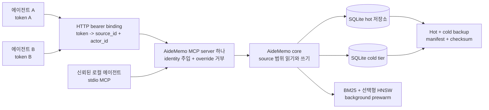

# 공용 메모리 레이어

AideMemo는 프로젝트 컨텍스트와 작성자 provenance를 명시적으로 유지하면서
여러 코딩 에이전트에 하나의 지속성 있는 메모리 저장소를 제공할 수 있습니다.
의도한 경계는 신뢰된 에이전트 집합입니다. `source_id`는 메모리 namespace를
선택하고, `actor_id`는 팩트를 쓴 주체를 기록합니다. 네트워크 호출자가 두 값을
직접 선택하면 안 될 때는 bearer-token binding을 사용합니다.

이 문서는 배포 관점의 가이드입니다. 개별 MCP 도구 schema는
[`MCP 설정`](MCP.md), lock·backup·sync 세부사항은 [`운영`](OPERATIONS.md)을
참고하세요.

## 배포 모델 선택

| 상황 | 권장 구성 |
|---|---|
| 한 사용자, 한 프로젝트 | 로컬 SQLite 저장소 하나와 stdio MCP, `source_id` 불필요 |
| 여러 에이전트가 한 프로젝트 공유 | 저장소 하나와 프로젝트 `source_id` 하나, writer마다 다른 `actor_id` |
| 신뢰된 여러 프로젝트가 한 서버 공유 | SQLite 저장소 하나, `mcp-serve` 하나, source/actor별 고정 token binding |
| 서로 신뢰하지 않는 tenant | 별도 저장소와 가능하면 별도 AideMemo process |
| 클라우드 또는 추측성 에이전트 실행 | baseline backup 복원 후 로컬 쓰기, 선택한 branch log만 merge |

SQLite / `libsqlite`가 기본 공용 저장소 backend입니다. 하나의 daemon 또는 HTTP
server를 writer coordinator로 사용하세요. 선택형 redb backend는 embedded
single-process workload에 적합하지만 single-writer file lock이 있으므로 여러
에이전트는 공용 server를 경유하는 편이 실용적입니다.

## 참조 아키텍처



Server는 semantic prewarm보다 먼저 listener를 bind합니다. 따라서 model이
warming 상태여도 lexical 요청과 `/health`를 사용할 수 있습니다. Bound되지
않은 administrator는 `/admin/status.semantic_prewarm`에서 `warming`, `ready`,
`failed`, `disabled` 상태를 확인할 수 있습니다.

## Identity와 가시성 규칙

다음 세 개념을 분리해서 사용합니다.

| 값 | 목적 | 보안 의미 |
|---|---|---|
| `source_id` | 프로젝트, 팀, upstream 메모리 namespace 선택 | 팩트, pinned context, entity 가시성, graph 읽기, mutation을 필터링 |
| `actor_id` | writer profile 또는 agent instance 기록 | provenance 전용이며 읽기 권한을 부여하지 않음 |
| Bearer token | HTTP 호출자 인증 | binding file 사용 시 두 identity를 고정하고 호출자 override 거부 |

저장 및 읽기 계약은 다음과 같습니다.

| 표면 | 범위 적용 동작 |
|---|---|
| Exact-content deduplication | 정규화된 `(source_id, content_hash)`가 key이며 두 source의 같은 문장은 두 팩트로 저장 |
| Fact get/list/search/pin/mutation | 선택한 source에 속한 팩트만 허용 |
| Entity get/list | 선택한 source의 팩트가 연결된 entity만 반환하고 unscoped summary metadata는 생략 |
| Traverse/path/graph | 보이는 entity와 relation provenance가 모두 정확한 source namespace와 일치해야 함 |
| Context/query/recent/aggregate | limit 또는 산술 적용 전에 source에 보이는 팩트만 참여 |
| Global admin과 sync export | source-bound HTTP token에는 거부 |

Entity name과 entity type은 한 저장소 안에서 공용 ontology로 유지됩니다. 따라서
`source_id`는 협력하는 팀을 위한 강한 partition이지 적대적인 multi-tenant
database boundary가 아닙니다. Entity 이름, resource 사용량, administrator
접근까지 공유하면 안 되는 경우 별도 저장소를 사용하세요.

## 로컬 에이전트가 한 프로젝트 공유

안정적인 프로젝트 source 하나를 선택하고 writer마다 다른 actor를 지정합니다.

```bash
aidememo --backend libsqlite --store ~/.aidememo/team.sqlite \
  mcp-install --target codex --source-id project:payments --actor-id codex:primary

aidememo --backend libsqlite --store ~/.aidememo/team.sqlite \
  mcp-install --target claude --source-id project:payments --actor-id claude:reviewer
```

두 에이전트는 같은 `source_id`를 사용하므로 동일한 프로젝트 팩트를 봅니다.
`actor_id`가 다르므로 쓰기 주체는 구분됩니다. 설치된 환경 기본값은 신뢰된
로컬 process에 적합하며 명시적인 MCP argument가 이를 override할 수 있습니다.

공유 쓰기에는 하나의 warm coordinator를 실행합니다.

```bash
aidememo --backend libsqlite daemon start \
  --store ~/.aidememo/team.sqlite --port 3000
```

## 네트워크 호출자 identity 고정

각자 인증하는 HTTP 에이전트에는 mode `0600` binding file을 만듭니다. 각
entry에는 비어 있지 않은 token, source, actor가 필요하며 중복 token은
거부됩니다.

```json
{
  "tokens": [
    {
      "token": "replace-with-agent-a-secret",
      "source_id": "project:payments",
      "actor_id": "codex:primary"
    },
    {
      "token": "replace-with-agent-b-secret",
      "source_id": "project:search",
      "actor_id": "claude:reviewer"
    }
  ]
}
```

```bash
chmod 600 ./token-bindings.json

aidememo --backend libsqlite --store ~/.aidememo/shared.sqlite \
  mcp-serve --bind 127.0.0.1 --port 3000 \
  --auth-bindings-file ./token-bindings.json
```

인증된 모든 `tools/call`에 server가 bound `source_id`와 `actor_id`를
주입합니다. 다른 top-level 값이나 `aidememo_fact_add_many` item 내부의 다른
값은 거부됩니다. Bound caller는 `/admin/status`와 `/sync/since`를 읽을 수
없고 `/health`에서는 health와 prewarm 상태만 받습니다.

`mcp-serve`는 plain HTTP입니다. Loopback에 유지하거나 non-loopback bind를
TLS-terminating reverse proxy 또는 암호화된 private tunnel과 적절한 rate
limit 뒤에 배치하세요.

## 공용 메모리 루프

일반적인 에이전트 루프에는 몇 개의 호출만 필요합니다.

1. `aidememo_context`로 턴을 열거나 `aidememo_workflow_start`로 티켓 작업을
   시작합니다.
2. 주제별 탐색은 `aidememo_query`를 사용합니다.
3. 여러 팩트의 count, currency, duration, timeline을 결정적으로 계산할 때만
   `aidememo_aggregate`를 사용합니다.
4. 오래 유지할 결과는 `aidememo_fact_add` 또는 `aidememo_fact_add_many`로
   저장하고 `decision`, `lesson`, `error`, `preference` type을 명시합니다.

Bound token을 사용하면 client는 identity field를 생략합니다. Server가 값을
공급합니다. 신뢰된 stdio 설치에서는 MCP environment가 기본값을 제공합니다.

## 연속성 보호

SQLite 저장소 backup은 hot database와 기존 `<store>.cold.sqlite` archive를
하나의 manifest에 포함하고 각각 size와 SHA-256 checksum을 기록합니다.

```bash
aidememo --store ~/.aidememo/shared.sqlite backup create ~/backups/aidememo
aidememo --store ~/.aidememo/shared.sqlite backup restore ~/backups/aidememo --force
```

Restore는 두 tier를 검증하고 교체 전에 완전한 이전 저장소 safety snapshot을
보존합니다. Restore 전에 writer를 중지하세요.

Incremental sync는 canonical-writer, pull-only 방식입니다. Cursor persistence는
process lock과 atomic write를 사용하고 relation 추가·update를 복제하지만
relation delete는 표현하지 않습니다. Sync를 multi-primary conflict resolution로
사용하지 말고 disposable cloud agent나 what-if memory 실험에는 branch log를
사용하세요.

## 운영 체크리스트

- 절대 store path를 사용하고 backend와 file suffix를 맞춥니다.
- 공유 프로젝트마다 안정적인 `source_id`, writer마다 안정적인 `actor_id`를
  사용합니다.
- HTTP caller가 scope를 선택하면 안 될 때 token binding을 사용합니다.
- `mcp-serve`를 loopback에 두거나 client 앞에서 TLS를 종료합니다.
- `aidememo doctor --json`으로 저장소 health와 sharing guidance를 확인합니다.
- Upgrade 또는 파괴적 maintenance 전에 hot과 cold tier를 모두 backup합니다.
- 지속적인 공유 쓰기에는 daemon/server 하나를 사용합니다.
- Relation delete와 경쟁하는 semantic decision은 application-level coordination
  대상으로 취급합니다.
